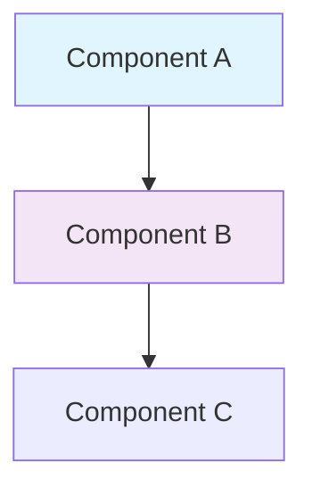

# Documentation Update Prompt

## Context

This repository maintains comprehensive documentation across multiple files:
- README files for the main project and GitCue extension
- CHANGELOG files tracking version history
- CONTRIBUTING guide for contributors
- Inline code documentation and comments
- Architecture diagrams and flowcharts

Documentation must remain accurate, clear, and synchronized with code changes.

## Objective

Update, maintain, and improve documentation to ensure it accurately reflects current functionality, provides clear guidance to users and contributors, and follows established documentation standards.

## Documentation Structure

### Primary Documentation Files

**Root Level:**
- `/README.md` - Main project documentation for Auto-Git CLI
- `/CHANGELOG.md` - Version history and release notes
- `/CONTRIBUTING.md` - Contribution guidelines
- `/LICENSE` - MIT license
- `/example-config.json` - Configuration example

**GitCue Extension:**
- `/gitcue/README.md` - Extension documentation
- `/gitcue/CHANGELOG.md` - Extension version history
- `/gitcue/INTERACTIVE_SIDEBAR_GUIDE.md` - Sidebar feature guide
- `/gitcue/MANUAL_TESTING_GUIDE.md` - Testing procedures

**Module Documentation:**
- `/lib/INTELLIGENT_COMMIT_CONFIG.md` - Intelligent commit configuration
- Various README.md files in subdirectories

## Requirements

### Documentation Standards

**Writing Style:**
- Clear and concise language
- Active voice preferred
- Present tense for current features
- Future tense for planned features
- No emojis in documentation text (allowed in visual elements only)
- Professional tone throughout

**Formatting:**
- Use Markdown for all documentation
- Consistent heading hierarchy
- Code blocks with language specification
- Tables for structured data
- Diagrams using Mermaid when appropriate
- Proper linking between documents

**Content Organization:**
- Table of contents for long documents
- Logical section ordering
- Progressive disclosure (simple to complex)
- Clear separation of concerns
- Version-specific information marked clearly

### README Structure

**Standard README Sections:**

1. **Title and Badges**: Project name, version, build status, downloads
2. **Description**: One-line description, key features summary
3. **What's New**: Latest version highlights
4. **Table of Contents**: Navigation for long documents
5. **Architecture Overview**: System design and components
6. **Quick Start**: Minimal steps to get running
7. **Installation**: Detailed installation instructions
8. **Usage**: Commands, options, examples
9. **Configuration**: Settings and customization
10. **Features**: Detailed feature descriptions
11. **Examples**: Real-world usage scenarios
12. **Troubleshooting**: Common issues and solutions
13. **Contributing**: Link to contribution guide
14. **License**: License information

### CHANGELOG Structure

Follow [Keep a Changelog](https://keepachangelog.com/) format:

```markdown
# Changelog

All notable changes to this project will be documented in this file.

The format is based on [Keep a Changelog](https://keepachangelog.com/en/1.0.0/),
and this project adheres to [Semantic Versioning](https://semver.org/spec/v2.0.0.html).

## [Unreleased]

### Added
- New features in development

### Changed
- Changes to existing functionality

### Deprecated
- Soon-to-be removed features

### Removed
- Removed features

### Fixed
- Bug fixes

### Security
- Security fixes

## [X.Y.Z] - YYYY-MM-DD

### Added
- Feature descriptions with context

### Fixed
- Bug fix descriptions with issue references
```

## Guidelines

### Updating README Files

**When to Update:**
- New features added
- Existing features modified
- Configuration options changed
- Installation process updated
- API changes
- Breaking changes introduced
- Major bug fixes
- Version updates

**Update Process:**

1. **Identify Affected Sections**: Determine which sections need updates
2. **Update Content**: Modify text, code examples, or diagrams
3. **Verify Examples**: Ensure all code examples work correctly
4. **Update Version**: Change version badges and references
5. **Check Links**: Verify all links are valid
6. **Review Consistency**: Ensure consistent terminology
7. **Test Instructions**: Follow documented steps to verify accuracy

**Best Practices:**

- Keep examples up-to-date with current syntax
- Include both CLI and VS Code examples where relevant
- Show expected output for commands
- Provide troubleshooting for common issues
- Link to related documentation
- Use collapsible sections for long content
- Include visual aids (screenshots, diagrams) when helpful

### Updating CHANGELOG Files

**When to Add Entries:**
- Every version release
- Significant unreleased changes
- Breaking changes immediately
- Security fixes immediately

**Entry Format:**

```markdown
## [X.Y.Z] - YYYY-MM-DD

### Category
- Description of change in past tense
- Related issue: #123
- Breaking change note (if applicable)
```

**Categories:**
- **Added**: New features
- **Changed**: Changes to existing functionality
- **Deprecated**: Soon-to-be removed features
- **Removed**: Removed features
- **Fixed**: Bug fixes
- **Security**: Security fixes and patches

**Best Practices:**

- Write from user perspective
- Link to relevant issues or PRs
- Group related changes
- Highlight breaking changes
- Include migration guidance
- Keep entries concise but informative
- Maintain chronological order (newest first)

### Code Documentation

**Inline Comments:**

```javascript
/**
 * Analyzes code changes using Google Gemini AI to determine if they warrant a commit.
 *
 * This function implements intelligent commit decision-making by:
 * 1. Validating API configuration and rate limits
 * 2. Sending diff to Gemini for structured analysis
 * 3. Applying configurable thresholds for significance
 * 4. Returning detailed decision with reasoning
 *
 * @param {string} diffText - Git diff output to analyze
 * @param {string} commitThreshold - Minimum significance: 'any', 'medium', or 'major'
 * @param {boolean} requireCompleteness - Whether to require complete implementations
 * @returns {Promise<Object>} Analysis result with shouldCommit, reason, and metadata
 * @throws {Error} If API call fails or rate limit exceeded
 *
 * @example
 * const analysis = await analyzeChangesForCommit(diff, 'medium', true);
 * if (analysis.shouldCommit) {
 *   await commit(analysis.commitMessage);
 * }
 */
async function analyzeChangesForCommit(diffText, commitThreshold, requireCompleteness) {
  // Implementation
}
```

**Module-Level Documentation:**

```javascript
/**
 * Gemini AI Integration Module
 *
 * Provides intelligent Git automation through Google Gemini AI:
 * - Commit message generation with conventional commit format
 * - Commit decision making with significance analysis
 * - Error analysis and solution suggestions
 *
 * Features:
 * - Function calling for structured responses
 * - Rate limiting (15 calls/minute)
 * - Diff hash optimization (80% API reduction)
 * - Comprehensive error handling
 *
 * @module lib/gemini
 * @requires @google/genai
 * @requires ./config
 * @requires ./rateLimiter
 */
```

### Architecture Documentation

**Diagram Standards:**

Use Mermaid for diagrams:

```markdown
### System Architecture


```

**Diagram Types:**
- **System Architecture**: High-level component overview
- **Data Flow**: Sequence of operations
- **Decision Trees**: Flowcharts for logic
- **Class Diagrams**: Object relationships

### API Documentation

**Command Documentation:**

```markdown
### auto-git watch

Start file watching with automatic commits.

Usage:
  auto-git watch [options]

Options:
  --mode <mode>        Commit mode: 'periodic' or 'intelligent' (default: 'periodic')
  --no-push            Commit locally without pushing to remote
  --paths <patterns>   Glob patterns to watch (default: '**/*')
  --verbose            Enable detailed logging

Examples:
  # Basic watching with periodic commits
  auto-git watch

  # Intelligent mode with AI-driven decisions
  auto-git watch --mode intelligent

  # Watch specific files without pushing
  auto-git watch --paths "src/**/*.js" --no-push
```

**Configuration Documentation:**

```markdown
### Configuration Options

#### gitcue.commitMode

Type: `string`
Default: `'intelligent'`
Values: `'periodic'` | `'intelligent'`

Controls the commit behavior:
- `periodic`: Time-based commits at regular intervals
- `intelligent`: AI-driven commits based on change analysis

Example:
{
  "gitcue.commitMode": "intelligent"
}
```

## Output Format

### Documentation Update Summary

After updating documentation:

```
Documentation Update Summary
===========================

Files Modified:
- README.md - Updated installation section and added new feature docs
- CHANGELOG.md - Added v4.1.0 release notes
- gitcue/README.md - Updated configuration examples

Sections Updated:
- Installation: Added Docker installation method
- Configuration: Added intelligent commit mode settings
- Examples: Added workflow examples for intelligent mode

New Content:
- Architecture diagram for AI integration
- Troubleshooting section for rate limiting
- Migration guide for v4.0 to v4.1

Validation:
- All code examples tested
- All links verified
- Spelling and grammar checked
- Formatting validated

Next Steps:
- Review updated documentation
- Update related docs if needed
- Publish to website/wiki
```

## Best Practices

### Consistency Guidelines

1. **Terminology**: Use consistent terms throughout
   - "Auto-Git" (not "auto-git" or "AutoGit")
   - "GitCue" (not "Git Cue" or "gitcue")
   - "commit mode" (not "mode" alone)
   - "intelligent mode" vs "periodic mode"

2. **Code Examples**: Always include context
   ```bash
   # Bad
   auto-git watch
   
   # Good
   # Start watching with intelligent mode
   auto-git watch --mode intelligent
   ```

3. **Version References**: Always use explicit versions
   - "In version 4.0.0" (not "in the latest version")
   - Update version numbers when creating releases

### Maintenance Checklist

Regular documentation maintenance:

- [ ] Update version badges when releasing
- [ ] Verify all links are valid
- [ ] Test all code examples
- [ ] Update screenshots if UI changed
- [ ] Review for outdated information
- [ ] Check grammar and spelling
- [ ] Ensure consistent formatting
- [ ] Validate Markdown rendering
- [ ] Update table of contents
- [ ] Sync changes across related docs

### Visual Elements

**Screenshots:**
- Use current UI version
- Highlight relevant areas
- Provide context
- Use consistent dimensions
- Include captions

**Badges:**
```markdown
[](...)
[](...)
```

## Validation

### Documentation Quality Checklist

- [ ] Accurate: Information reflects current implementation
- [ ] Complete: All features are documented
- [ ] Clear: Easy to understand for target audience
- [ ] Consistent: Terminology and style are uniform
- [ ] Current: Version references are up-to-date
- [ ] Tested: Code examples work as shown
- [ ] Linked: Cross-references are correct
- [ ] Formatted: Markdown renders properly
- [ ] Accessible: Clear language, good structure
- [ ] Maintained: No outdated information

## Notes

- Documentation is as important as code
- Keep documentation close to code (inline comments)
- Update documentation with code changes
- Use PR descriptions to document changes
- Review documentation in code reviews
- Consider documentation a deliverable
- Write for your future self and others
- Assume readers have varying expertise levels
