# Auto-Git v4.0.0

[](https://badge.fury.io/js/@sbeeredd04%2Fauto-git)
[](https://www.npmjs.com/package/@sbeeredd04/auto-git)
[](https://opensource.org/licenses/MIT)
[](https://nodejs.org/)
[](https://github.com/sbeeredd04/auto-git/stargazers)
[](https://github.com/sbeeredd04/auto-git/issues)

> AI-powered Git automation with intelligent commit decisions, enhanced interactive sidebar, smart diff optimization, push control, and persistent terminal session

Auto-Git is a cross-platform CLI tool that intelligently analyzes your code changes and automatically generates meaningful commit messages using Google's Gemini AI. **Version 4.0.0** introduces a revolutionary VS Code extension with enhanced interactive sidebar, improved UI/UX, and seamless integration alongside the powerful CLI tools.

## 🚀 What's New in v4.0.0

### 🎨 Enhanced VS Code Extension
- **Interactive Sidebar**: Redesigned with actionable buttons and better space utilization
- **Smart Status Cards**: Real-time GitCue status, file changes, and repository information
- **One-Click Actions**: Direct commit, terminal access, and configuration from sidebar
- **Enhanced Activity Feed**: Improved activity tracking with visual indicators and commands
- **Professional UI**: Modern interface with proper icons, tooltips, and organized sections

### 🧠 Intelligent Commit Mode
- **AI-Driven Decisions**: Gemini analyzes changes and decides when to commit based on significance
- **Function Calling**: Structured AI analysis with commit recommendations
- **30-Second Buffer**: Review and cancel commits before execution
- **Smart Significance Detection**: High/Medium/Low change analysis

### ⚡ Smart API Optimization
- **Diff Hash Tracking**: Only calls Gemini when actual changes are detected
- **80% API Usage Reduction**: Prevents redundant calls for unchanged files
- **Rate Limiting**: 15 calls per minute with sliding window protection
- **Debug Logging**: Clear feedback when API calls are optimized

### 📦 Push Control System
- **No-Push Mode**: Commit locally without pushing to remote
- **Flexible Configuration**: Command line, environment variables, or config file
- **Local Development**: Perfect for testing commits before sharing

## 📋 Table of Contents

- [Architecture Overview](#architecture-overview)
- [Tech Stack](#tech-stack)
- [Quick Start](#quick-start)
- [Installation](#installation)
- [Usage](#usage)
  - [Commit Modes](#commit-modes)
  - [Commands](#commands)
  - [Interactive Session](#interactive-session)
- [Configuration](#configuration)
- [Intelligent Commit Guide](#intelligent-commit-guide)
- [Examples](#examples)
- [Project Structure](#project-structure)
- [Development](#development)
- [API Integration](#api-integration)
- [Troubleshooting](#troubleshooting)
- [Contributing](#contributing)

## 🏗️ Architecture Overview

Auto-Git follows a modular architecture designed for scalability, maintainability, and intelligent automation. The system consists of several interconnected components that work together to provide seamless Git automation.

### System Architecture

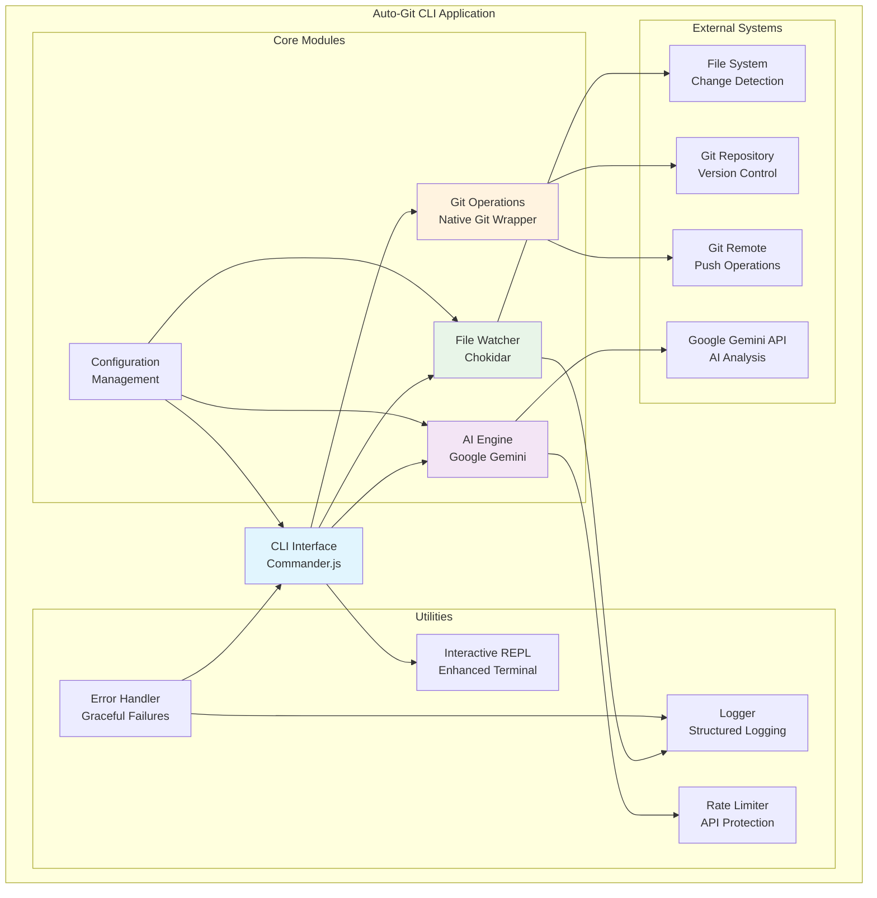

### Data Flow Architecture

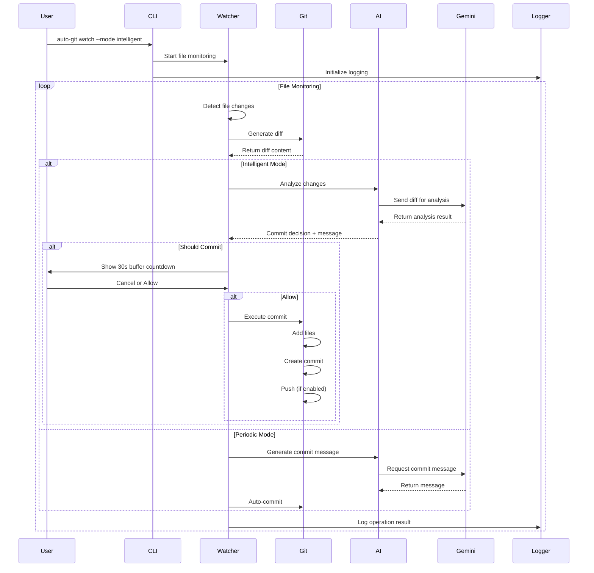

### Intelligent Commit Decision Flow

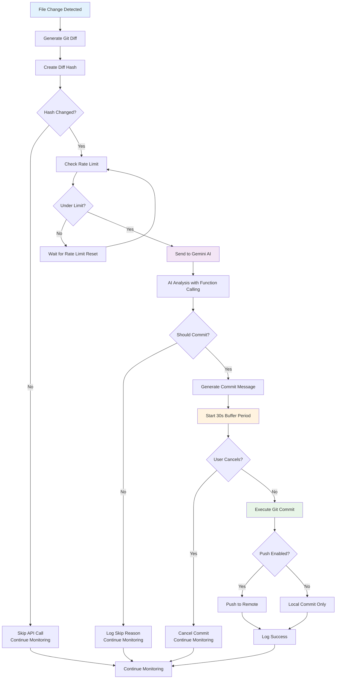

## 🛠️ Tech Stack

### Core Technologies

| Technology | Version | Purpose |
|------------|---------|---------|
| **Node.js** | ≥18.0.0 | Runtime environment |
| **ESM Modules** | Native | Modern module system |
| **Google Gemini AI** | 2.0-flash | AI analysis and commit generation |
| **Commander.js** | ^11.1.0 | CLI interface and argument parsing |
| **Chokidar** | ^3.5.3 | Cross-platform file watching |

### Dependencies

#### AI & API Integration
- **@google/genai** (^1.0.1) - Google Gemini AI SDK
- **node-fetch** (^3.3.2) - HTTP client for API requests

#### CLI & User Interface
- **commander** (^11.1.0) - Command line interface framework
- **inquirer** (^9.2.12) - Interactive command line prompts
- **boxen** (^7.1.1) - Create boxes in terminal output
- **chalk** (^5.3.0) - Terminal string styling
- **ora** (^8.0.1) - Elegant terminal spinners
- **cli-spinners** (^2.9.2) - Spinner definitions

#### File System & Process Management
- **chokidar** (^3.5.3) - Efficient file watching
- **execa** (^8.0.1) - Better child process execution
- **keypress** (^0.2.1) - Keyboard input handling

#### Configuration & Environment
- **dotenv** (^16.3.1) - Environment variable loading

### Architecture Patterns

#### 1. **Event-Driven Architecture**
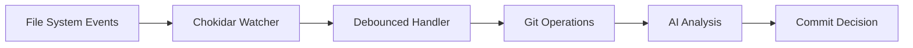

#### 2. **Plugin-Style Modularity**
- Each major component is a separate module with well-defined interfaces
- Loose coupling through dependency injection
- Configurable behavior through the configuration system

#### 3. **Rate Limiting & Optimization**
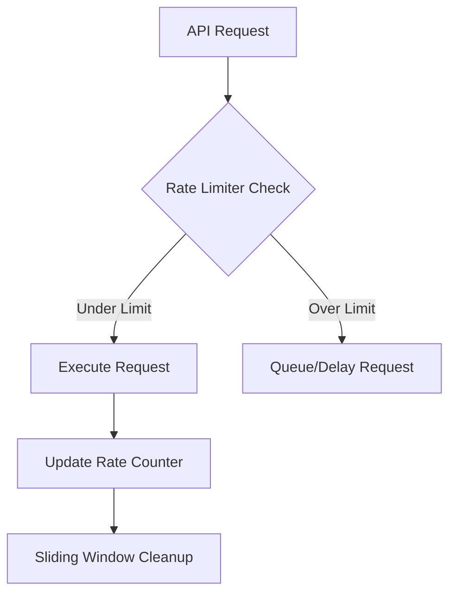

## 🚀 Quick Start

### 1. Install Auto-Git

```bash
# Global installation (recommended)
npm install -g @sbeeredd04/auto-git

# Or via npx (no installation)
npx @sbeeredd04/auto-git
```

### 2. Get Google Gemini API Key

1. Visit [Google AI Studio](https://aistudio.google.com/app/apikey)
2. Create a new API key
3. Copy the key for the next step

### 3. Configure API Key

```bash
# Set environment variable (recommended)
export GEMINI_API_KEY="your-api-key-here"

# Or add to your shell profile
echo 'export GEMINI_API_KEY="your-api-key-here"' >> ~/.bashrc
source ~/.bashrc
```

### 4. Initialize in Your Project

```bash
cd your-git-project
auto-git setup  # Interactive setup guide
```

### 5. Start Using Auto-Git

```bash
# Simple file watching (periodic commits)
auto-git watch

# Intelligent AI-driven commits
auto-git watch --mode intelligent

# Interactive terminal session
auto-git interactive
```

## 📦 Installation

### Prerequisites

- **Node.js** ≥18.0.0
- **Git** ≥2.0.0
- **Google Gemini API Key**

### Installation Methods

#### Method 1: Global Installation (Recommended)

```bash
npm install -g @sbeeredd04/auto-git
auto-git --version
```

#### Method 2: Local Project Installation

```bash
npm install @sbeeredd04/auto-git
npx auto-git --version
```

#### Method 3: Development Installation

```bash
git clone https://github.com/sbeeredd04/auto-git.git
cd auto-git
npm install
npm link
auto-git --version
```

### Verification

```bash
# Check installation
auto-git debug

# Verify API key setup
auto-git config
```

## 📝 Usage

### Commit Modes

Auto-Git supports two distinct commit modes, each designed for different workflows:

#### 🕐 Periodic Mode (Default)
- **Behavior**: Time-based commits at regular intervals
- **Use Case**: Continuous development with regular snapshots
- **AI Usage**: Only for commit message generation
- **Configuration**: Configurable debounce timing

```bash
auto-git watch
# or
auto-git watch --mode periodic
```

#### 🧠 Intelligent Mode (AI-Driven)
- **Behavior**: AI analyzes changes and decides when to commit
- **Use Case**: Production-ready commits with significance analysis
- **AI Usage**: Full analysis with function calling
- **Features**: 30-second buffer, significance detection

```bash
auto-git watch --mode intelligent
```

### Commands

#### Core Commands

```bash
# File watching and automation
auto-git watch [options]           # Start file monitoring
auto-git watch --mode intelligent  # AI-driven commit decisions
auto-git watch --no-push          # Commit without pushing

# One-time operations
auto-git commit [options]          # Generate single AI commit
auto-git commit --verbose         # Detailed commit process

# Interactive session
auto-git interactive              # Enhanced terminal session

# Repository management
auto-git reset <count> [options]  # Undo recent commits
auto-git reset 3 --soft          # Soft reset last 3 commits
auto-git reset 1 --hard          # Hard reset last commit

# Configuration and setup
auto-git config                   # Show current configuration
auto-git setup                    # Interactive setup guide
auto-git debug                    # System diagnostics
```

#### Command Options

| Option | Description | Applies To |
|--------|-------------|------------|
| `--mode <mode>` | Set commit mode (periodic/intelligent) | watch |
| `--no-push` | Commit locally without pushing | watch, commit |
| `--verbose` | Enable detailed logging | All commands |
| `--soft` | Soft reset (preserve changes) | reset |
| `--hard` | Hard reset (discard changes) | reset |
| `--help` | Show command help | All commands |

### Interactive Session

The interactive session provides an enhanced terminal experience with:

#### Features
- **Persistent Command History**: Commands saved across sessions
- **Arrow Key Navigation**: Browse history with ↑/↓ keys
- **Git Syntax Highlighting**: Enhanced display for Git commands
- **AI-Powered Suggestions**: Context-aware command recommendations
- **Markdown Formatting**: Rich text output for AI responses

#### Usage
```bash
auto-git interactive
```

#### Navigation
- **↑/↓ Arrow Keys**: Navigate command history
- **Tab**: Auto-completion (where available)
- **Ctrl+C**: Exit session
- **Ctrl+P**: Pause and show navigation menu

#### Special Commands
```bash
# Within interactive session
help          # Show available commands
config        # Display current configuration
status        # Git repository status
clear         # Clear terminal
exit          # Exit interactive session
```

## ⚙️ Configuration

Auto-Git supports multiple configuration methods with a clear precedence order:

### Configuration Precedence
1. **Command Line Arguments** (highest priority)
2. **Environment Variables**
3. **Configuration File** (`~/.auto-gitrc.json`)
4. **Default Values** (lowest priority)

### Configuration File

Create `~/.auto-gitrc.json` for persistent settings:

```json
{
  "apiKey": "your-gemini-api-key",
  "commitMode": "intelligent",
  "noPush": false,
  "watchPaths": ["src/**", "lib/**", "*.js", "*.md"],
  "debounceMs": 2000,
  "rateLimiting": {
    "maxCallsPerMinute": 15,
    "bufferTimeSeconds": 30
  },
  "interactiveOnError": true,
  "enableSuggestions": true,
  "hotkeys": {
    "pause": "ctrl+p"
  },
  "watchOptions": {
    "ignored": [
      "**/node_modules/**",
      "**/.git/**",
      "**/dist/**",
      "**/build/**",
      "**/*.log"
    ],
    "persistent": true,
    "ignoreInitial": true,
    "followSymlinks": false,
    "depth": undefined
  }
}
```

### Environment Variables

```bash
# API Configuration
export GEMINI_API_KEY="your-api-key"

# Commit Behavior
export AUTO_GIT_COMMIT_MODE="intelligent"  # or "periodic"
export AUTO_GIT_NO_PUSH="false"           # true to disable pushing

# Rate Limiting
export AUTO_GIT_MAX_CALLS_PER_MINUTE="15"
export AUTO_GIT_BUFFER_TIME_SECONDS="30"

# Development/Debug
export AUTO_GIT_DEBUG="true"
export NODE_ENV="development"
```

### Watch Patterns

Configure which files and directories to monitor:

```bash
# Watch everything (default)
auto-git watch

# Watch specific patterns
auto-git watch --paths "src/**,*.js,*.md"

# Watch single directory
auto-git watch --paths "src/"
```

### Advanced Configuration

#### Rate Limiting Configuration
```json
{
  "rateLimiting": {
    "maxCallsPerMinute": 15,      // Max API calls per minute
    "bufferTimeSeconds": 30,      // User cancellation window
    "slidingWindowSize": 60000    // Rate limit window (ms)
  }
}
```

#### File Watching Configuration
```json
{
  "watchOptions": {
    "ignored": [
      "**/node_modules/**",       // Dependencies
      "**/.git/**",              // Git metadata
      "**/dist/**",              // Build outputs
      "**/coverage/**",          // Test coverage
      "**/*.log",                // Log files
      "**/.DS_Store"             // macOS files
    ],
    "persistent": true,           // Keep process alive
    "ignoreInitial": true,        // Skip initial file scan
    "followSymlinks": false,      // Security consideration
    "depth": undefined,           // Unlimited depth
    "awaitWriteFinish": {
      "stabilityThreshold": 100,  // File stability (ms)
      "pollInterval": 50          // Polling interval (ms)
    }
  }
}
```

## 🧠 Intelligent Commit Guide

The Intelligent Commit system represents the core innovation of Auto-Git, using advanced AI analysis to determine when and how to commit your changes.

### How It Works

#### 1. **Change Detection & Optimization**
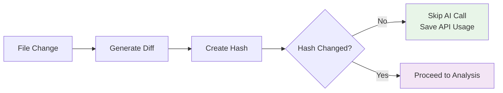

The system creates a hash of the diff content to avoid redundant API calls when files are saved multiple times without actual changes.

#### 2. **AI Analysis Process**
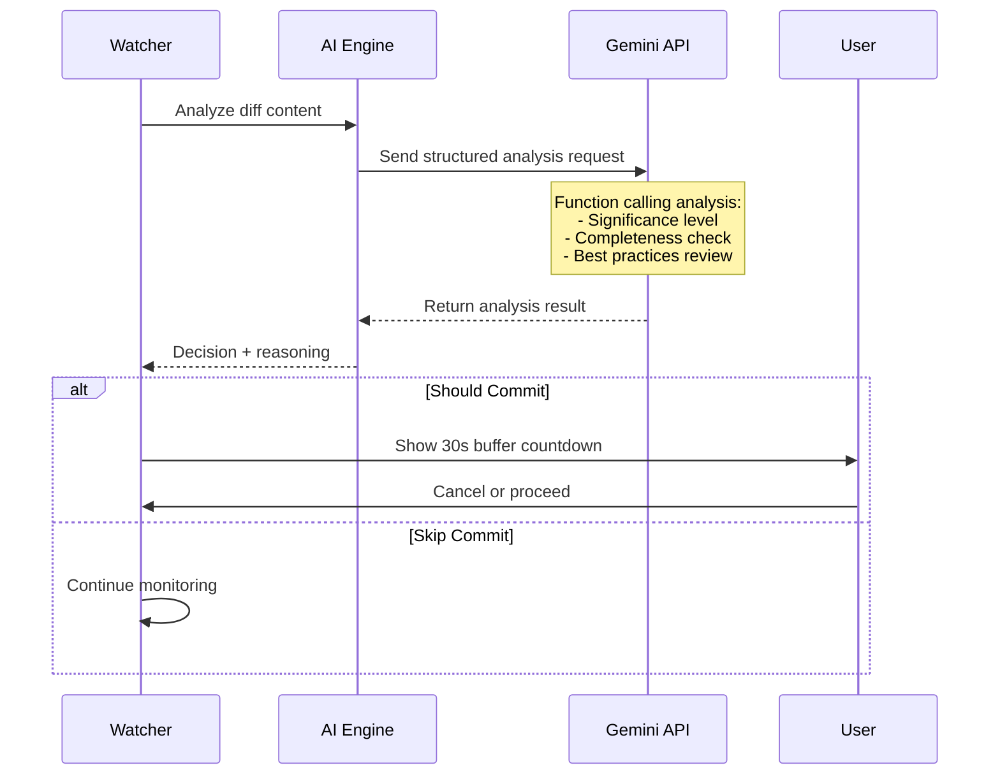

#### 3. **Function Calling Analysis**

The AI uses structured function calling to provide consistent analysis:

```typescript
interface CommitAnalysis {
  shouldCommit: boolean;       // Primary decision
  reason: string;             // Explanation for decision
  significance: 'low' | 'medium' | 'high';  // Change importance
  commitMessage?: string;     // Suggested message (if committing)
}
```

### Analysis Criteria

#### Significance Levels

| Level | Description | Examples |
|-------|-------------|----------|
| **High** | Major changes requiring immediate commit | New features, critical fixes, breaking changes, major refactoring |
| **Medium** | Standard development changes | Bug fixes, minor features, code improvements, documentation updates |
| **Low** | Minor changes that may not warrant commit | Formatting, comments, trivial config changes, debugging code |

#### Completeness Assessment

The AI evaluates whether changes represent a complete unit of work:

✅ **Complete Work (Commit)**
- Finished features or bug fixes
- Complete documentation updates
- Finalized configuration changes
- Working code with proper error handling

❌ **Incomplete Work (Skip)**
- Work-in-progress features
- Debugging or temporary code
- Broken functionality
- Missing documentation or tests

#### Best Practices Check

The AI ensures commits follow conventional commit guidelines:

- **Atomic Commits**: One logical change per commit
- **Meaningful Messages**: Clear, descriptive commit messages
- **Working Code**: No broken functionality committed
- **Proper Scope**: Changes are focused and related

### Example Workflow

#### Scenario: Adding a new feature

```bash
# Start intelligent watching
auto-git watch --mode intelligent

# 1. Create new feature file
echo "export function newFeature() { return 'hello'; }" > feature.js
# AI Analysis: Incomplete work, skip commit

# 2. Add tests
echo "import { newFeature } from './feature.js';" > feature.test.js
# AI Analysis: Still incomplete, skip commit

# 3. Complete implementation with documentation
cat >> feature.js << EOF
/**
 * New feature implementation
 * @returns {string} Greeting message
 */
export function newFeature() {
  return 'Hello from new feature!';
}
EOF

# AI Analysis: Complete feature, HIGH significance
# Decision: COMMIT with message "feat: add new feature implementation"
# Buffer: 30 seconds to cancel
# Result: Automatic commit and push
```

### When AI Skips Commits

The AI will skip commits for:

- **Incomplete Features**: Partial implementations without proper completion
- **Debugging Code**: Console logs, temporary variables, debugging statements
- **Work-in-Progress**: Code marked with TODO, FIXME, or similar indicators
- **Minor Formatting**: Whitespace changes, code formatting without logic changes
- **Configuration Tweaks**: Minor config adjustments without functional impact
- **Broken Code**: Syntax errors or non-functional implementations

### Customization Options

#### Adjust Sensitivity
```bash
# More aggressive committing (lower threshold)
export AUTO_GIT_COMMIT_THRESHOLD="low"

# More conservative committing (higher threshold)
export AUTO_GIT_COMMIT_THRESHOLD="high"
```

#### Buffer Time Adjustment
```bash
# Longer buffer for review
export AUTO_GIT_BUFFER_TIME_SECONDS="60"

# Immediate commits (careful!)
export AUTO_GIT_BUFFER_TIME_SECONDS="0"
```

## 📚 Examples

### Basic Usage Examples

#### 1. **Simple Project Setup**
```bash
# Initialize in existing project
cd my-project
git init  # if not already a git repo
auto-git setup

# Start basic file watching
auto-git watch
```

#### 2. **Intelligent Development Workflow**
```bash
# Start intelligent mode for production-ready commits
auto-git watch --mode intelligent --verbose

# Monitor the AI decision-making process
# See detailed logs of why commits are made or skipped
```

#### 3. **Local Development Mode**
```bash
# Commit locally without pushing (great for experimentation)
auto-git watch --no-push

# Or set via environment
export AUTO_GIT_NO_PUSH=true
auto-git watch --mode intelligent
```

### Advanced Configuration Examples

#### 4. **Custom File Patterns**
```bash
# Watch only source files
auto-git watch --paths "src/**/*.js,src/**/*.ts,*.md"

# Watch specific directories
auto-git watch --paths "components/,utils/,docs/"
```

#### 5. **Team Development Setup**
```json
// .auto-gitrc.json for team consistency
{
  "commitMode": "intelligent",
  "rateLimiting": {
    "maxCallsPerMinute": 10,  // Conservative for team usage
    "bufferTimeSeconds": 45   // Longer review time
  },
  "watchPaths": [
    "src/**",
    "lib/**", 
    "docs/**",
    "*.md",
    "package.json"
  ],
  "watchOptions": {
    "ignored": [
      "**/node_modules/**",
      "**/dist/**",
      "**/coverage/**",
      "**/*.log",
      "**/tmp/**"
    ]
  }
}
```

### Integration Examples

#### 6. **CI/CD Integration**
```yaml
# .github/workflows/auto-git.yml
name: Auto-Git Integration
on: [push]

jobs:
  validate-commits:
    runs-on: ubuntu-latest
    steps:
      - uses: actions/checkout@v3
      - uses: actions/setup-node@v3
        with:
          node-version: '18'
      - run: npm install -g @sbeeredd04/auto-git
      - run: auto-git debug
        env:
          GEMINI_API_KEY: ${{ secrets.GEMINI_API_KEY }}
```

#### 7. **Development Container Setup**
```dockerfile
# Dockerfile for development environment
FROM node:18-alpine

# Install Auto-Git
RUN npm install -g @sbeeredd04/auto-git

# Set up workspace
WORKDIR /workspace
COPY package*.json ./
RUN npm install

# Configure Auto-Git
ENV AUTO_GIT_COMMIT_MODE=intelligent
ENV AUTO_GIT_BUFFER_TIME_SECONDS=30

CMD ["auto-git", "interactive"]
```

### Workflow Examples

#### 8. **Feature Development Workflow**
```bash
# Start feature branch
git checkout -b feature/new-component

# Begin intelligent monitoring
auto-git watch --mode intelligent --verbose

# Development process:
# 1. Create component file → AI skips (incomplete)
# 2. Add basic structure → AI skips (incomplete) 
# 3. Implement functionality → AI skips (no tests)
# 4. Add tests → AI commits (complete feature)
# 5. Update documentation → AI commits (documentation update)
# 6. Fix typo → AI skips (trivial change)
```

#### 9. **Documentation Workflow**
```bash
# Watch only documentation files
auto-git watch --paths "docs/**,*.md,README*" --mode intelligent

# AI will commit:
# - Complete documentation sections
# - Substantial README updates
# - New documentation files

# AI will skip:
# - Typo fixes
# - Minor formatting changes
# - Incomplete draft sections
```

#### 10. **Code Review Preparation**
```bash
# Local development without pushing
auto-git watch --mode intelligent --no-push

# When ready for review:
git log --oneline  # Review AI-generated commits
git push origin feature-branch
```

## 🏗️ Project Structure

Auto-Git follows a modular architecture with clear separation of concerns:

```
auto-git/
├── 📁 bin/                    # Entry points
│   └── auto-git.js           # Main CLI application
├── 📁 lib/                    # Core modules
│   ├── config.js             # Configuration management
│   ├── errorHandler.js       # Error handling utilities
│   ├── gemini.js             # AI integration (Google Gemini)
│   ├── git.js                # Git operations wrapper
│   ├── rateLimiter.js        # API rate limiting
│   ├── repl.js               # Interactive terminal session
│   ├── utils.js              # General utilities
│   └── watcher.js            # File watching and change handling
├── 📁 utils/                  # Utility modules
│   ├── logger.js             # Structured logging system
│   └── markdown.js           # Markdown processing
├── 📁 .github/               # GitHub configuration
│   ├── 📁 ISSUE_TEMPLATE/    # Issue templates
│   └── pull_request_template.md
├── 📄 package.json           # Project configuration
├── 📄 example-config.json    # Example configuration
└── 📄 README.md             # This documentation
```

### Module Responsibilities

#### 🚪 Entry Point (`bin/`)

**`auto-git.js`**
- CLI interface using Commander.js
- Command parsing and routing
- Global error handling and process management
- Help system and command documentation

#### 🔧 Core Modules (`lib/`)

**`config.js`**
- Configuration loading and validation
- Environment variable processing
- User settings management
- Default configuration values

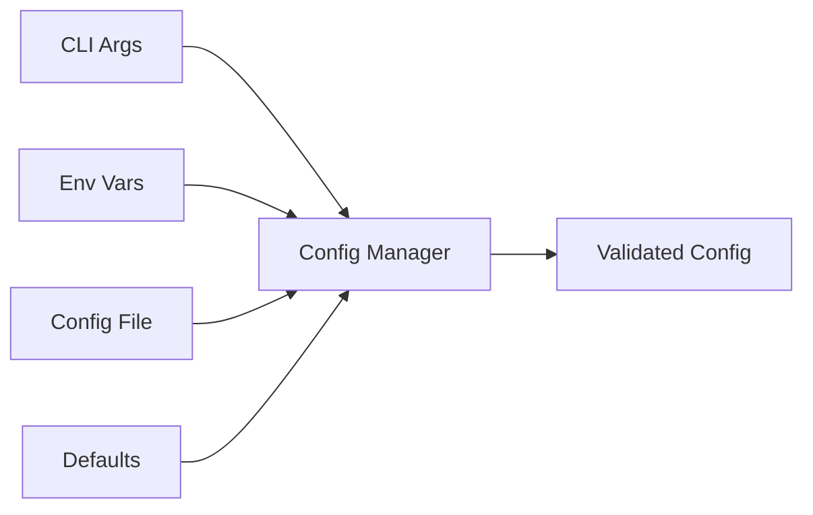

**`watcher.js`**
- File system monitoring using Chokidar
- Change detection and debouncing
- Commit mode orchestration
- User interaction management (30s buffer)

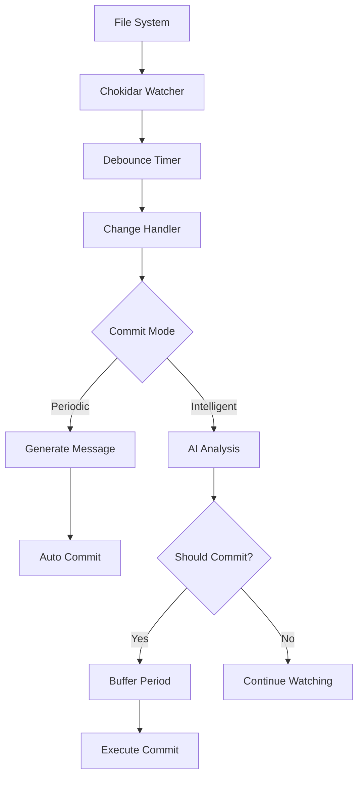

**`gemini.js`**
- Google Gemini AI integration
- Function calling for structured analysis
- Commit message generation
- Rate limiting integration

**`git.js`**
- Git command wrapper and abstraction
- Repository validation and status
- Commit and push operations
- Branch and remote management

**`rateLimiter.js`**
- API call rate limiting
- Sliding window implementation
- Request queuing and timing
- Usage tracking and reporting

**`repl.js`**
- Interactive terminal session
- Command history management
- Syntax highlighting for Git commands
- Markdown rendering for AI responses

**`errorHandler.js`**
- Centralized error handling
- Error classification and recovery
- User-friendly error messages
- Debug information collection

**`utils.js`**
- Shared utility functions
- Process management helpers
- File system utilities
- Cross-platform compatibility

#### 🛠️ Utilities (`utils/`)

**`logger.js`**
- Structured logging with levels
- Colorized console output
- Progress indicators and spinners
- Configuration and status displays

**`markdown.js`**
- Markdown parsing and rendering
- Terminal-friendly formatting
- Syntax highlighting support
- Interactive content processing

### Data Flow Patterns

#### Configuration Flow
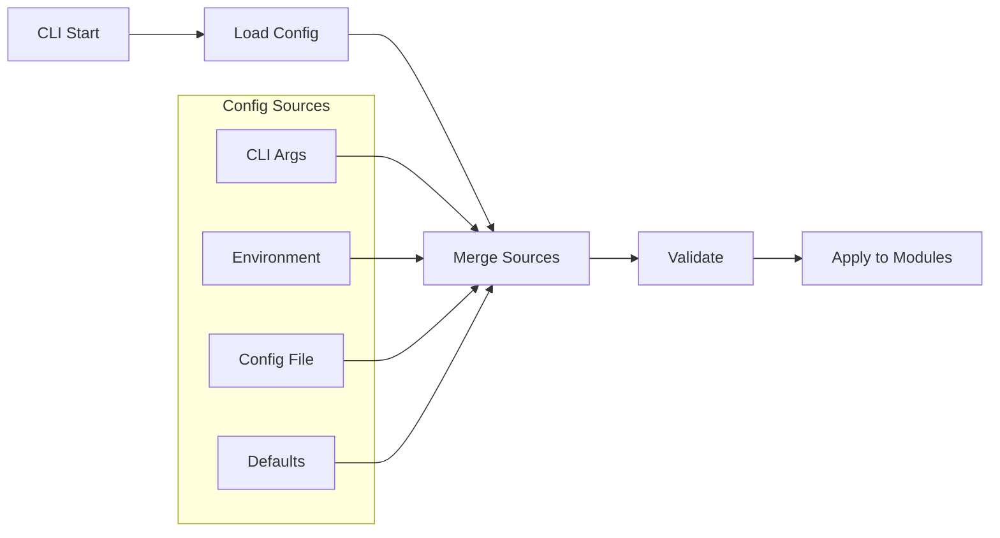

#### Error Handling Flow
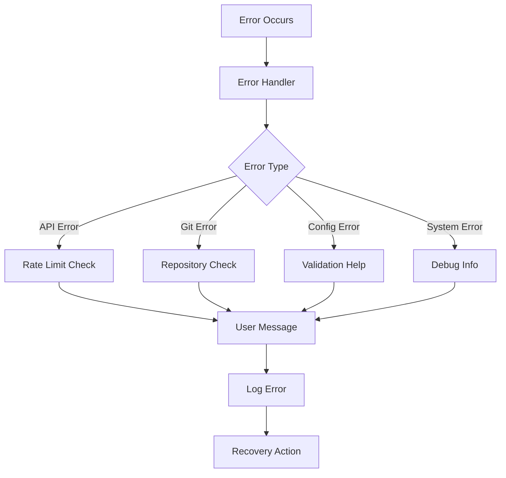

### Module Dependencies

```mermaid
graph TD
    CLI[auto-git.js] --> WATCHER[watcher.js]
    CLI --> CONFIG[config.js]
    CLI --> REPL[repl.js]
    CLI --> LOGGER[logger.js]
    
    WATCHER --> GIT[git.js]
    WATCHER --> GEMINI[gemini.js]
    WATCHER --> ERROR[errorHandler.js]
    
    GEMINI --> RATE[rateLimiter.js]
    GEMINI --> CONFIG
    
    REPL --> MARKDOWN[markdown.js]
    REPL --> GIT
    
    ERROR --> LOGGER
    
    subgraph "External Dependencies"
        CHOK[chokidar]
        COMM[commander]
        GENAI[@google/genai]
        EXEC[execa]
    end
    
    WATCHER --> CHOK
    CLI --> COMM
    GEMINI --> GENAI
    GIT --> EXEC
```

## 💻 Development

### Development Environment Setup

#### Prerequisites
- Node.js ≥18.0.0
- Git ≥2.0.0
- Google Gemini API key

#### Initial Setup
```bash
# Clone repository
git clone https://github.com/sbeeredd04/auto-git.git
cd auto-git

# Install dependencies
npm install

# Link for local development
npm link

# Verify installation
auto-git --version
```

#### Development Configuration
```bash
# Set up development environment
export NODE_ENV=development
export AUTO_GIT_DEBUG=true
export GEMINI_API_KEY="your-development-api-key"

# Create development config
cat > ~/.auto-gitrc.json << EOF
{
  "commitMode": "periodic",
  "rateLimiting": {
    "maxCallsPerMinute": 5,
    "bufferTimeSeconds": 10
  },
  "watchPaths": ["lib/**", "utils/**", "bin/**"],
  "debounceMs": 1000
}
EOF
```

### Testing Locally

#### Basic Functionality Tests
```bash
# Test configuration
auto-git config

# Test debug information
auto-git debug

# Test commit functionality
auto-git commit --verbose

# Test intelligent mode with verbose logging
auto-git watch --mode intelligent --verbose
```

#### Development Testing Workflow
```bash
# Install and link for testing
npm install
npm link

# Test basic commands
auto-git config
auto-git debug
auto-git commit --verbose

# Test intelligent mode
auto-git watch --mode intelligent --verbose

# Test optimization (save same file multiple times)
# Should see "skipping Gemini call" in logs

# Test interactive features
auto-git interactive
```

#### Testing API Integration
```bash
# Test with different file types
echo "// Test comment" >> test.js
echo "# Test markdown" >> test.md
echo '{"test": true}' >> test.json

# Monitor AI decisions
auto-git watch --mode intelligent --verbose

# Verify rate limiting
# Make rapid file changes and observe rate limit messages
```

### Code Quality Standards

#### ESLint Configuration
```json
{
  "env": {
    "es6": true,
    "node": true
  },
  "extends": ["eslint:recommended"],
  "parserOptions": {
    "ecmaVersion": 2022,
    "sourceType": "module"
  },
  "rules": {
    "no-console": "warn",
    "no-unused-vars": "error",
    "semi": ["error", "always"],
    "quotes": ["error", "single"]
  }
}
```

#### Code Style Guidelines
- Use ES6+ modules (`import`/`export`)
- Prefer `const` over `let`, avoid `var`
- Use async/await over Promises where possible
- Follow conventional commit message format
- Document complex functions with JSDoc

#### Testing Guidelines
```bash
# Manual testing checklist
# 1. Test all CLI commands
# 2. Test both commit modes
# 3. Test error conditions
# 4. Test rate limiting
# 5. Test configuration options
# 6. Test interactive session
# 7. Test on different platforms
```

### Debugging

#### Debug Mode
```bash
# Enable debug logging
export AUTO_GIT_DEBUG=true
auto-git watch --verbose

# View detailed API interactions
export NODE_ENV=development
auto-git watch --mode intelligent --verbose
```

#### Common Debug Commands
```bash
# System diagnostics
auto-git debug

# Configuration verification
auto-git config

# Git repository status
git status
git log --oneline -5

# Process monitoring
ps aux | grep auto-git
```

#### Troubleshooting Development Issues

**Module Resolution Issues**
```bash
# Clear npm cache
npm cache clean --force

# Reinstall dependencies
rm -rf node_modules package-lock.json
npm install

# Relink global installation
npm unlink
npm link
```

**API Integration Issues**
```bash
# Test API key
curl -H "Authorization: Bearer $GEMINI_API_KEY" \
     "https://generativelanguage.googleapis.com/v1/models"

# Test with minimal request
node -e "
import { GoogleGenAI } from '@google/genai';
const ai = new GoogleGenAI({ apiKey: process.env.GEMINI_API_KEY });
console.log('API client created successfully');
"
```

### Performance Optimization

#### Memory Usage
```bash
# Monitor memory usage
node --max-old-space-size=512 bin/auto-git.js watch

# Profile memory usage
node --inspect bin/auto-git.js watch
```

#### File Watching Optimization
```javascript
// Optimize watch patterns
const optimizedPatterns = [
  'src/**/*.{js,ts,jsx,tsx}',  // Source files only
  '!src/**/*.test.{js,ts}',    // Exclude tests
  '!src/**/dist/**',           // Exclude build outputs
];
```

### Contributing Guidelines

#### Before Contributing
1. **Read the Code**: Understand the existing architecture
2. **Check Issues**: Look for existing issues or feature requests
3. **Discuss First**: Open an issue for significant changes
4. **Test Thoroughly**: Ensure your changes work across platforms

#### Development Workflow
1. **Fork** the repository
2. **Create** a feature branch (`git checkout -b feature/amazing-feature`)
3. **Develop** with tests and documentation
4. **Test** thoroughly on your local environment
5. **Commit** using conventional commit format
6. **Push** to your fork
7. **Submit** a pull request

#### Code Review Process
- All PRs require review before merging
- Automated checks must pass (when implemented)
- Documentation must be updated for new features
- Breaking changes require major version bump

#### Commit Message Format
```
type(scope): brief description

Detailed explanation of the change, including:
- What was changed
- Why it was changed
- Any breaking changes
- Issue references

Closes #123
```

**Types**: `feat`, `fix`, `docs`, `style`, `refactor`, `test`, `chore`

## 🔌 API Integration

### Google Gemini Integration

Auto-Git integrates with Google's Gemini AI using the official `@google/genai` SDK to provide intelligent commit analysis and message generation.

#### Authentication
```javascript
import { GoogleGenAI } from '@google/genai';

const ai = new GoogleGenAI({
  apiKey: process.env.GEMINI_API_KEY
});
```

#### API Usage Patterns

**Function Calling for Structured Analysis**
```javascript
const shouldCommitFunctionDeclaration = {
  name: 'should_commit_changes',
  description: 'Analyzes code changes and determines if they warrant a commit',
  parameters: {
    type: Type.OBJECT,
    properties: {
      shouldCommit: {
        type: Type.BOOLEAN,
        description: 'Whether changes are significant enough to warrant a commit'
      },
      reason: {
        type: Type.STRING,
        description: 'Explanation for the commit decision'
      },
      commitMessage: {
        type: Type.STRING,
        description: 'Suggested commit message if shouldCommit is true'
      },
      significance: {
        type: Type.STRING,
        enum: ['low', 'medium', 'high'],
        description: 'The significance level of the changes'
      }
    },
    required: ['shouldCommit', 'reason', 'significance']
  }
};
```

**API Call Flow**
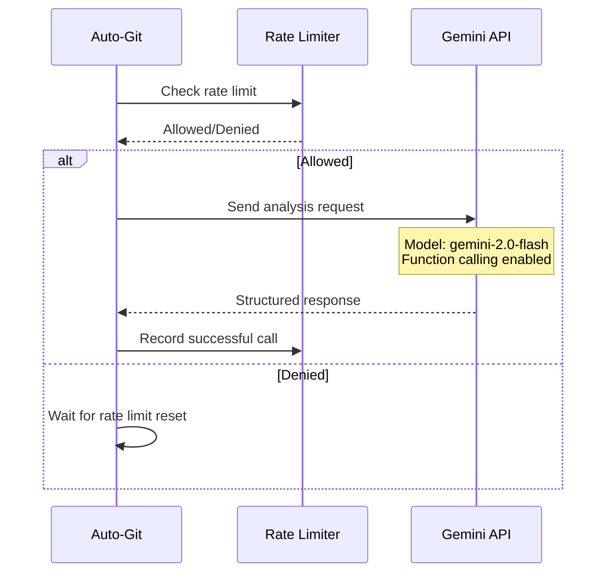

#### Rate Limiting Strategy

**Sliding Window Implementation**
```javascript
class RateLimiter {
  constructor(maxCallsPerMinute = 15) {
    this.maxCalls = maxCallsPerMinute;
    this.calls = [];
    this.windowSize = 60000; // 1 minute in milliseconds
  }
  
  canMakeCall() {
    this.cleanupOldCalls();
    return this.calls.length < this.maxCalls;
  }
  
  recordCall() {
    this.calls.push(Date.now());
  }
  
  cleanupOldCalls() {
    const now = Date.now();
    this.calls = this.calls.filter(
      timestamp => now - timestamp < this.windowSize
    );
  }
}
```

**API Optimization Techniques**
1. **Diff Hash Comparison**: Skip API calls for unchanged content
2. **Request Batching**: Combine multiple small changes
3. **Intelligent Caching**: Cache responses for similar diffs
4. **Graceful Degradation**: Fall back to simple commit messages on API errors

#### Error Handling

**API Error Types and Responses**
```javascript
const handleAPIError = (error) => {
  if (error.status === 429) {
    // Rate limit exceeded
    return 'Rate limit exceeded. Please wait before making more requests.';
  } else if (error.status === 401) {
    // Authentication error
    return 'Invalid API key. Please check your GEMINI_API_KEY.';
  } else if (error.status === 403) {
    // Quota exceeded
    return 'API quota exceeded. Check your Google AI Studio usage.';
  } else if (error.status >= 500) {
    // Server error
    return 'Gemini API temporarily unavailable. Retrying...';
  } else {
    // Other errors
    return `API error: ${error.message}`;
  }
};
```

**Retry Strategy**
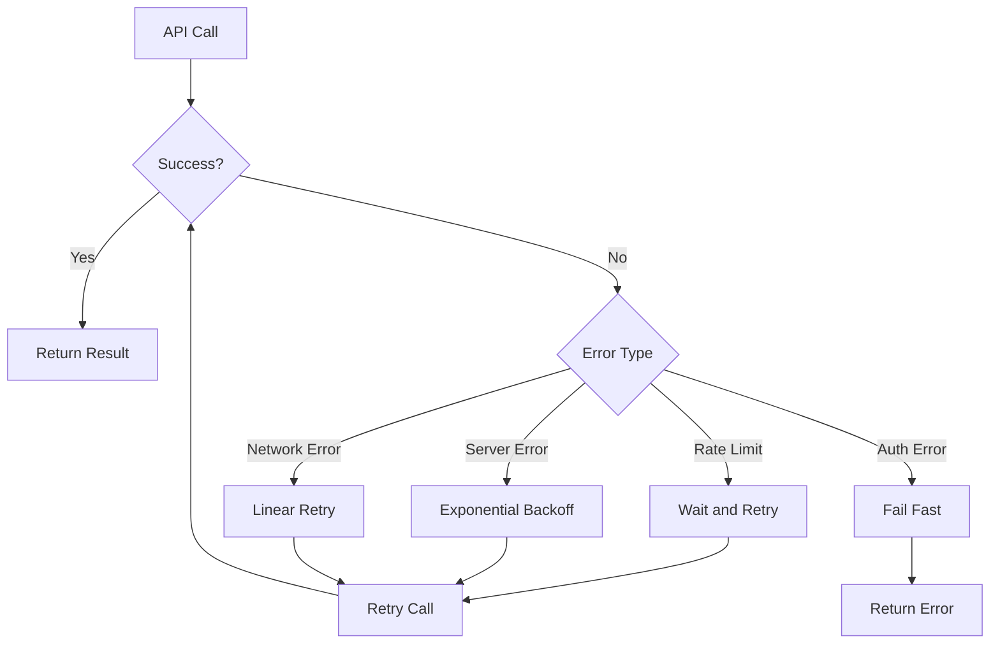

### Security Considerations

#### API Key Management
- **Environment Variables**: Recommended approach
- **Config File**: Local development only
- **Never Commit**: API keys never stored in repository
- **Rotation**: Support for key rotation without restart

#### Data Privacy
- **Minimal Data**: Only git diffs sent to API
- **No Secrets**: Sensitive information filtered out
- **Local Processing**: Most operations performed locally
- **User Control**: 30-second buffer for review/cancellation

#### Request Sanitization
```javascript
function sanitizeErrorText(errorText) {
  return errorText
    .replace(/GEMINI_API_KEY[=:]\s*[\w-]+/gi, 'GEMINI_API_KEY=[REDACTED]')
    .replace(/password[=:]\s*\S+/gi, 'password=[REDACTED]')
    .replace(/token[=:]\s*\S+/gi, 'token=[REDACTED]')
    .replace(/secret[=:]\s*\S+/gi, 'secret=[REDACTED]');
}
```

## 🐛 Troubleshooting

### Common Issues

#### API Key Problems

**Issue**: `GEMINI_API_KEY not found`
```bash
# Solution 1: Set environment variable
export GEMINI_API_KEY="your-api-key"

# Solution 2: Add to shell profile
echo 'export GEMINI_API_KEY="your-api-key"' >> ~/.bashrc
source ~/.bashrc

# Solution 3: Create config file
echo '{"apiKey":"your-api-key"}' > ~/.auto-gitrc.json
```

**Issue**: `Invalid API key`
```bash
# Verify API key format (should start with specific pattern)
echo $GEMINI_API_KEY | head -c 10

# Test API key directly
curl -H "Authorization: Bearer $GEMINI_API_KEY" \
     "https://generativelanguage.googleapis.com/v1/models"

# Get new API key
open "https://aistudio.google.com/app/apikey"
```

#### Git Repository Issues

**Issue**: `Not a git repository`
```bash
# Initialize git repository
git init

# Add remote origin
git remote add origin https://github.com/username/repo.git

# Verify git status
git status
```

**Issue**: `No changes to commit`
```bash
# Check for staged changes
git status

# Check if files are ignored
git check-ignore <filename>

# Force add files
git add . --force
```

#### File Watching Issues

**Issue**: `File watcher not detecting changes`
```bash
# Check watch patterns
auto-git config

# Test with specific patterns
auto-git watch --paths "**/*.js" --verbose

# Platform-specific fixes (macOS)
echo fs.inotify.max_user_watches=524288 | sudo tee -a /etc/sysctl.conf
sudo sysctl -p
```

**Issue**: `Too many files to watch`
```bash
# Optimize watch patterns
auto-git watch --paths "src/**,lib/**" --exclude "node_modules/**"

# Check system limits
cat /proc/sys/fs/inotify/max_user_watches

# Increase limits (Linux)
echo fs.inotify.max_user_watches=524288 | sudo tee -a /etc/sysctl.conf
sudo sysctl -p
```

#### Rate Limiting Issues

**Issue**: `Rate limit exceeded`
```bash
# Check current rate limit status
auto-git debug

# Adjust rate limit in config
echo '{"rateLimiting":{"maxCallsPerMinute":10}}' > ~/.auto-gitrc.json

# Use periodic mode instead
auto-git watch --mode periodic
```

**Issue**: `API quota exceeded`
- Check Google AI Studio usage dashboard
- Upgrade to paid plan if needed
- Implement request batching
- Use local fallback mode

#### Performance Issues

**Issue**: `High CPU usage`
```bash
# Reduce file watching scope
auto-git watch --paths "src/**" --exclude "node_modules/**,dist/**"

# Increase debounce time
echo '{"debounceMs":5000}' > ~/.auto-gitrc.json

# Monitor resource usage
top -p $(pgrep -f auto-git)
```

**Issue**: `Memory leaks`
```bash
# Restart watcher periodically
auto-git watch &
PID=$!
sleep 3600  # Run for 1 hour
kill $PID

# Monitor memory usage
ps -o pid,vsz,rss,comm -p $(pgrep -f auto-git)
```

### Debug Information

#### Comprehensive Diagnostics
```bash
# Run full system check
auto-git debug

# Sample output:
# ✓ Node.js version: 18.19.0
# ✓ Git available: 2.39.2
# ✓ Repository status: Valid
# ✓ API key: Configured
# ✓ Network: Connected
# ✓ File permissions: OK
```

#### Verbose Logging
```bash
# Enable all debug output
export AUTO_GIT_DEBUG=true
export NODE_ENV=development
auto-git watch --verbose

# Debug specific components
export DEBUG=auto-git:watcher
export DEBUG=auto-git:gemini
export DEBUG=auto-git:rate-limiter
```

#### Log Analysis
```bash
# View recent logs (if logging to file)
tail -f ~/.auto-git/logs/auto-git.log

# Search for specific errors
grep -i "error\|failed\|exception" ~/.auto-git/logs/auto-git.log

# Count API calls
grep "Gemini API" ~/.auto-git/logs/auto-git.log | wc -l
```

### Platform-Specific Issues

#### macOS Issues
```bash
# File descriptor limits
launchctl limit maxfiles
ulimit -n 10240

# Keychain access for Git
git config --global credential.helper osxkeychain

# Homebrew Node.js issues
brew uninstall node
brew install node@18
brew link node@18
```

#### Windows Issues
```powershell
# PowerShell execution policy
Set-ExecutionPolicy -ExecutionPolicy RemoteSigned -Scope CurrentUser

# Windows file path issues
npm config set script-shell "C:\\Program Files\\git\\bin\\bash.exe"

# Long path support
git config --global core.longpaths true
```

#### Linux Issues
```bash
# File watcher limits
echo fs.inotify.max_user_watches=524288 | sudo tee -a /etc/sysctl.conf
sudo sysctl -p

# Permission issues
sudo chown -R $USER:$USER ~/.npm
sudo chown -R $USER:$USER ~/.auto-gitrc.json

# SELinux issues (if applicable)
sudo setsebool -P allow_execheap 1
```

### Recovery Procedures

#### Reset Configuration
```bash
# Remove user configuration
rm ~/.auto-gitrc.json

# Clear npm cache
npm cache clean --force

# Reinstall globally
npm uninstall -g @sbeeredd04/auto-git
npm install -g @sbeeredd04/auto-git
```

#### Emergency Cleanup
```bash
# Stop all auto-git processes
pkill -f auto-git

# Clean up temporary files
rm -rf /tmp/auto-git-*

# Reset Git state (if needed)
git reset --hard HEAD
git clean -fd
```

#### Data Recovery
```bash
# Recover lost commits
git reflog
git cherry-pick <commit-hash>

# Recover from hard reset
git reflog
git reset --hard HEAD@{1}

# Check backup commits
git log --all --oneline | head -20
```

### Getting Help

#### Community Support
- **GitHub Issues**: [Report bugs and request features](https://github.com/sbeeredd04/auto-git/issues)
- **Discussions**: [Community discussions and Q&A](https://github.com/sbeeredd04/auto-git/discussions)
- **Documentation**: [Comprehensive guides and examples](https://github.com/sbeeredd04/auto-git#readme)

#### Professional Support
- **Enterprise Support**: Contact for enterprise deployments
- **Custom Integration**: Professional services for custom implementations
- **Training**: Team training and onboarding services

## 🤝 Contributing

We welcome contributions to Auto-Git! This section provides comprehensive guidelines for contributing to the project.

### Getting Started

#### Prerequisites for Contributors
- Node.js ≥18.0.0
- Git ≥2.0.0
- Google Gemini API key (for testing)
- Familiarity with ES6+ JavaScript
- Understanding of Git workflows

#### Initial Setup
```bash
# Fork the repository on GitHub
# Then clone your fork
git clone https://github.com/your-username/auto-git.git
cd auto-git

# Add upstream remote
git remote add upstream https://github.com/sbeeredd04/auto-git.git

# Install dependencies
npm install

# Set up development environment
npm link
export AUTO_GIT_DEBUG=true
export GEMINI_API_KEY="your-development-api-key"
```

### Development Workflow

#### Branch Strategy
```bash
# Create feature branch from main
git checkout main
git pull upstream main
git checkout -b feature/your-feature-name

# For bug fixes
git checkout -b fix/issue-description

# For documentation
git checkout -b docs/section-update
```

#### Code Development Process
1. **Understand the Architecture**: Review the codebase structure
2. **Write Tests**: Create tests for new functionality (when applicable)
3. **Implement Changes**: Make minimal, focused changes
4. **Test Thoroughly**: Test on multiple platforms
5. **Document Changes**: Update relevant documentation
6. **Commit Properly**: Use conventional commit format

#### Testing Your Changes
```bash
# Test basic functionality
auto-git debug
auto-git config
auto-git commit --verbose

# Test new features
auto-git watch --mode intelligent --verbose

# Test edge cases
# - Large file changes
# - Network connectivity issues
# - API rate limiting
# - Invalid configurations

# Test on different platforms (if possible)
# - macOS
# - Windows
# - Linux (Ubuntu/CentOS)
```

### Code Standards

#### JavaScript Style Guide
```javascript
// Use ES6+ modules
import { someFunction } from './module.js';

// Prefer const over let, avoid var
const config = getConfig();
let counter = 0;

// Use async/await over Promises
async function processChanges() {
  try {
    const result = await analyzeChanges();
    return result;
  } catch (error) {
    logger.error('Failed to process changes', error);
    throw error;
  }
}

// Document complex functions
/**
 * Analyzes git diff and determines commit significance
 * @param {string} diffText - Git diff output
 * @param {Object} options - Analysis options
 * @returns {Promise<Object>} Analysis result with decision and reasoning
 */
async function analyzeCommitSignificance(diffText, options = {}) {
  // Implementation
}
```

#### Commit Message Format
We follow the [Conventional Commits](https://www.conventionalcommits.org/) specification:

```
type(scope): brief description

Optional longer description explaining the change,
its motivation, and any breaking changes.

Closes #123
```

**Types:**
- `feat`: New features
- `fix`: Bug fixes
- `docs`: Documentation changes
- `style`: Code style changes (formatting, etc.)
- `refactor`: Code refactoring without functional changes
- `test`: Adding or updating tests
- `chore`: Maintenance tasks, dependency updates

**Examples:**
```bash
feat(ai): add intelligent commit significance analysis

- Implement function calling for structured AI analysis
- Add significance levels (high/medium/low)
- Include 30-second user buffer for commit cancellation

Closes #45

fix(watcher): resolve file watching issues on Windows

- Fix path normalization for Windows file systems
- Handle long path names properly
- Improve error handling for file access permissions

Closes #67

docs(readme): add comprehensive API integration guide

- Document Gemini API setup and configuration
- Add troubleshooting section for common API issues
- Include rate limiting and optimization strategies
```

### Types of Contributions

#### 🐛 Bug Reports
When reporting bugs, please include:

```markdown
## Bug Description
Brief description of the issue

## Steps to Reproduce
1. Run command: `auto-git watch --mode intelligent`
2. Create file: `echo "test" > test.js`
3. Observe behavior: No commit generated

## Expected Behavior
AI should analyze the change and make a commit decision

## Actual Behavior
File change is detected but no AI analysis occurs

## Environment
- OS: macOS 13.4
- Node.js: 18.16.0
- Auto-Git: 3.10.0
- Git: 2.39.2

## Additional Context
- API key is configured correctly
- Other commands work fine
- No error messages in verbose mode

## Debug Output
```bash
auto-git debug
# Paste debug output here
```

#### ✨ Feature Requests
For new features, please provide:

```markdown
## Feature Description
Add support for custom AI prompts for commit message generation

## Use Case
As a developer working on specialized projects (e.g., scientific computing),
I want to customize the AI prompts to generate domain-specific commit messages
that follow my project's conventions.

## Proposed Solution
Add a `prompts` section to the configuration file:

```json
{
  "prompts": {
    "commitMessage": "Generate a commit message for scientific computing project...",
    "analysis": "Analyze changes in the context of..."
  }
}
```

## Alternatives Considered
- Environment variables for prompts
- Command-line flags for custom prompts

## Additional Context
This would help teams maintain consistent commit message styles
across different types of projects.
```

#### 📚 Documentation Improvements
- Fix typos or grammatical errors
- Add missing examples or use cases
- Improve clarity of existing sections
- Add new troubleshooting scenarios
- Create video tutorials or guides

#### 🔧 Code Contributions

**Small Changes (< 20 lines)**
- Bug fixes
- Typo corrections
- Minor feature additions
- Configuration improvements

**Medium Changes (20-100 lines)**
- New utility functions
- Enhanced error handling
- Performance optimizations
- Test additions

**Large Changes (> 100 lines)**
- New major features
- Architecture changes
- API integrations
- Significant refactoring

### Pull Request Process

#### Before Submitting
1. **Test Thoroughly**: Ensure your changes work as expected
2. **Update Documentation**: Add or update relevant documentation
3. **Check for Breaking Changes**: Ensure backward compatibility
4. **Review Your Code**: Self-review for quality and consistency
5. **Sync with Upstream**: Rebase on latest main branch

#### Submitting a Pull Request
```bash
# Ensure your branch is up to date
git checkout main
git pull upstream main
git checkout your-feature-branch
git rebase main

# Push your changes
git push origin your-feature-branch

# Create PR through GitHub interface
```

#### Pull Request Template
```markdown
## Description
Brief description of the changes made.

## Type of Change
- [ ] Bug fix (non-breaking change which fixes an issue)
- [ ] New feature (non-breaking change which adds functionality)
- [ ] Breaking change (fix or feature that would cause existing functionality to not work as expected)
- [ ] Documentation update

## Testing
- [ ] Tested on macOS
- [ ] Tested on Windows
- [ ] Tested on Linux
- [ ] All existing functionality works
- [ ] New functionality works as expected

## Checklist
- [ ] My code follows the project's style guidelines
- [ ] I have performed a self-review of my own code
- [ ] I have commented my code, particularly in hard-to-understand areas
- [ ] I have made corresponding changes to the documentation
- [ ] My changes generate no new warnings
- [ ] I have tested my changes thoroughly

## Screenshots (if applicable)
Include screenshots for UI changes or terminal output modifications.

## Related Issues
Closes #123
Related to #456
```

#### Review Process
1. **Automated Checks**: Basic validation (when implemented)
2. **Maintainer Review**: Code quality and architecture review
3. **Community Feedback**: Open for community comments
4. **Testing**: Verification on different platforms
5. **Merge**: After approval and successful tests

### Community Guidelines

#### Code of Conduct
- **Be Respectful**: Treat all contributors with respect
- **Be Inclusive**: Welcome developers of all skill levels
- **Be Constructive**: Provide helpful feedback and suggestions
- **Be Patient**: Allow time for responses and reviews
- **Be Collaborative**: Work together toward common goals

#### Communication Channels
- **GitHub Issues**: Bug reports and feature requests
- **GitHub Discussions**: General questions and community chat
- **Pull Request Comments**: Code-specific discussions
- **Email**: Direct contact for sensitive issues

#### Recognition
Contributors are recognized in the following ways:
- **Contributors List**: Added to repository contributors
- **Release Notes**: Mentioned in version release notes
- **Special Thanks**: Highlighted for significant contributions
- **Maintainer Status**: Invited for ongoing substantial contributions

### Development Resources

#### Useful Commands
```bash
# Development testing
npm run dev-test

# Code formatting (when implemented)
npm run format

# Linting (when implemented)
npm run lint

# Documentation generation
npm run docs

# Release preparation
npm run prepare-release
```

#### Debugging Resources
```bash
# Enable comprehensive debugging
export DEBUG=auto-git:*
export AUTO_GIT_DEBUG=true
export NODE_ENV=development

# Memory and performance profiling
node --inspect --inspect-brk bin/auto-git.js watch

# API request debugging
export DEBUG=auto-git:gemini,auto-git:rate-limiter
```

#### Learning Resources
- [Node.js Documentation](https://nodejs.org/docs/)
- [Google Gemini AI Documentation](https://ai.google.dev/docs)
- [Conventional Commits](https://www.conventionalcommits.org/)
- [Git Best Practices](https://git-scm.com/book)
- [JavaScript Style Guide](https://github.com/airbnb/javascript)

### Release Process

#### Version Management
We follow [Semantic Versioning](https://semver.org/):
- **MAJOR**: Breaking changes
- **MINOR**: New features (backward compatible)
- **PATCH**: Bug fixes (backward compatible)

#### Release Checklist
- [ ] Update version in `package.json`
- [ ] Update `CHANGELOG.md`
- [ ] Update documentation
- [ ] Test on all supported platforms
- [ ] Create release notes
- [ ] Tag release
- [ ] Publish to npm
- [ ] Update GitHub release

Thank you for contributing to Auto-Git! Your contributions help make intelligent Git automation accessible to developers worldwide.

---

## 📄 License

MIT License - see [LICENSE](LICENSE) file for details.

## 🙏 Acknowledgments

- **Google Gemini Team** - For providing the powerful AI capabilities
- **Open Source Community** - For the excellent tools and libraries
- **Contributors** - For their valuable contributions and feedback

---

**Auto-Git v3.10.0** - Transforming Git workflows with intelligent automation