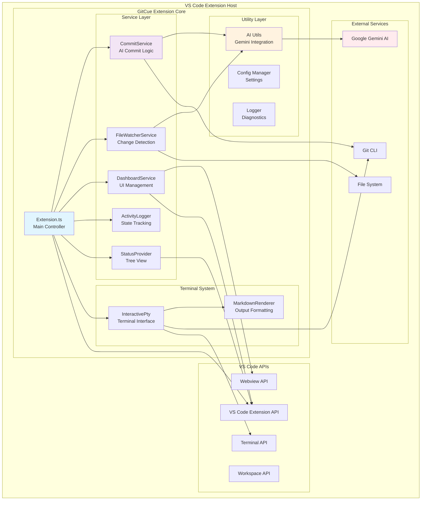
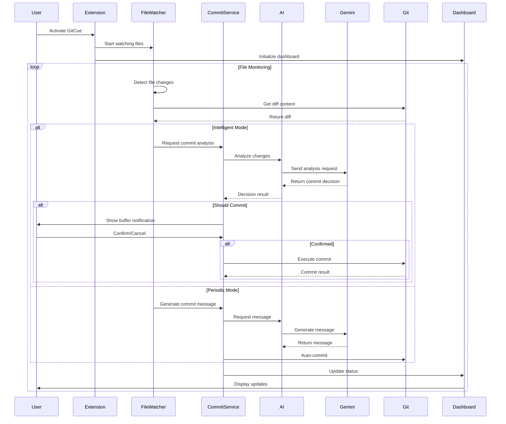
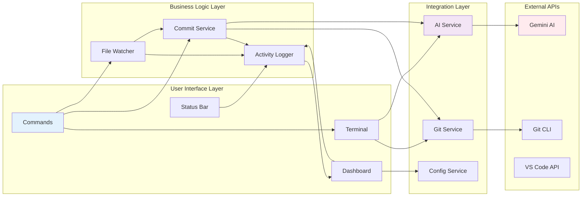
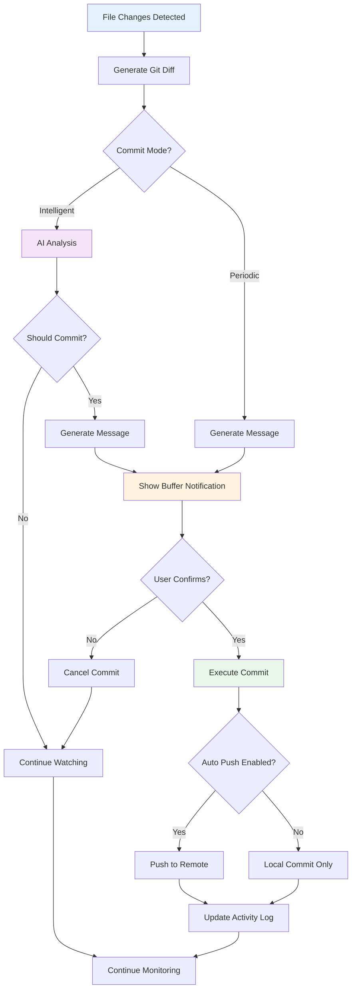
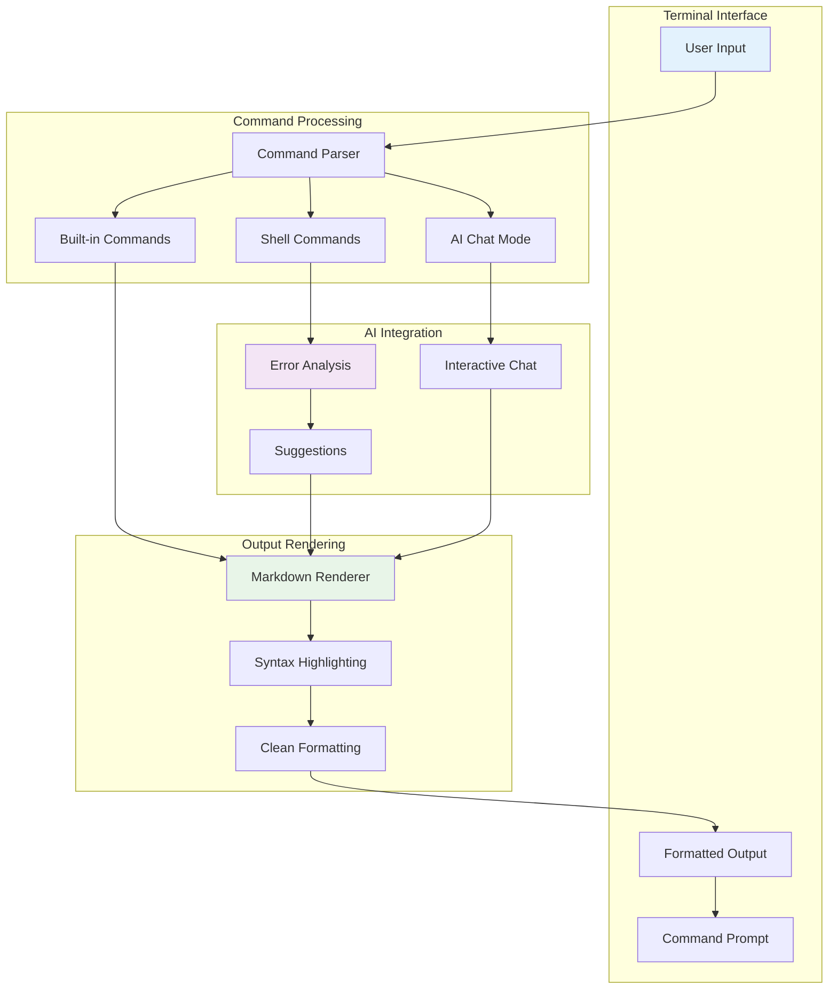
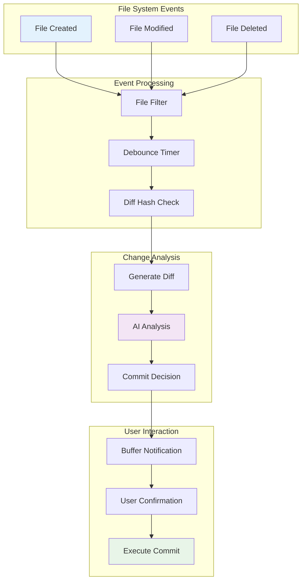
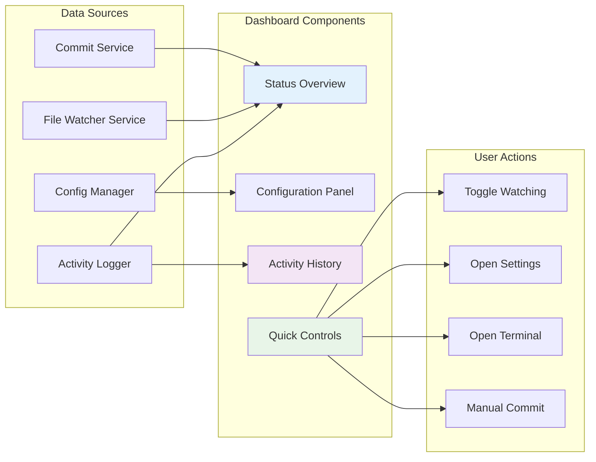
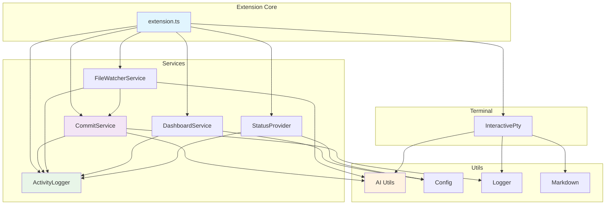

# 🎯 GitCue - AI-Powered Git Assistant for VS Code

[](https://marketplace.visualstudio.com/items?itemName=sbeeredd04.gitcue)
[](https://code.visualstudio.com/)
[](https://ai.google.dev/)
[](https://opensource.org/licenses/MIT)

> **Your intelligent Git companion with enhanced interactive sidebar, AI-crafted commit messages, smart repository management, and seamless VS Code integration for effortless version control.**

GitCue transforms your Git workflow with an enhanced interactive sidebar featuring actionable buttons, real-time status cards, and one-click actions. It intelligently analyzes code changes, generates meaningful commit messages using Google's Gemini AI, and provides a professional UI with improved space utilization and modern design.

---

## 🚀 What's New in v4.0.0

### 🎨 Enhanced Interactive Sidebar
- **Smart Status Cards**: Real-time GitCue status, file changes, and repository overview
- **One-Click Actions**: Direct commit, terminal access, and settings from sidebar
- **Professional UI**: Modern interface with proper icons and organized sections
- **Better Space Utilization**: Actionable buttons and interactive elements instead of plain text
- **Enhanced Activity Feed**: Improved activity tracking with visual indicators

### 🔧 Improved User Experience
- **Intuitive Navigation**: Quick access to all GitCue features
- **Visual Feedback**: Clear status indicators and tooltips
- **Responsive Design**: Better organization with collapsible sections
- **Interactive Elements**: Clickable items for immediate actions

### 📊 Smart Repository Management
- **Repository Info Card**: Branch details, commit counts, and change status
- **Configuration Panel**: Easy access to all settings with inline actions
- **Activity Summary**: Enhanced tracking with categorized activities

---

## 🏗️ Architecture Overview

GitCue follows a modular, service-oriented architecture designed for scalability, maintainability, and intelligent automation. The extension consists of interconnected services that work together to provide seamless Git automation.

### 🔧 High-Level System Architecture



### 🔄 Data Flow Architecture



### 🧩 Component Interaction Diagram



---

## ✨ What's New in v0.3.8

### 🎨 **Enhanced Terminal Experience**
- **Professional Markdown Rendering**: Clean, styled output with proper formatting for headers, code blocks, and lists
- **Concise AI Responses**: Dramatically reduced AI response length (93% reduction) for faster, more focused suggestions
- **Git Internal File Filtering**: Smart filtering to ignore Git internal files like `index.lock`, preventing duplicate notifications
- **Command Palette Integration**: Access GitCue commands via Ctrl+Shift+P (Command Palette)

### 🤖 **Improved AI Intelligence**
- **Ultra-Concise Error Analysis**: AI responses now under 200 words, focusing on actionable solutions
- **Enhanced Commit Message Generation**: Better AI-powered commit messages with proper staging
- **Smart File Change Detection**: Accurate file counting without Git noise
- **Professional Output Formatting**: Clean terminal display with visual separators and status indicators

### 🚀 **New Features**
- **Dashboard Commands**: "GitCue: Open AI Terminal" and "GitCue: Dashboard" now available in Command Palette
- **Activity History Tracking**: Real-time monitoring of file changes, commits, and AI analysis
- **Enhanced Error Recovery**: Better error handling with retry logic and user-friendly messages
- **Cross-Platform Compatibility**: Improved shell support for Windows and Unix systems

---

## 🚀 Core Features

### 🤖 **AI-Powered Commit Messages**



**Features**:
- Intelligent analysis of your code changes using Google Gemini AI
- Customizable commit modes (periodic/intelligent)
- Preview and edit capabilities before committing
- Configurable buffer time to cancel unwanted commits
- Automatic push capabilities with remote validation

### 🖥️ **AI-Enhanced Interactive Terminal**



**Enhanced Features in v0.3.8**:
- **Full Terminal Navigation**: Use `cd`, `pwd`, and other shell commands seamlessly
- **Cross-Platform Support**: Works flawlessly on Windows, macOS, and Linux
- **Professional Markdown Rendering**: Clean, styled output with proper formatting
- **Visual Separators**: Clear borders and status indicators for better readability
- **Git Syntax Highlighting**: Enhanced display for Git commands and output

**Core Terminal Features**:
- Execute any command with real-time output capture
- Persistent command history across VS Code sessions
- Arrow key navigation (↑↓) through command history
- Smart error analysis with AI-powered suggestions
- Built-in commands: `history`, `clear`, `config`, `ai`, `help`, `exit`, `cd`, `pwd`

### 👁️ **Smart File Watching**



**Features**:
- Configurable watch patterns and intelligent ignore rules
- Debounced commits to prevent spam from rapid file changes
- Buffer notifications with cancellation options
- Support for both intelligent and periodic commit modes
- Real-time activity tracking and logging

### 📊 **Intuitive Dashboard**



**Features**:
- Real-time status monitoring with live updates
- Comprehensive configuration management interface
- Activity history with detailed logging
- Quick access to all GitCue features and commands
- System health indicators and diagnostics

---

## 🎮 Quick Start Guide

### 1. **Installation**
```bash
# From VS Code Marketplace
ext install sbeeredd04.gitcue

# Or install from VSIX file
code --install-extension gitcue-0.3.8.vsix
```

### 2. **Setup API Key**
1. Get your Gemini API key from [Google AI Studio](https://makersuite.google.com/app/apikey)
2. Open VS Code Settings (`Ctrl+,` or `Cmd+,`)
3. Search for "GitCue" and set your API key in `gitcue.geminiApiKey`

### 3. **Start Using GitCue**

#### **AI Commit** (`Ctrl+Alt+C` / `Cmd+Alt+C`)
```bash
# Make changes to your code
# Press Ctrl+Alt+C (or Cmd+Alt+C on Mac)
# Review the AI-generated commit message
# Commit with one click!
```

#### **AI Terminal** (`Ctrl+Alt+T` / `Cmd+Alt+T`)
```bash
# Open AI-powered terminal
gitcue> git status
gitcue> ai  # Enter AI chat mode
ai-chat> explain git rebase vs merge
ai-chat> exit  # Exit chat mode
gitcue> exit  # Exit terminal
```

#### **Dashboard** (`Ctrl+Shift+P` → "GitCue: Open Dashboard")
Access the centralized control panel for comprehensive GitCue management.

---

## 📋 Commands & Shortcuts

| Command | Shortcut | Description |
|---------|----------|-------------|
| **GitCue: AI Commit** | `Ctrl+Alt+C` / `Cmd+Alt+C` | Generate and preview AI commit |
| **GitCue: Open AI Terminal** | `Ctrl+Alt+T` / `Cmd+Alt+T` | Launch interactive AI terminal |
| **GitCue: Toggle Auto-Watch** | `Ctrl+Alt+W` / `Cmd+Alt+W` | Start/stop file watching |
| **GitCue: Open Dashboard** | `Ctrl+Shift+P` → "GitCue: Dashboard" | Open GitCue control panel |
| **GitCue: Cancel Commit** | `Ctrl+Alt+X` / `Cmd+Alt+X` | Cancel pending commit |

### **Terminal Built-in Commands**
| Command | Description |
|---------|-------------|
| `ai` | Enter interactive AI chat mode |
| `history` | Show command history with syntax highlighting |
| `config` | Display GitCue configuration |
| `help` | Show comprehensive help |
| `clear` | Clear terminal screen |
| `exit` | Exit interactive session or AI chat mode |
| `cd <path>` | Change directory |
| `pwd` | Print current directory |

---

## ⚙️ Configuration

### **Core Settings**
```json
{
  "gitcue.geminiApiKey": "your-api-key-here",
  "gitcue.commitMode": "intelligent",
  "gitcue.autoPush": true,
  "gitcue.enableNotifications": true,
  "gitcue.autoWatch": false
}
```

### **File Watching Configuration**
```json
{
  "gitcue.watchPaths": ["src/**", "*.js", "*.ts", "*.py"],
  "gitcue.debounceMs": 30000,
  "gitcue.bufferTimeSeconds": 30
}
```

### **AI & Rate Limiting**
```json
{
  "gitcue.maxCallsPerMinute": 15,
  "gitcue.interactiveOnError": true,
  "gitcue.enableSuggestions": true
}
```

### **Interactive Terminal**
```json
{
  "gitcue.sessionPersistence": true,
  "gitcue.maxHistorySize": 100,
  "gitcue.terminalVerbose": false
}
```

---

## 🏗️ Source Code Architecture

The GitCue extension is organized into several key directories, each serving a specific purpose in the overall architecture:

### 📁 Source Directory Structure

```
src/
├── 📄 extension.ts           # Main extension entry point and controller
├── 📁 services/             # Core business logic services
│   ├── activityLogger.ts    # Activity tracking and state management
│   ├── commitService.ts     # AI-powered commit logic
│   ├── dashboardService.ts  # Webview dashboard management
│   ├── fileWatcherService.ts # File system monitoring
│   ├── index.ts            # Service exports
│   └── statusProvider.ts   # VS Code tree view provider
├── 📁 terminal/            # Interactive terminal implementation
│   └── interactivePty.ts  # Pseudoterminal with AI capabilities
├── 📁 test/               # Test files and test utilities
│   └── extension.test.ts  # Extension test suite
├── 📁 types/              # TypeScript type definitions
│   ├── index.ts          # Type exports
│   └── interfaces.ts     # Core interfaces and types
└── 📁 utils/              # Utility functions and helpers
    ├── ai.ts             # AI integration and rate limiting
    ├── config.ts         # Configuration management
    ├── logger.ts         # Logging and output utilities
    └── markdown.ts       # Markdown rendering utilities
```

### 🔗 Service Dependencies



For detailed documentation of each directory and its components, see the individual README files:

- [📁 Services](src/services/README.md) - Core business logic and service implementations
- [📁 Terminal](src/terminal/README.md) - Interactive terminal and pseudoterminal implementation
- [📁 Types](src/types/README.md) - TypeScript interfaces and type definitions
- [📁 Utils](src/utils/README.md) - Utility functions and helper modules
- [📁 Test](src/test/README.md) - Test files and testing utilities

---

## 🐛 Troubleshooting

### **Common Issues**

#### API Key Problems
```bash
# Check if API key is set
code --list-extensions | grep gitcue
# Open settings and verify gitcue.geminiApiKey

# Test API connection
# Open GitCue terminal and run: test-ai
```

#### File Watching Issues
```bash
# Check watch patterns in settings
# Verify file permissions
# Restart VS Code if needed
```

#### Terminal Issues
```bash
# Ensure workspace is open
# Check VS Code output panel for errors
# Restart extension if needed
```

### **Debug Mode**
Enable verbose logging by setting `gitcue.terminalVerbose` to `true` in VS Code settings.

---

## 🤝 Contributing

We welcome contributions to GitCue! Here's how you can help:

### **Development Setup**
```bash
# Clone the repository
git clone https://github.com/sbeeredd04/Auto-Commit.git
cd Auto-Commit/gitcue

# Install dependencies
npm install

# Compile TypeScript
npm run compile

# Package extension for testing
npm run package
```

### **Architecture Guidelines**
- Follow the service-oriented architecture pattern
- Maintain separation of concerns between modules
- Use proper TypeScript types and interfaces
- Write comprehensive tests for new features
- Update documentation when adding new functionality

### **Pull Request Process**
1. Fork the repository
2. Create a feature branch
3. Make your changes with proper documentation
4. Test thoroughly
5. Submit a pull request with detailed description

---

## 📄 License

This project is licensed under the **MIT License** - see the [LICENSE](LICENSE) file for details.

---

## 🙏 Acknowledgments

- **Google Gemini AI** - For powering our intelligent features
- **VS Code Team** - For the excellent extension API
- **Open Source Community** - For inspiration and contributions

---

<div align="center">

**Made with ❤️ for Developers**


**GitCue v0.3.8** - Your AI-Powered Git Assistant

[⭐ Star on GitHub](https://github.com/sbeeredd04/Auto-Commit) | [🐛 Report Issues](https://github.com/sbeeredd04/Auto-Commit/issues) | [💬 Discussions](https://github.com/sbeeredd04/Auto-Commit/discussions)

**Happy Coding! 🚀**

</div>
