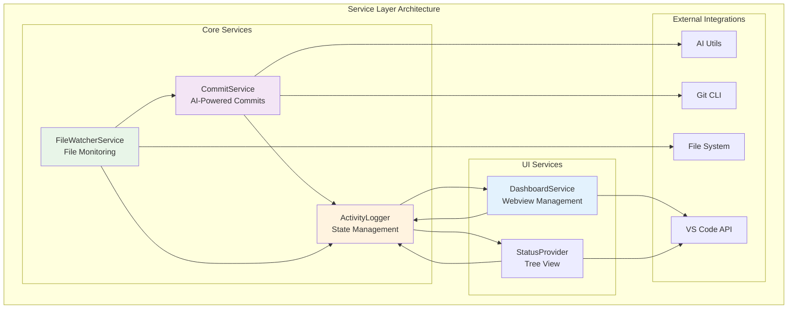
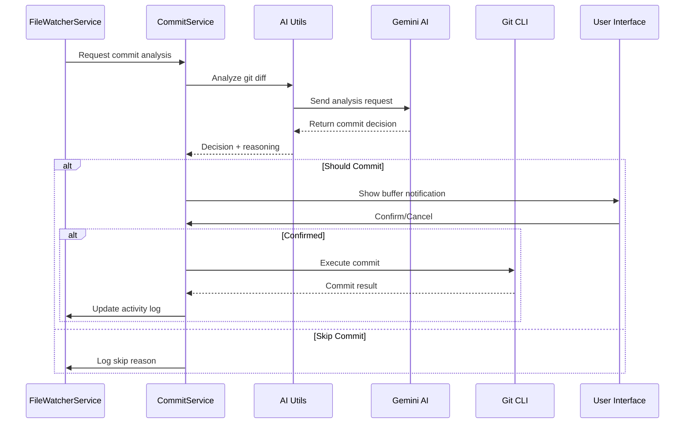
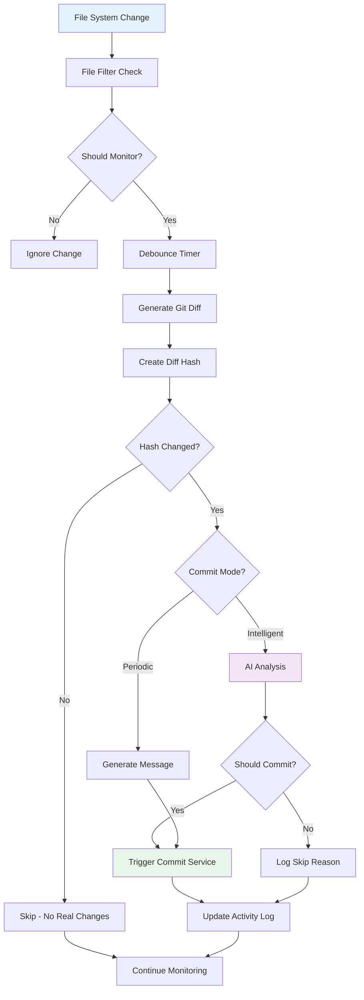
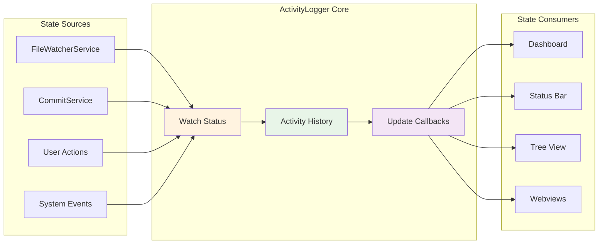
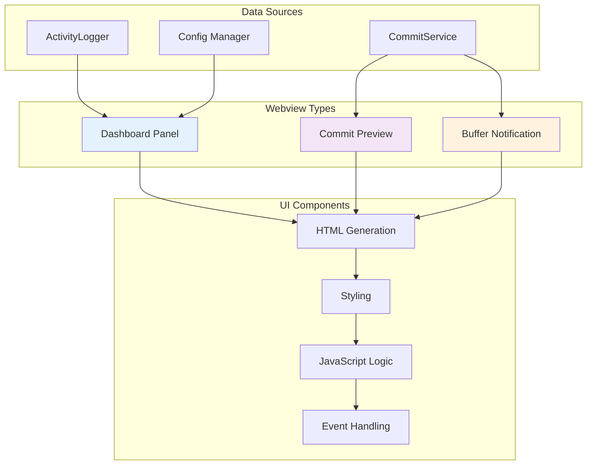
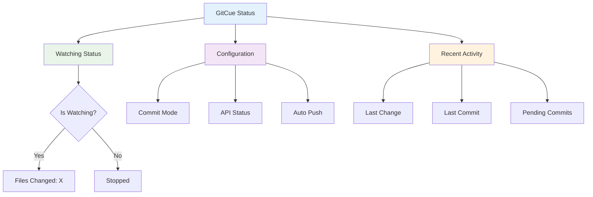
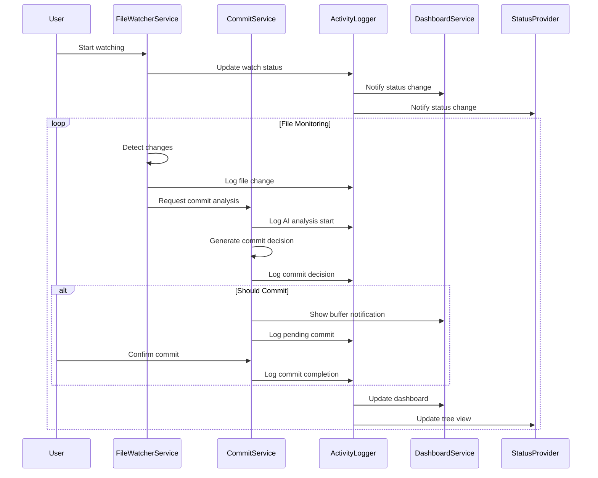
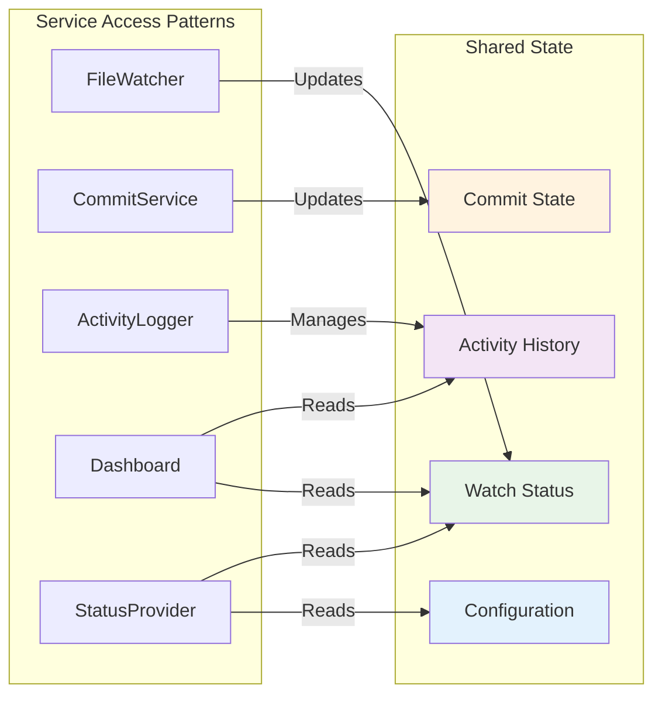

# 🔧 Services Directory

The Services directory contains the core business logic of GitCue, implementing the main functionality as modular, reusable services. Each service has a specific responsibility and follows the singleton pattern for global state management.

## 🏗️ Architecture Overview



## 📋 Service Overview

| Service | Purpose | Key Features |
|---------|---------|--------------|
| **CommitService** | AI-powered commit generation and execution | Intelligent analysis, message generation, buffer notifications |
| **FileWatcherService** | File system monitoring and change detection | Debounced watching, Git diff analysis, intelligent filtering |
| **ActivityLogger** | Centralized state and activity tracking | Real-time logging, state management, dashboard updates |
| **DashboardService** | Webview UI management | Dashboard panels, commit previews, buffer notifications |
| **StatusProvider** | VS Code tree view integration | Status display, configuration overview, quick actions |

---

## 🤖 CommitService

**Purpose**: Manages AI-powered commit generation, analysis, and execution with intelligent decision-making capabilities.

### 🔄 Service Architecture



### 🎯 Key Features

#### **Intelligent Commit Analysis**
```typescript
// AI-driven commit decision making
async analyzeChangesWithAI(workspacePath: string): Promise<{
  shouldCommit: boolean;
  reason: string;
  significance: string;
}> {
  // Analyzes git diff using Gemini AI
  // Returns structured decision with reasoning
}
```

#### **Commit Message Generation**
```typescript
// Generate contextual commit messages
async generateCommitMessage(workspacePath: string, config: GitCueConfig): Promise<string> {
  // Uses AI to create meaningful commit messages
  // Follows conventional commit standards
}
```

#### **Buffer Notification System**
- **30-second buffer** for user review and cancellation
- **Real-time countdown** with cancel options
- **Webview integration** for rich UI experience

### 🔧 Methods

| Method | Description | Parameters |
|--------|-------------|------------|
| `commitWithPreview()` | Generate commit with user preview | `workspacePath`, `config` |
| `commitWithBuffer()` | Execute commit with buffer period | `workspacePath`, `config` |
| `analyzeChangesWithAI()` | AI analysis of git changes | `workspacePath` |
| `generateCommitMessage()` | Generate AI commit message | `workspacePath`, `config` |
| `cancelBufferedCommit()` | Cancel pending commit | None |

---

## 👁️ FileWatcherService

**Purpose**: Monitors file system changes and orchestrates intelligent commit decisions based on detected modifications.

### 🔄 File Watching Flow



### 🎯 Key Features

#### **Smart File Filtering**
```typescript
private shouldIgnoreFile(fileName: string, filePath: string): boolean {
  // Filters out Git internal files, node_modules, build artifacts
  // Configurable ignore patterns
  // Smart Git file detection (index.lock, etc.)
}
```

#### **Debounced Change Detection**
- **Configurable debounce timing** (default: 30 seconds)
- **Change aggregation** to prevent spam commits
- **Diff hash comparison** to detect real changes

#### **Intelligent Git Integration**
```typescript
private createDiffHash(diffText: string): string | null {
  // Creates hash of git diff content
  // Prevents redundant AI calls for unchanged content
  // Optimizes API usage and rate limiting
}
```

### 🔧 Methods

| Method | Description | Parameters |
|--------|-------------|------------|
| `startWatching()` | Begin file system monitoring | None |
| `stopWatching()` | Stop file system monitoring | None |
| `handleFileChange()` | Process detected file changes | `uri`, `changeTracker`, `lastDiffHash` |
| `shouldIgnoreFile()` | Check if file should be ignored | `fileName`, `filePath` |
| `createDiffHash()` | Generate hash of git diff | `diffText` |

---

## 📊 ActivityLogger

**Purpose**: Centralized state management and activity tracking system that maintains real-time status and coordinates between services.

### 🔄 State Management Architecture



### 🎯 Key Features

#### **Real-Time State Tracking**
```typescript
interface WatchStatus {
  isWatching: boolean;
  filesChanged: number;
  lastChange: string;
  lastCommit: string;
  pendingCommit: boolean;
  aiAnalysisInProgress: boolean;
  activityHistory: ActivityLogEntry[];
  changedFiles: Set<string>;
}
```

#### **Activity History Management**
```typescript
interface ActivityLogEntry {
  timestamp: string;
  type: 'file_change' | 'ai_analysis' | 'commit' | 'error' | 'watch_start' | 'watch_stop';
  message: string;
  details?: string;
}
```

#### **Observer Pattern Implementation**
```typescript
setUpdateCallback(callback: () => void): void {
  // Registers callbacks for real-time UI updates
  // Notifies all subscribers when state changes
}
```

### 🔧 Methods

| Method | Description | Parameters |
|--------|-------------|------------|
| `updateWatchStatus()` | Update current watch state | `updates: Partial<WatchStatus>` |
| `logActivity()` | Log new activity entry | `type`, `message`, `details?` |
| `setFileChanged()` | Record file change event | `fileName`, `filePath` |
| `setCommitCompleted()` | Record successful commit | `message`, `shouldPush` |
| `setPendingCommit()` | Update pending commit status | `pending: boolean` |
| `setAiAnalysisInProgress()` | Update AI analysis status | `inProgress: boolean` |

---

## 🖥️ DashboardService

**Purpose**: Manages webview panels for dashboard, commit previews, and buffer notifications with rich HTML interfaces.

### 🔄 Webview Architecture



### 🎯 Key Features

#### **Dashboard Panel**
- **Real-time status monitoring** with live updates
- **Configuration management** interface
- **Activity history** with detailed logging
- **Quick action buttons** for common tasks

#### **Commit Preview**
- **AI-generated message preview** with edit capabilities
- **Git status display** showing staged/unstaged changes
- **One-click commit execution** with confirmation
- **Push options** and configuration

#### **Buffer Notification**
- **Countdown timer** with visual progress
- **Cancel functionality** with immediate feedback
- **Commit details** and reasoning display
- **Auto-dismiss** after timeout

### 🔧 Methods

| Method | Description | Parameters |
|--------|-------------|------------|
| `createDashboard()` | Create main dashboard panel | `onMessage` callback |
| `updateDashboards()` | Update all dashboard instances | `state: DashboardState` |
| `createCommitPreview()` | Create commit preview panel | `options`, `onMessage` |
| `createBufferNotification()` | Create buffer notification | `options` |

---

## 🌳 StatusProvider

**Purpose**: Implements VS Code tree view provider for GitCue status display in the sidebar with hierarchical information.

### 🔄 Tree View Structure



### 🎯 Key Features

#### **Hierarchical Status Display**
```typescript
getChildren(element?: GitCueStatusItem): Thenable<GitCueStatusItem[]> {
  // Builds tree structure based on current state
  // Shows watching status, configuration, and activity
}
```

#### **Real-Time Updates**
```typescript
refresh(): void {
  // Triggers tree view refresh
  // Updates all status indicators
  // Reflects current GitCue state
}
```

#### **Interactive Elements**
- **Click-to-action** tree items
- **Status indicators** with icons
- **Tooltip information** for detailed context
- **Dynamic content** based on current state

### 🔧 Methods

| Method | Description | Parameters |
|--------|-------------|------------|
| `refresh()` | Refresh entire tree view | None |
| `getTreeItem()` | Get tree item representation | `element: GitCueStatusItem` |
| `getChildren()` | Get child items for element | `element?: GitCueStatusItem` |
| `getConfig()` | Get current GitCue configuration | None |
| `getWatchingStatus()` | Get current watching state | None |

---

## 🔗 Service Interactions

### Cross-Service Communication Flow



### Shared State Management



---

## 🛠️ Development Guidelines

### **Service Design Principles**

1. **Single Responsibility**: Each service has one clear purpose
2. **Singleton Pattern**: Global state management with single instances
3. **Observer Pattern**: Event-driven updates and notifications
4. **Dependency Injection**: Services depend on abstractions, not concretions
5. **Error Isolation**: Each service handles its own errors gracefully

### **Adding New Services**

```typescript
export class NewService {
  private static instance: NewService;
  
  private constructor() {
    // Initialize service
  }
  
  static getInstance(): NewService {
    if (!NewService.instance) {
      NewService.instance = new NewService();
    }
    return NewService.instance;
  }
  
  // Service methods...
}
```

### **Service Communication Best Practices**

```typescript
// ✅ Good: Use ActivityLogger for state management
const activityLogger = ActivityLogger.getInstance();
activityLogger.logActivity('commit', 'Commit completed successfully');

// ✅ Good: Use callback pattern for UI updates
activityLogger.setUpdateCallback(() => {
  // Update UI elements
});

// ❌ Avoid: Direct service-to-service coupling
// Don't call CommitService directly from FileWatcherService
```

### **Error Handling Pattern**

```typescript
async serviceMethod(): Promise<ResultType> {
  try {
    // Service logic
    const result = await performOperation();
    this.activityLogger.logActivity('success', 'Operation completed');
    return result;
  } catch (error) {
    this.activityLogger.logActivity('error', 'Operation failed', error.message);
    throw error;
  }
}
```

---

## 🧪 Testing Services

### **Unit Testing Pattern**

```typescript
describe('CommitService', () => {
  let commitService: CommitService;
  
  beforeEach(() => {
    commitService = CommitService.getInstance();
  });
  
  it('should generate commit message with AI', async () => {
    const message = await commitService.generateCommitMessage('/path', config);
    expect(message).toBeDefined();
    expect(message.length).toBeGreaterThan(0);
  });
});
```

### **Integration Testing**

```typescript
describe('Service Integration', () => {
  it('should coordinate file watching and commits', async () => {
    const fileWatcher = FileWatcherService.getInstance();
    const activityLogger = ActivityLogger.getInstance();
    
    await fileWatcher.startWatching();
    // Simulate file change
    // Verify activity logging
    expect(activityLogger.getWatchStatus().isWatching).toBe(true);
  });
});
```

---

## 📚 API Reference

### **Common Interfaces**

```typescript
// Core configuration interface
interface GitCueConfig {
  geminiApiKey: string;
  commitMode: 'periodic' | 'intelligent';
  autoPush: boolean;
  watchPaths: string[];
  debounceMs: number;
  bufferTimeSeconds: number;
  maxCallsPerMinute: number;
  enableNotifications: boolean;
  autoWatch: boolean;
}

// Activity tracking interface
interface ActivityLogEntry {
  timestamp: string;
  type: 'file_change' | 'ai_analysis' | 'commit' | 'error' | 'watch_start' | 'watch_stop';
  message: string;
  details?: string;
}

// Watch status interface
interface WatchStatus {
  isWatching: boolean;
  filesChanged: number;
  lastChange: string;
  lastCommit: string;
  pendingCommit: boolean;
  aiAnalysisInProgress: boolean;
  activityHistory: ActivityLogEntry[];
  changedFiles: Set<string>;
}
```

### **Service Export**

```typescript
// src/services/index.ts
export { CommitService } from './commitService';
export { FileWatcherService } from './fileWatcherService';
export { ActivityLogger } from './activityLogger';
export { DashboardService } from './dashboardService';
export { GitCueStatusProvider } from './statusProvider';
```

---

The Services directory forms the backbone of GitCue's functionality, providing robust, scalable, and maintainable business logic that powers the extension's intelligent Git automation capabilities. 