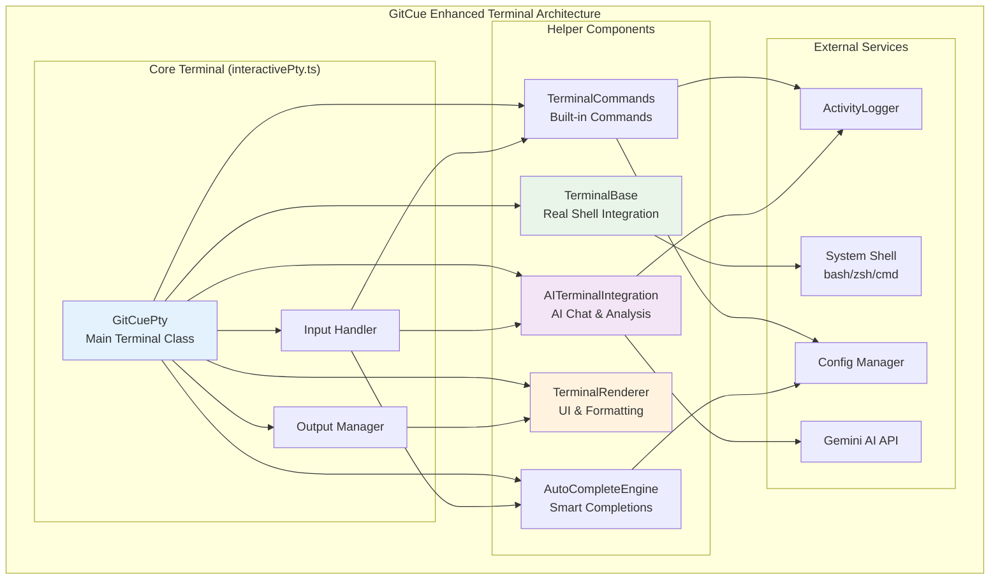

# 🖥️ Terminal Directory

The Terminal directory contains the GitCue Enhanced Terminal - a fully refactored AI-powered development terminal with real shell integration, intelligent auto-completion, and advanced AI assistance capabilities.

## 🏗️ New Refactored Architecture



## 📁 File Structure

### Core Files
- **`interactivePty.ts`** - Main terminal class implementing VS Code Pseudoterminal interface
- **`terminalBase.ts`** - Real shell process management and I/O handling
- **`autoComplete.ts`** - AI-powered auto-completion engine with intelligent suggestions
- **`aiIntegration.ts`** - AI chat mode, error analysis, and intelligent assistance
- **`terminalCommands.ts`** - Built-in commands (help, config, ai, history, etc.)
- **`terminalRenderer.ts`** - Advanced UI rendering and formatting

## ✨ Enhanced Features

### 🤖 **AI-Powered Intelligence**
- **Interactive AI Chat Mode**: Type `ai` to enter conversational AI assistance
- **Automatic Error Analysis**: Failed commands trigger intelligent problem diagnosis
- **Contextual Help**: AI understands your project and provides relevant suggestions
- **Smart Troubleshooting**: Get specific solutions for Git, npm, and shell issues

### ⚡ **AI-Powered Smart Auto-Completion**
- **AI Ghost Text**: AI-generated translucent suggestions as you type
- **Context-Aware Intelligence**: AI understands your current directory, recent commands, and project structure
- **Dynamic Learning**: Completions improve based on your command history and patterns
- **Multi-Modal Suggestions**: Git commands, shell operations, npm scripts, development tools
- **Intelligent Prioritization**: AI ranks suggestions by relevance and likelihood
- **Instant Tab Completion**: Press Tab to accept AI suggestions or show completion menu

### 🎨 **Beautiful UI**
- **Enhanced Prompt**: Branded GitCue prompt with current directory
- **Color-Coded Output**: Different colors for commands, files, directories, errors
- **Progress Indicators**: Visual feedback for long-running operations
- **Formatted Overlays**: Beautiful AI analysis displays with borders and icons
- **Status Messages**: Clear success/error/warning messages

### 🔄 **Real Shell Integration**
- **Native Shell**: Uses your actual shell (bash, zsh, cmd) underneath
- **Full Compatibility**: All shell features work (pipes, redirects, environment variables)
- **Custom Prompt**: GitCue-branded prompt while maintaining shell functionality
- **Process Management**: Proper handling of shell lifecycle and cleanup

## 🔧 Built-in Commands

### Core Commands
| Command | Description | Example |
|---------|-------------|---------|
| `help [topic]` | Show help information | `help ai`, `help git` |
| `config [setting]` | Show/modify GitCue configuration | `config`, `config open` |
| `ai` | Enter interactive AI chat mode | `ai` |
| `history [count]` | Show command history | `history 20` |
| `test-ai` | Test AI connection and features | `test-ai` |
| `clear` | Clear terminal screen | `clear` |
| `version` | Show GitCue version info | `version` |
| `exit` | Exit terminal | `exit` |

### AI Chat Commands
When in AI mode (after typing `ai`):
- Ask any development questions naturally
- Get help with Git commands and errors
- Request code explanations and suggestions
- Type `exit`, `quit`, or press Ctrl+C to return to terminal

## 🚀 Usage Examples

### Basic Usage
```bash
GitCue:~/project$ git st<tab>
# AI shows: git status (translucent ghost text)
GitCue:~/project$ git status
# Normal git output...

GitCue:~/project$ npm r<tab>
# AI suggests: npm run build, npm run dev, npm run test...
# Learns from your project's package.json and usage patterns
```

### AI Chat Mode
```bash
GitCue:~/project$ ai
🤖 GitCue AI Chat Mode
Welcome to AI Chat! I can help you with:
• Git commands and troubleshooting
• Terminal usage and shell scripting  
• Development workflow optimization
• Code analysis and suggestions

🤖 ai-chat> How do I undo my last commit?
🤖 AI Response:
To undo your last commit, you have several options...
[Detailed AI response with commands and explanations]

🤖 ai-chat> exit
🤖 Exited AI chat mode. Back to terminal.
GitCue:~/project$ 
```

### Error Analysis
```bash
GitCue:~/project$ git push origin nonexistent-branch
# Command fails...
🤖 AI Error Analysis
╭─────────────────────────────────────────╮
│ The error occurred because the branch    │
│ 'nonexistent-branch' doesn't exist.     │
│ Here are the solutions:                  │
│                                         │
│ 1. Check existing branches:             │
│    git branch -a                        │
│                                         │
│ 2. Create the branch first:             │
│    git checkout -b nonexistent-branch   │
╰─────────────────────────────────────────╯
```

## 🔄 Architecture Benefits

### **Maintainability**
- **Modular Design**: Each helper class has a specific responsibility
- **Separation of Concerns**: UI, logic, AI, and shell handling are separate
- **Easy Testing**: Individual components can be unit tested
- **Clear Interfaces**: Well-defined contracts between components

### **Extensibility**
- **Plugin Architecture**: Easy to add new completion sources
- **Command System**: Simple to add new built-in commands
- **AI Enhancements**: Straightforward to add new AI capabilities
- **Renderer Flexibility**: Easy to modify UI appearance and behavior

### **Performance**
- **Lazy Loading**: Components initialize only when needed
- **AI Caching**: Intelligent caching of AI completion responses
- **Smart Debouncing**: Input handling optimized to prevent excessive AI calls
- **Context Learning**: Recent commands stored for better AI context
- **Memory Management**: Proper cleanup and disposal of resources

## 🔧 Development Guide

### Adding New Commands
1. Add command logic to `TerminalCommands.isBuiltInCommand()`
2. Implement command in `TerminalCommands.executeCommand()`
3. Add help documentation in `showHelp()` method
4. AI will automatically learn and suggest new commands based on usage

### Extending AI Features
1. Add new AI methods to `AITerminalIntegration`
2. Update context building in `buildChatContext()`
3. Enhance error detection in `detectError()`
4. Add new analysis types to `analyzeCommandError()`

### Customizing UI
1. Modify colors and styling in `TerminalRenderer.defaultColors`
2. Update rendering methods for new visual elements
3. Add new status types and icons
4. Enhance progress indicators and overlays

### Shell Integration
1. Extend `TerminalBase` for new shell features
2. Add environment variable handling
3. Implement new I/O stream processing
4. Add platform-specific shell configurations

## 🔗 Integration Points

### VS Code Extension
- **Pseudoterminal Interface**: Implements `vscode.Pseudoterminal`
- **Event Handling**: Integrates with VS Code terminal events
- **Settings Integration**: Uses VS Code configuration system
- **Command Registration**: Registers terminal commands with VS Code

### GitCue Services
- **ActivityLogger**: Logs terminal events and AI interactions
- **Config Manager**: Accesses GitCue configuration settings
- **AI Utils**: Uses shared AI utilities and API management
- **File Watcher**: Coordinates with file watching services

### External APIs
- **Gemini AI**: Integrates with Google's Gemini API for AI features
- **System Shell**: Communicates with native shell processes
- **File System**: Reads project files for completions and context
- **Git CLI**: Executes and analyzes Git commands

---

The refactored GitCue Enhanced Terminal provides a powerful, intelligent, and beautifully designed terminal experience that combines the full functionality of native shells with AI-powered assistance and smart automation features. 