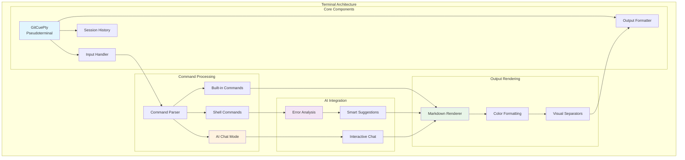
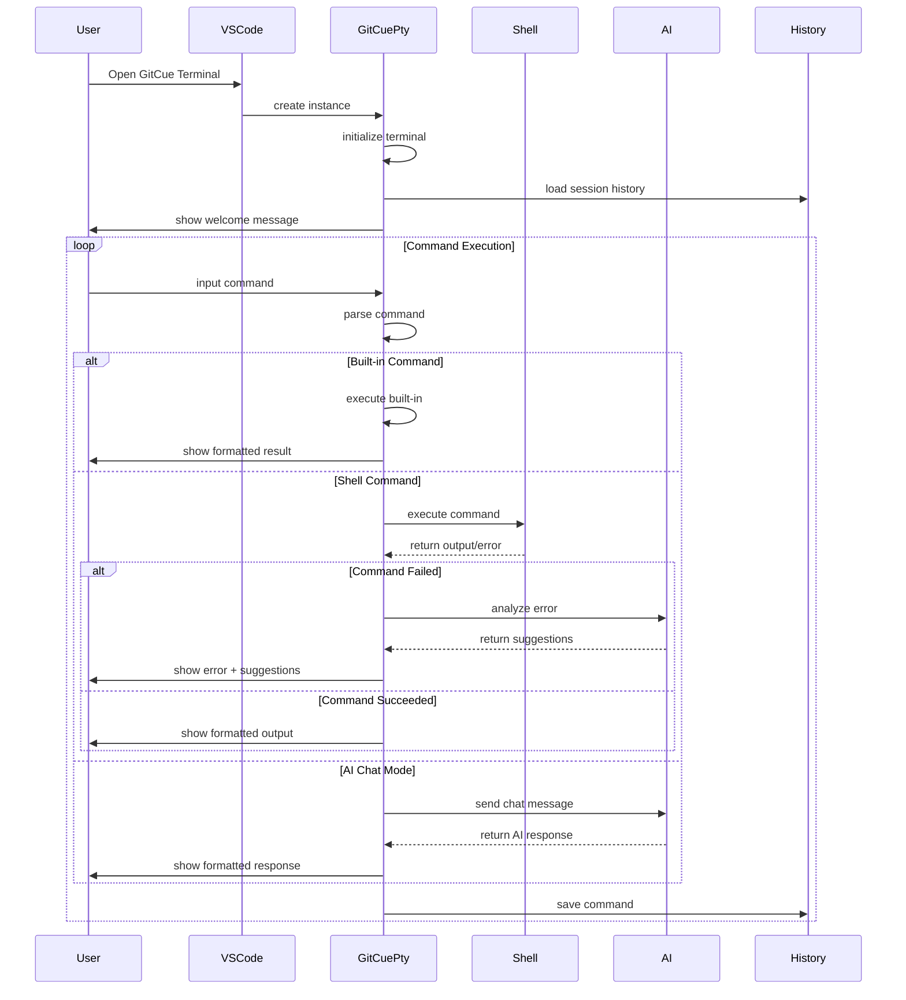
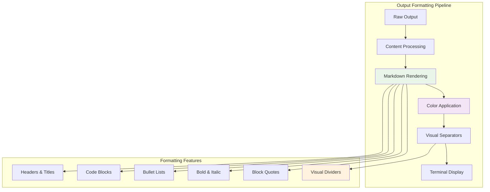
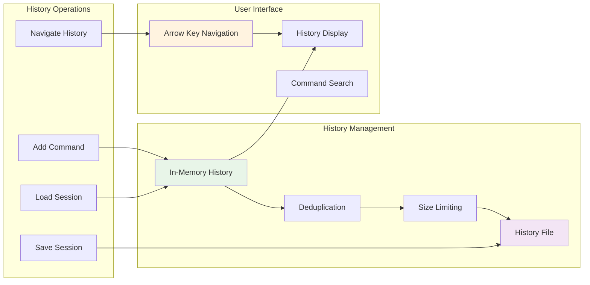
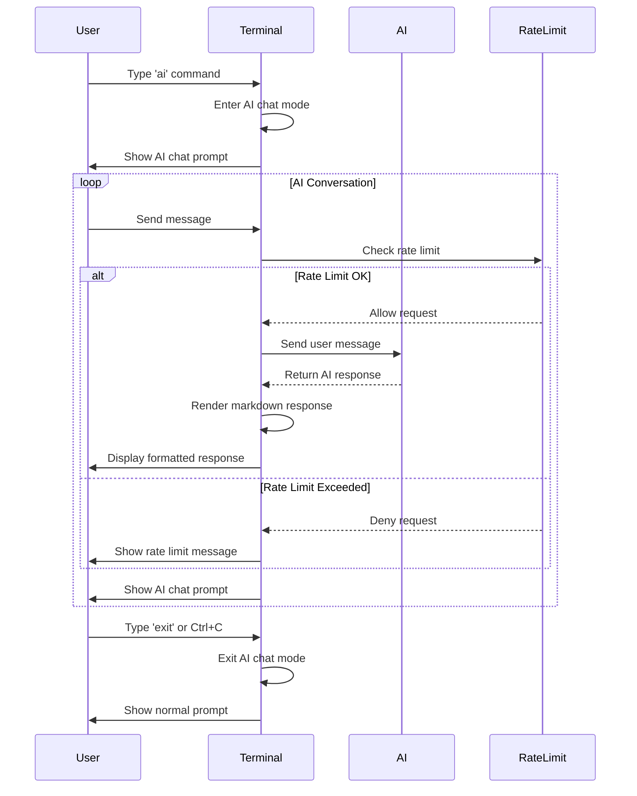
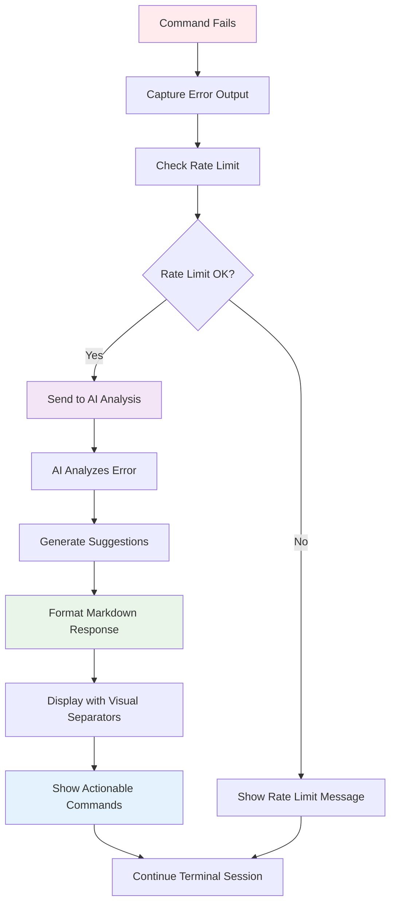

# 🖥️ Terminal Directory

The Terminal directory contains the interactive terminal implementation for GitCue, providing an AI-enhanced command-line interface within VS Code. The terminal offers seamless command execution, intelligent error analysis, and AI chat capabilities.

## 🏗️ Architecture Overview



---

## 🎯 GitCuePty - Interactive Pseudoterminal

**Purpose**: Implements a VS Code pseudoterminal that provides an AI-enhanced command-line interface with intelligent error analysis, chat capabilities, and professional output formatting.

### 🔄 Terminal Lifecycle



### 🎨 Key Features

#### **Professional Output Formatting**
```typescript
// Enhanced markdown rendering with visual separators
private renderMarkdown(content: string): void {
  const renderer = new MarkdownRenderer({
    maxWidth: 80,
    colors: {
      header: '\x1b[1;36m',     // Bright cyan headers
      code: '\x1b[1;33m',       // Bright yellow code
      bold: '\x1b[1m',          // Bold text
      italic: '\x1b[3m',        // Italic text
      list: '\x1b[36m',         // Cyan list items
      quote: '\x1b[2m',         // Dim quotes
      reset: '\x1b[0m',         // Reset formatting
      dim: '\x1b[2m'            // Dim text
    }
  });
  
  this.write(renderer.render(content));
}
```

#### **Cross-Platform Shell Support**
```typescript
// Seamless directory navigation across platforms
private async executeTerminalCommand(command: string): Promise<void> {
  // Handle built-in commands
  if (command.startsWith('cd ')) {
    const newPath = command.substring(3).trim();
    try {
      process.chdir(newPath);
      this.currentDirectory = process.cwd();
      this.write(`${this.colors.success}✓${this.colors.reset} Changed directory to: ${this.currentDirectory}\n`);
    } catch (error) {
      this.write(`${this.colors.error}✗${this.colors.reset} Cannot change directory: ${error.message}\n`);
    }
    return;
  }
  
  // Execute shell commands with proper environment
  const { spawn } = require('child_process');
  const isWindows = process.platform === 'win32';
  const shell = isWindows ? 'cmd.exe' : '/bin/bash';
  const shellArgs = isWindows ? ['/c', command] : ['-c', command];
  
  // ... command execution logic
}
```

#### **AI-Powered Error Analysis**
```typescript
// Intelligent error analysis with concise suggestions
private async analyzeError(command: string, errorMessage: string): Promise<void> {
  try {
    this.isAiAnalysisRunning = true;
    this.write(`\n${this.colors.processing}🔄 Analyzing error with AI...${this.colors.reset}\n`);
    
    const errorContext = `Command: ${command}\nError: ${errorMessage}`;
    const suggestion = await generateErrorSuggestionWithRateLimit(errorContext);
    
    this.write(`${this.colors.success}🔍 Analysis Complete:${this.colors.reset}\n`);
    this.write('─'.repeat(80) + '\n');
    this.renderMarkdown(suggestion);
    this.write('─'.repeat(80) + '\n');
    this.write(`${this.colors.info}💡 You can run the suggested commands directly in this terminal!${this.colors.reset}\n\n`);
  } catch (error) {
    this.write(`${this.colors.error}❌ AI analysis failed: ${error.message}${this.colors.reset}\n`);
  } finally {
    this.isAiAnalysisRunning = false;
  }
}
```

#### **Interactive AI Chat Mode**
```typescript
// Seamless AI chat integration
private async handleAiChat(message: string): Promise<void> {
  if (message.toLowerCase() === 'exit' || message === '\x03') {
    this.isInAiChatMode = false;
    this.write(`${this.colors.info}👋 Exited AI chat mode${this.colors.reset}\n`);
    this.showPrompt();
    return;
  }
  
  try {
    this.write(`${this.colors.processing}🤖 AI Response:${this.colors.reset}\n`);
    
    const response = await generateErrorSuggestionWithRateLimit(
      `User question: ${message}\nProvide a helpful, concise response.`
    );
    
    this.renderMarkdown(response);
    this.write(`\n${this.colors.chat}ai-chat>${this.colors.reset} `);
  } catch (error) {
    this.write(`${this.colors.error}❌ AI chat failed: ${error.message}${this.colors.reset}\n`);
    this.write(`${this.colors.chat}ai-chat>${this.colors.reset} `);
  }
}
```

---

## 🎨 Output Formatting & Rendering

### Visual Design System



### **Color Scheme**

```typescript
private readonly colors = {
  reset: '\x1b[0m',
  bold: '\x1b[1m',
  dim: '\x1b[2m',
  
  // Status colors
  success: '\x1b[32m',      // Green
  error: '\x1b[31m',        // Red
  warning: '\x1b[33m',      // Yellow
  info: '\x1b[36m',         // Cyan
  processing: '\x1b[35m',   // Magenta
  
  // UI elements
  prompt: '\x1b[1;34m',     // Bright blue
  command: '\x1b[37m',      // White
  output: '\x1b[0m',        // Default
  chat: '\x1b[1;35m',       // Bright magenta
  
  // Syntax highlighting
  keyword: '\x1b[34m',      // Blue
  string: '\x1b[32m',       // Green
  number: '\x1b[33m',       // Yellow
  comment: '\x1b[2;37m'     // Dim white
};
```

### **Professional Separators**

```typescript
// Visual separation for different content sections
private showSeparator(type: 'full' | 'partial' | 'double' = 'full'): void {
  const separators = {
    full: '─'.repeat(80),
    partial: '─'.repeat(40),
    double: '═'.repeat(80)
  };
  
  this.write(`${this.colors.dim}${separators[type]}${this.colors.reset}\n`);
}
```

---

## 📜 Command History Management

### Session Persistence Architecture



### **History Features**

#### **Persistent Storage**
```typescript
interface SessionHistory {
  commands: string[];
  timestamp: number;
}

// Load history from previous sessions
private async loadSessionHistory(): Promise<void> {
  try {
    if (fs.existsSync(this.historyFile)) {
      const historyData = fs.readFileSync(this.historyFile, 'utf8');
      const sessionHistory: SessionHistory = JSON.parse(historyData);
      
      // Load commands from previous sessions
      this.sessionHistory = sessionHistory.commands || [];
      this.historyIndex = -1;
    }
  } catch (error) {
    // Initialize empty history on error
    this.sessionHistory = [];
  }
}
```

#### **Smart Deduplication**
```typescript
private addToHistory(command: string): void {
  const trimmedCommand = command.trim();
  if (trimmedCommand && 
      trimmedCommand !== 'history' && 
      trimmedCommand !== 'clear' &&
      this.sessionHistory[this.sessionHistory.length - 1] !== trimmedCommand) {
    
    this.sessionHistory.push(trimmedCommand);
    
    // Limit history size
    const maxHistorySize = 100;
    if (this.sessionHistory.length > maxHistorySize) {
      this.sessionHistory = this.sessionHistory.slice(-maxHistorySize);
    }
    
    this.historyIndex = -1;
    this.saveSessionHistory();
  }
}
```

#### **Arrow Key Navigation**
```typescript
private navigateHistory(direction: 'up' | 'down'): void {
  if (this.sessionHistory.length === 0) return;
  
  if (direction === 'up') {
    if (this.historyIndex < this.sessionHistory.length - 1) {
      this.historyIndex++;
    }
  } else {
    if (this.historyIndex > -1) {
      this.historyIndex--;
    }
  }
  
  // Clear current input and show history item
  this.write(this.CLEAR_LINE);
  this.showPrompt();
  
  if (this.historyIndex >= 0) {
    const historyCommand = this.sessionHistory[this.sessionHistory.length - 1 - this.historyIndex];
    this.currentInput = historyCommand;
    this.write(historyCommand);
  } else {
    this.currentInput = '';
  }
}
```

---

## 🤖 AI Integration Features

### AI Chat Mode



### **AI Chat Features**

#### **Seamless Mode Switching**
```typescript
private enterAiChatMode(): void {
  this.isInAiChatMode = true;
  this.write(`\n${this.colors.success}🤖 Entering AI Chat Mode${this.colors.reset}\n`);
  this.write(`${this.colors.dim}Type 'exit' or press Ctrl+C to return to terminal${this.colors.reset}\n`);
  this.write(`${this.colors.chat}ai-chat>${this.colors.reset} `);
}
```

#### **Concise AI Responses**
```typescript
// Optimized for quick, actionable responses (under 200 words)
private async handleAiChat(message: string): Promise<void> {
  const prompt = `
    User question: ${message}
    
    Provide a helpful, concise response under 200 words.
    Focus on actionable advice and key points.
    Use markdown formatting for clarity.
  `;
  
  const response = await generateErrorSuggestionWithRateLimit(prompt);
  this.renderMarkdown(response);
}
```

### Error Analysis System



---

## 🛠️ Built-in Commands

### Command Reference

| Command | Description | Example |
|---------|-------------|---------|
| `ai` | Enter interactive AI chat mode | `ai` |
| `history` | Show command history with syntax highlighting | `history` |
| `config` | Display GitCue configuration | `config` |
| `help` | Show comprehensive help information | `help` |
| `clear` | Clear terminal screen | `clear` |
| `exit` | Exit terminal or AI chat mode | `exit` |
| `cd <path>` | Change current directory | `cd /home/user` |
| `pwd` | Print current working directory | `pwd` |
| `test-ai` | Test AI connection and functionality | `test-ai` |

### **Built-in Command Implementation**

```typescript
private async executeCommand(command: string): Promise<void> {
  const trimmedCommand = command.trim().toLowerCase();
  
  // Handle built-in commands
  switch (trimmedCommand) {
    case 'help':
      await this.showHelp();
      break;
    case 'config':
      await this.showConfig();
      break;
    case 'history':
      await this.showHistory();
      break;
    case 'clear':
      this.write('\x1b[2J\x1b[H');
      break;
    case 'ai':
      this.enterAiChatMode();
      return;
    case 'test-ai':
      await this.testAI();
      break;
    case 'pwd':
      this.write(`${process.cwd()}\n`);
      break;
    case 'exit':
      this.close();
      return;
    default:
      // Handle shell commands
      await this.executeTerminalCommand(command);
  }
  
  this.showPrompt();
}
```

### **Help System**

```typescript
private async showHelp(): Promise<void> {
  const helpContent = `
# GitCue Terminal Help

## Built-in Commands
- **ai** - Enter interactive AI chat mode
- **history** - Show command history
- **config** - Display GitCue configuration  
- **help** - Show this help information
- **clear** - Clear terminal screen
- **exit** - Exit terminal
- **cd <path>** - Change directory
- **pwd** - Print working directory
- **test-ai** - Test AI connection

## Features
- **Arrow Keys** - Navigate command history (↑/↓)
- **AI Error Analysis** - Automatic analysis of failed commands
- **Cross-Platform** - Works on Windows, macOS, and Linux
- **Session Persistence** - Command history saved across sessions

## AI Chat Mode
Type \`ai\` to enter interactive chat mode with AI assistance.
Use \`exit\` or Ctrl+C to return to normal terminal.
  `;
  
  this.renderMarkdown(helpContent);
}
```

---

## 🧪 Testing & Development

### **Terminal Testing Scenarios**

```typescript
// Test basic terminal functionality
describe('GitCuePty', () => {
  let terminal: GitCuePty;
  
  beforeEach(() => {
    terminal = new GitCuePty('/test/workspace');
  });
  
  it('should handle basic commands', async () => {
    await terminal.open(undefined);
    terminal.handleInput('help\r');
    // Verify help output
  });
  
  it('should navigate command history', () => {
    terminal.handleInput('test command\r');
    terminal.handleInput('\x1b[A'); // Up arrow
    // Verify history navigation
  });
  
  it('should handle AI chat mode', async () => {
    terminal.handleInput('ai\r');
    terminal.handleInput('test question\r');
    // Verify AI chat functionality
  });
});
```

### **Integration Testing**

```typescript
// Test terminal integration with VS Code
describe('Terminal Integration', () => {
  it('should integrate with VS Code terminal API', () => {
    const terminal = new GitCuePty();
    expect(terminal.onDidWrite).toBeDefined();
    expect(terminal.onDidClose).toBeDefined();
  });
  
  it('should handle pseudoterminal lifecycle', async () => {
    const terminal = new GitCuePty();
    await terminal.open({ columns: 80, rows: 24 });
    terminal.close();
    // Verify proper cleanup
  });
});
```

---

## 🔧 Configuration & Customization

### **Terminal Configuration**

```typescript
interface TerminalConfig {
  maxHistorySize: number;      // Maximum command history entries
  enableSuggestions: boolean;  // Enable AI error suggestions
  sessionPersistence: boolean; // Save history across sessions
  terminalVerbose: boolean;    // Enable verbose logging
  colors: {                    // Custom color scheme
    success: string;
    error: string;
    info: string;
    processing: string;
  };
}
```

### **Customization Options**

```typescript
// Custom welcome message
private showWelcomeMessage(): void {
  const version = '0.3.8';
  const welcomeText = `
╭─────────────────────────────────────────╮
│  🎯 GitCue AI Terminal v${version}           │
│  Your intelligent Git companion         │
╰─────────────────────────────────────────╯

${this.colors.info}Welcome to GitCue Terminal!${this.colors.reset}
Type ${this.colors.bold}help${this.colors.reset} for available commands or ${this.colors.bold}ai${this.colors.reset} for AI chat.
  `;
  
  this.write(welcomeText);
}
```

---

## 📚 API Reference

### **Core Interfaces**

```typescript
// Pseudoterminal interface implementation
interface vscode.Pseudoterminal {
  onDidWrite: vscode.Event<string>;
  onDidClose?: vscode.Event<number>;
  open(initialDimensions: vscode.TerminalDimensions | undefined): void | Thenable<void>;
  close(): void;
  handleInput?(data: string): void;
}

// Session history interface
interface SessionHistory {
  commands: string[];
  timestamp: number;
}

// Markdown element interface
interface MarkdownElement {
  type: 'text' | 'bold' | 'italic' | 'code' | 'codeblock' | 'header' | 'list';
  content: string;
  language?: string;
}
```

### **Export Structure**

```typescript
// src/terminal/index.ts
export { GitCuePty } from './interactivePty';
export type { SessionHistory, MarkdownElement };
```

---

The Terminal directory provides a sophisticated, AI-enhanced command-line interface that seamlessly integrates with VS Code, offering professional output formatting, intelligent error analysis, and interactive AI chat capabilities for an enhanced development experience. 