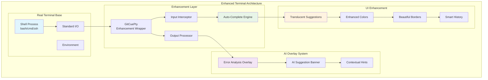
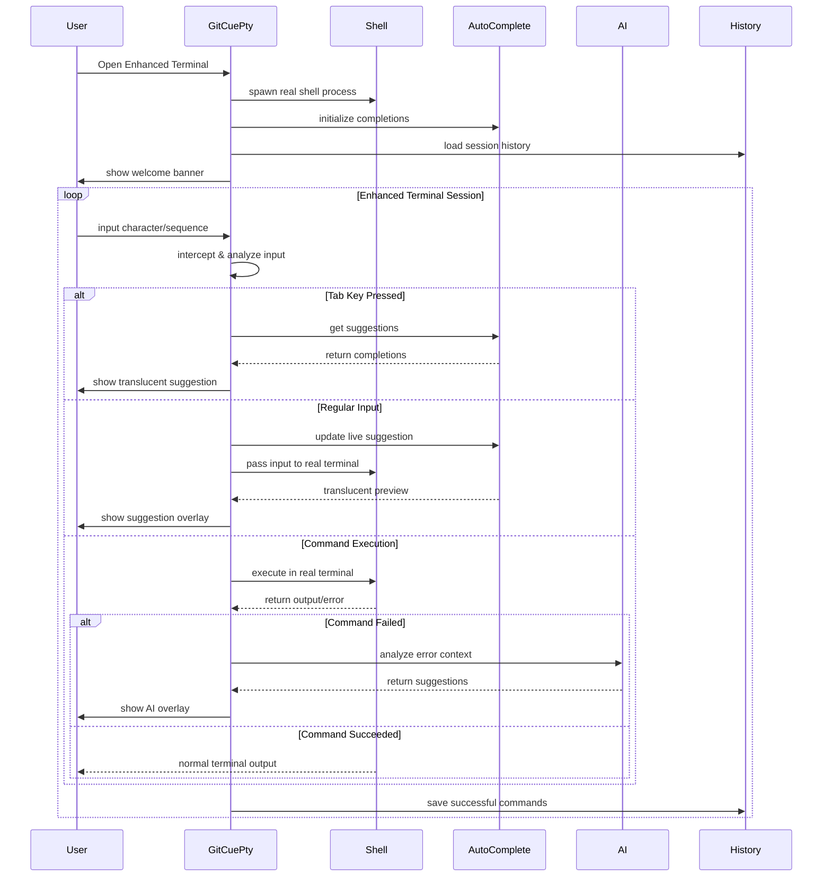
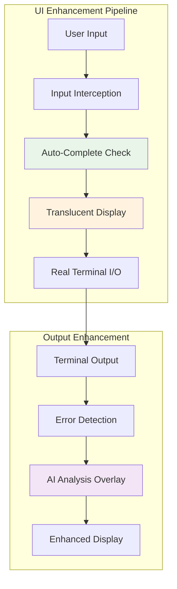
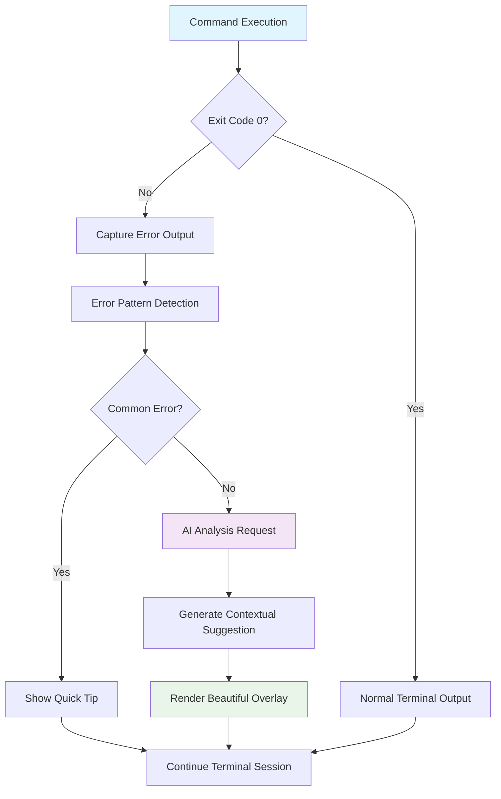
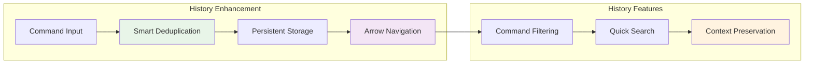
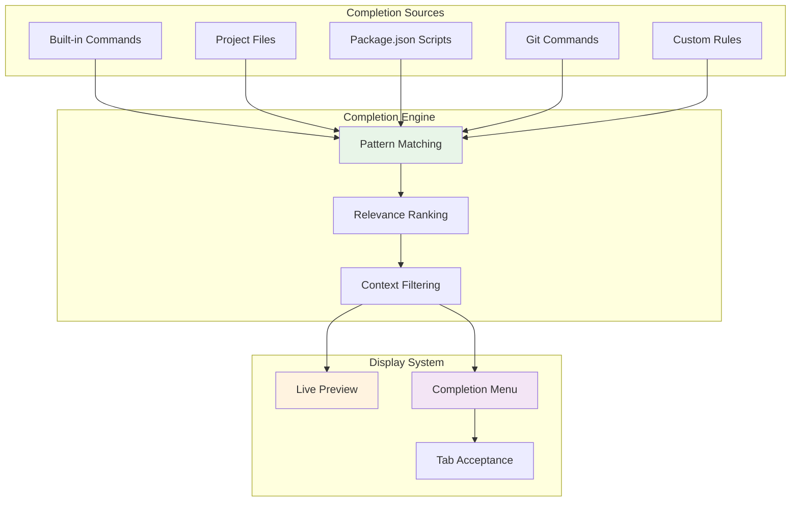

# 🖥️ Terminal Directory

The Terminal directory contains the GitCue Enhanced Terminal - a beautified real terminal with AI-powered overlays, intelligent auto-completion, and sophisticated UI enhancements while preserving standard terminal behavior.

## 🏗️ Architecture Overview



---

## 🎯 GitCuePty - Enhanced Terminal Wrapper

**Purpose**: Wraps a real terminal process with intelligent enhancements including auto-completion, AI error analysis, and beautiful UI overlays while preserving complete terminal compatibility.

### 🔄 Enhanced Terminal Lifecycle



### 🎨 Key Enhanced Features

#### **Real Terminal Foundation**
```typescript
// Spawn actual shell process for complete compatibility
private async startTerminalSession(): Promise<void> {
  const shell = this.getDefaultShell(); // bash/zsh/cmd based on OS
  const shellArgs = this.getShellArgs();

  this.terminalProcess = spawn(shell, shellArgs, {
    cwd: this.workspaceRoot,
    env: {
      ...process.env,
      TERM: 'xterm-256color',
      COLORTERM: 'truecolor',
      PS1: '\\[\\e[1;34m\\]gitcue\\[\\e[0m\\]:\\[\\e[1;36m\\]\\w\\[\\e[0m\\]$ ',
    },
    stdio: ['pipe', 'pipe', 'pipe']
  });

  // Direct I/O passthrough for normal terminal behavior
  this.terminalProcess.stdout?.on('data', (data: Buffer) => {
    this.handleTerminalOutput(data.toString());
  });
}
```

#### **Intelligent Auto-Completion with Translucent Suggestions**
```typescript
// Live auto-complete with translucent preview
private updateAutoCompleteSuggestion(): void {
  const suggestions = this.getAutoCompleteSuggestions(this.currentInput);
  
  if (suggestions.length > 0) {
    const words = this.currentInput.split(' ');
    const lastWord = words[words.length - 1];
    const suggestion = suggestions[0];
    
    if (suggestion.command.startsWith(lastWord) && suggestion.command !== lastWord) {
      const completion = suggestion.command.substring(lastWord.length);
      this.showTranslucentSuggestion(completion); // Dim, non-intrusive preview
    }
  }
}

private showTranslucentSuggestion(completion: string): void {
  // Save cursor, show translucent text, restore cursor
  this.writeEmitter.fire(this.SAVE_CURSOR);
  this.writeEmitter.fire(this.colors.translucent + completion + this.colors.reset);
  this.writeEmitter.fire(this.RESTORE_CURSOR);
}
```

#### **AI Error Analysis Overlays**
```typescript
// Beautiful AI analysis overlays that don't interfere with terminal
private showAiAnalysisOverlay(suggestion: string): void {
  this.writeEmitter.fire('\r\n');
  this.writeEmitter.fire(`${this.colors.ai}╭─ 🤖 AI Analysis ─────────────────────────────────────────────────────────────╮${this.colors.reset}\r\n`);
  
  const rendered = renderMarkdown(suggestion, {
    maxWidth: 76,
    colors: {
      header: this.colors.bright + this.colors.info,
      code: this.colors.success,
      bold: this.colors.bright,
      italic: this.colors.dim,
      list: this.colors.warning,
      quote: this.colors.dim,
      reset: this.colors.reset,
      dim: this.colors.dim
    }
  });
  
  // Beautifully formatted content with borders
  const lines = rendered.split('\n');
  lines.forEach(line => {
    this.writeEmitter.fire(`${this.colors.ai}│${this.colors.reset} ${line.padEnd(76)} ${this.colors.ai}│${this.colors.reset}\r\n`);
  });
  
  this.writeEmitter.fire(`${this.colors.ai}╰───────────────────────────────────────────────────────────────────────────────╯${this.colors.reset}\r\n`);
}
```

#### **Smart Auto-Complete System**
```typescript
interface AutoCompleteEntry {
  command: string;
  description?: string;
  type: 'command' | 'file' | 'directory' | 'git' | 'npm';
}

// Dynamic completion loading from multiple sources
private async initializeAutoComplete(): Promise<void> {
  this.autoCompleteEntries = [
    // Git commands with descriptions
    { command: 'git status', type: 'git', description: 'Show repository status' },
    { command: 'git add', type: 'git', description: 'Add files to staging' },
    { command: 'git commit', type: 'git', description: 'Commit changes' },
    
    // System commands
    { command: 'ls', type: 'command', description: 'List directory contents' },
    { command: 'cd', type: 'command', description: 'Change directory' },
    
    // NPM commands from package.json
    { command: 'npm install', type: 'npm', description: 'Install packages' },
  ];

  // Load project-specific completions
  await this.loadProjectCompletions(); // package.json scripts, files, dirs
}
```

---

## 🎨 Enhanced User Interface

### Visual Enhancement System



### **Translucent Auto-Complete**

The terminal shows live auto-complete suggestions as translucent text that appears as you type:

```
$ git st█                    # User types "git st"
$ git status                # System shows "atus" in dim/translucent text
$ git status█               # User presses Tab to accept
```

### **Beautiful Error Overlays**

When commands fail, AI analysis appears as elegant overlays:

```
$ git push origin nonexistent-branch
fatal: The current branch nonexistent-branch has no upstream branch.

╭─ 🤖 AI Analysis ─────────────────────────────────────────────────────────────╮
│ **Issue**: The branch doesn't exist on the remote repository.                │
│                                                                               │
│ **Solutions**:                                                                │
│ 1. Create and push the branch:                                               │
│    ```bash                                                                    │
│    git push -u origin nonexistent-branch                                     │
│    ```                                                                        │
│                                                                               │
│ 2. Switch to an existing branch:                                             │
│    ```bash                                                                    │
│    git checkout main                                                          │
│    ```                                                                        │
╰───────────────────────────────────────────────────────────────────────────────╯
💡 You can run the suggested commands directly in this terminal
```

### **Smart Tab Completion Menu**

Multiple completions show as organized menus:

```
$ npm █  # User presses Tab with multiple options
📋 Available completions:
  npm install    - Install packages
  npm run        - Run script  
  npm start      - Start application
  npm build      - Build application
  npm test       - Run tests
```

---

## 🤖 AI Integration Architecture

### Intelligent Error Analysis



### **Context-Aware Analysis**

```typescript
// Intelligent error detection and context building
private async triggerAiErrorAnalysis(command: string, errorOutput: string): Promise<void> {
  // Build rich context from terminal state
  const errorContext = `
    Command: ${command}
    Working Directory: ${this.workspaceRoot}
    Error Output: ${errorOutput}
    Recent Commands: ${this.sessionHistory.slice(-3).join(', ')}
  `;
  
  const suggestion = await generateErrorSuggestion(errorContext);
  this.showAiAnalysisOverlay(suggestion); // Beautiful overlay
}
```

### **Non-Intrusive AI Assistance**

- **Automatic Trigger**: AI analysis only triggers on command failures
- **Cancellable**: Press Ctrl+C to cancel AI analysis
- **Overlay Design**: Suggestions appear as overlays, not interrupting terminal flow
- **Actionable**: All suggestions are directly executable in the terminal

---

## 📜 Enhanced History & Navigation

### Smart History Management



### **Enhanced History Features**

#### **Smart Command Tracking**
```typescript
private addToHistory(command: string): void {
  const trimmedCommand = command.trim();
  
  // Only save meaningful commands (not duplicates, not trivial commands)
  if (trimmedCommand && 
      trimmedCommand !== this.sessionHistory[this.sessionHistory.length - 1] &&
      !this.isTrivialCommand(trimmedCommand)) {
    
    this.sessionHistory.push(trimmedCommand);
    this.maintainHistorySize();
    this.saveSessionHistory(); // Persist across sessions
  }
}
```

#### **Intelligent Navigation**
```typescript
// Enhanced arrow key navigation with real terminal integration
private handleHistoryNavigation(direction: 'up' | 'down'): void {
  if (direction === 'up') {
    this.historyIndex = Math.min(this.sessionHistory.length - 1, this.historyIndex + 1);
  } else {
    this.historyIndex = Math.max(-1, this.historyIndex - 1);
  }

  // Seamlessly integrate with real terminal prompt
  const historyCommand = this.historyIndex >= 0 
    ? this.sessionHistory[this.sessionHistory.length - 1 - this.historyIndex] 
    : '';
  
  this.currentInput = historyCommand;
  this.terminalProcess?.stdin?.write('\r' + historyCommand); // Real terminal handles display
}
```

---

## 🔧 Auto-Complete Engine

### Dynamic Completion System



### **Completion Features**

#### **Multi-Source Completions**
```typescript
// Load completions from various sources
private async loadProjectCompletions(): Promise<void> {
  // Package.json scripts
  const packageJson = await this.loadPackageJson();
  if (packageJson?.scripts) {
    Object.keys(packageJson.scripts).forEach(script => {
      this.autoCompleteEntries.push({
        command: `npm run ${script}`,
        type: 'npm',
        description: packageJson.scripts[script]
      });
    });
  }

  // Project files and directories
  const items = await fs.readdir(this.workspaceRoot);
  for (const item of items) {
    const stats = await fs.stat(path.join(this.workspaceRoot, item));
    this.autoCompleteEntries.push({
      command: item,
      type: stats.isDirectory() ? 'directory' : 'file',
      description: stats.isDirectory() ? 'Directory' : 'File'
    });
  }
}
```

#### **Smart Completion Logic**
```typescript
// Context-aware completion suggestions
private getAutoCompleteSuggestions(input: string): AutoCompleteEntry[] {
  const words = input.split(' ');
  const lastWord = words[words.length - 1].toLowerCase();
  
  return this.autoCompleteEntries
    .filter(entry => entry.command.toLowerCase().startsWith(lastWord))
    .sort((a, b) => {
      // Prioritize by type and usage frequency
      const typeOrder = { git: 0, command: 1, npm: 2, file: 3, directory: 4 };
      return typeOrder[a.type] - typeOrder[b.type];
    })
    .slice(0, 10); // Limit for performance
}
```

---

## 🛠️ Enhanced Terminal Capabilities

### Core Features

| Feature | Description | Enhancement |
|---------|-------------|-------------|
| **Real Terminal** | Uses actual shell process | Complete compatibility with all terminal features |
| **Auto-Complete** | Smart tab completion | Translucent live preview + organized menus |
| **AI Error Analysis** | Automatic error analysis | Beautiful overlays with actionable suggestions |
| **History Navigation** | Arrow key history | Smart deduplication + persistent storage |
| **Cross-Platform** | Windows/macOS/Linux | Native shell detection and adaptation |
| **Beautiful UI** | Enhanced visual design | Colors, borders, and formatted overlays |

### **Terminal Integration**

```typescript
// Complete terminal compatibility
private handleRegularInput(char: string): void {
  // Update internal state for enhancements
  this.currentInput = this.currentInput.slice(0, this.cursorPosition) + 
                     char + 
                     this.currentInput.slice(this.cursorPosition);
  this.cursorPosition++;
  
  // Pass directly to real terminal (preserves all terminal behavior)
  this.terminalProcess?.stdin?.write(char);
  
  // Add enhancements on top
  this.updateAutoCompleteSuggestion();
}
```

### **Advanced Features**

#### **Cursor Management**
- Full cursor position tracking
- Left/right arrow support
- Insert mode editing
- Proper backspace handling

#### **Error Detection**
- Pattern-based error recognition
- Context preservation for AI analysis
- Automatic trigger on command failure

#### **Session Persistence**
- Command history across sessions
- Auto-complete cache
- Configuration preservation

---

## 🧪 Testing & Development

### **Testing Enhanced Terminal**

```typescript
describe('GitCue Enhanced Terminal', () => {
  let terminal: GitCuePty;
  
  beforeEach(() => {
    terminal = new GitCuePty('/test/workspace');
  });
  
  it('should spawn real terminal process', async () => {
    await terminal.open(undefined);
    expect(terminal.terminalProcess).toBeDefined();
    expect(terminal.terminalProcess?.pid).toBeGreaterThan(0);
  });
  
  it('should provide auto-complete suggestions', () => {
    const suggestions = terminal.getAutoCompleteSuggestions('git st');
    expect(suggestions).toContain({ command: 'git status', type: 'git' });
  });
  
  it('should handle tab completion', () => {
    terminal.handleInput('git st\t');
    // Should auto-complete to 'git status'
  });
  
  it('should trigger AI analysis on errors', async () => {
    // Simulate command failure
    terminal.triggerAiErrorAnalysis('git push', 'fatal: no upstream branch');
    // Should show AI overlay
  });
});
```

### **Integration Testing**

```typescript
describe('Terminal Integration', () => {
  it('should maintain real terminal behavior', async () => {
    // All standard terminal features should work unchanged
    const terminal = new GitCuePty();
    await terminal.open({ columns: 80, rows: 24 });
    
    // Test that it behaves like a real terminal
    terminal.handleInput('echo "test"\r');
    // Should see normal echo output
  });
});
```

---

## 📚 Configuration & Customization

### **Terminal Configuration**

```typescript
interface EnhancedTerminalConfig {
  // Auto-complete settings
  enableAutoComplete: boolean;
  maxSuggestions: number;
  showTranslucentSuggestions: boolean;
  
  // AI enhancement settings
  enableAiAnalysis: boolean;
  aiAnalysisDelay: number;
  
  // UI enhancement settings
  enhancedColors: boolean;
  showWelcomeBanner: boolean;
  overlayStyle: 'minimal' | 'standard' | 'rich';
  
  // History settings
  maxHistorySize: number;
  sessionPersistence: boolean;
  historyDeduplication: boolean;
}
```

### **Customization Options**

```typescript
// Custom welcome banner
private showWelcomeBanner(): void {
  this.writeEmitter.fire(`
╭─ 🚀 GitCue Enhanced Terminal ─────────────────────────────────────────────────╮
│  A beautiful terminal with AI-powered enhancements                           │
╰───────────────────────────────────────────────────────────────────────────────╯

✨ Enhanced Features:
  • Tab completion with translucent suggestions
  • AI-powered error analysis for failed commands  
  • Command history with ↑↓ navigation
  • Beautiful UI overlays on standard terminal
  `);
}
```

---

## 🎯 Summary

The GitCue Enhanced Terminal provides a **real terminal experience** with sophisticated enhancements:

- **🔧 Real Terminal Base**: Uses actual shell processes for complete compatibility
- **✨ Auto-Complete Magic**: Translucent suggestions + smart tab completion
- **🤖 AI Error Analysis**: Beautiful overlays with actionable suggestions
- **🎨 Enhanced UI**: Colors, borders, and visual enhancements
- **📜 Smart History**: Persistent, intelligent command history
- **🚀 Performance**: Lightweight enhancements that don't impact terminal speed

This creates the perfect balance of **terminal authenticity** with **modern enhancements**, giving users a familiar yet powerfully enhanced development experience. 