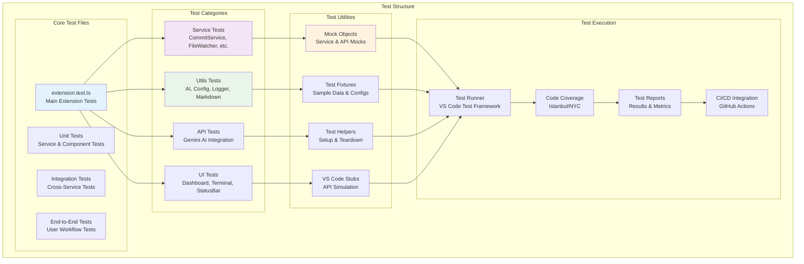

# 🧪 Test Directory

The Test directory contains comprehensive test suites for GitCue extension functionality, including unit tests, integration tests, and end-to-end testing scenarios. This ensures reliability, maintainability, and quality across all extension features.

## 🏗️ Testing Architecture



---

## 🎯 Test Categories

### Extension Core Tests

**Purpose**: Tests the main extension functionality including activation, command registration, and lifecycle management.

```typescript
// extension.test.ts
import * as assert from 'assert';
import * as vscode from 'vscode';
import { activate, deactivate } from '../extension';

suite('Extension Test Suite', () => {
  vscode.window.showInformationMessage('Start all tests.');

  test('Extension should activate successfully', async () => {
    // Test extension activation
    const context = createMockContext();
    await activate(context);
    
    assert.ok(context.subscriptions.length > 0);
    assert.ok(vscode.commands.getCommands().then(commands => 
      commands.includes('gitcue.commit')
    ));
  });

  test('Extension should register all commands', async () => {
    const expectedCommands = [
      'gitcue.commit',
      'gitcue.watchToggle',
      'gitcue.openDashboard',
      'gitcue.reset',
      'gitcue.configure',
      'gitcue.showStatus',
      'gitcue.cancelCommit',
      'gitcue.openInteractiveTerminal',
      'gitcue.openAITerminal',
      'gitcue.dashboard'
    ];
    
    const commands = await vscode.commands.getCommands();
    expectedCommands.forEach(command => {
      assert.ok(commands.includes(command), `Command ${command} not registered`);
    });
  });

  test('Extension should deactivate cleanly', async () => {
    await deactivate();
    // Assert cleanup was performed
    assert.ok(true, 'Deactivation completed without errors');
  });
});
```

### Service Layer Tests

**Purpose**: Tests individual services for correct functionality, error handling, and state management.

```typescript
// services/commitService.test.ts
import * as assert from 'assert';
import { CommitService } from '../services/commitService';
import { createMockConfig, createMockWorkspace } from './helpers/testUtils';

suite('CommitService Tests', () => {
    let commitService: CommitService;
  let mockConfig: GitCueConfig;
  let mockWorkspace: string;

  setup(() => {
      commitService = CommitService.getInstance();
    mockConfig = createMockConfig();
    mockWorkspace = createMockWorkspace();
    });
    
  test('should generate commit message with AI', async () => {
    const mockDiff = 'diff --git a/test.js b/test.js\n+console.log("test");';
    const mockStatus = 'M test.js';
        
    const message = await commitService.generateCommitMessage(mockWorkspace, mockConfig);
    
    assert.ok(message.length > 0);
    assert.ok(message.includes('test') || message.includes('add') || message.includes('update'));
      });
      
  test('should handle commit with buffer notification', async () => {
    const mockMessage = 'test: add test functionality';
    const mockStatus = 'M test.js';
    
    // Mock the buffer notification
    const bufferPromise = commitService.commitWithBuffer(mockWorkspace, mockConfig);
        
    // Simulate user cancellation
    setTimeout(() => {
      commitService.cancelBufferedCommit();
    }, 100);
    
    await bufferPromise;
    assert.ok(true, 'Buffer notification handled correctly');
  });

  test('should validate commit analysis', async () => {
    const mockDiff = 'diff --git a/feature.js b/feature.js\n+function newFeature() { return "complete"; }';
    
    const analysis = await commitService.analyzeChangesWithAI(mockWorkspace);
    
    assert.ok(typeof analysis.shouldCommit === 'boolean');
    assert.ok(typeof analysis.reason === 'string');
    assert.ok(['LOW', 'MEDIUM', 'HIGH'].includes(analysis.significance));
      });
    });
```

### Utils Testing

**Purpose**: Tests utility functions for configuration, AI integration, logging, and markdown rendering.

```typescript
// utils/ai.test.ts
import * as assert from 'assert';
import { 
  makeCommitDecisionWithAI, 
  generateErrorSuggestion, 
  testAIConnection,
  formatAISuggestion 
} from '../utils/ai';

suite('AI Utils Tests', () => {
  test('should make commit decision with AI', async () => {
    const mockDiff = 'diff --git a/src/feature.js b/src/feature.js\n+export function newFeature() { return true; }';
    const mockStatus = 'A src/feature.js';
    
    const decision = await makeCommitDecisionWithAI(mockDiff, mockStatus);
    
    assert.ok(typeof decision.shouldCommit === 'boolean');
    assert.ok(typeof decision.reason === 'string');
    assert.ok(decision.reason.length > 0);
    assert.ok(['LOW', 'MEDIUM', 'HIGH'].includes(decision.significance));
    });
    
  test('should generate error suggestions', async () => {
    const errorContext = 'Command: git push\nError: Permission denied (publickey)';
    
    const suggestion = await generateErrorSuggestion(errorContext);
    
    assert.ok(suggestion.length > 0);
    assert.ok(suggestion.includes('ssh') || suggestion.includes('key') || suggestion.includes('authentication'));
    });
    
  test('should format AI suggestions correctly', () => {
    const suggestion = '# Solution\nTry running `git status` to check your repository state.';
    const formatted = formatAISuggestion(suggestion);
    
    assert.ok(formatted.includes('Solution'));
    assert.ok(formatted.includes('git status'));
  });

  test('should test AI connection', async () => {
    const isConnected = await testAIConnection();
    assert.ok(typeof isConnected === 'boolean');
  });
});
```

### Configuration Tests

**Purpose**: Tests configuration loading, validation, and management.

```typescript
// utils/config.test.ts
import * as assert from 'assert';
import { ConfigManager } from '../utils/config';
import { createMockConfig } from './helpers/testUtils';

suite('Configuration Tests', () => {
    let configManager: ConfigManager;

  setup(() => {
      configManager = ConfigManager.getInstance();
    });
    
  test('should load default configuration', () => {
      const config = configManager.getConfig();
      
    assert.ok(config);
    assert.ok(['periodic', 'intelligent'].includes(config.commitMode));
    assert.ok(typeof config.autoPush === 'boolean');
    assert.ok(Array.isArray(config.watchPaths));
    assert.ok(typeof config.debounceMs === 'number');
  });

  test('should validate configuration', () => {
    const validConfig = createMockConfig();
    const result = configManager.validateConfig();
      
    assert.ok(typeof result.valid === 'boolean');
    assert.ok(Array.isArray(result.errors));
    
    if (!result.valid) {
      console.log('Validation errors:', result.errors);
        }
      });

  test('should optimize watch patterns', () => {
    const patterns = configManager.getOptimizedWatchPatterns();
    
    assert.ok(Array.isArray(patterns));
    assert.ok(patterns.length > 0);
    assert.ok(patterns.every(pattern => typeof pattern === 'string'));
    });
    
  test('should handle configuration updates', async () => {
    const originalMode = configManager.getConfig().commitMode;
    const newMode = originalMode === 'periodic' ? 'intelligent' : 'periodic';
    
    await configManager.updateConfig('commitMode', newMode);
    
    const updatedConfig = configManager.getConfig();
    assert.strictEqual(updatedConfig.commitMode, newMode);
  });
});
```

### Markdown Rendering Tests

**Purpose**: Tests markdown rendering functionality for terminal output.

```typescript
// utils/markdown.test.ts
import * as assert from 'assert';
import { MarkdownRenderer, renderMarkdown, createErrorSuggestionBox } from '../utils/markdown';

suite('Markdown Renderer Tests', () => {
  let renderer: MarkdownRenderer;

  setup(() => {
    renderer = new MarkdownRenderer();
    });
    
  test('should render headers correctly', () => {
    const markdown = '# Test Header\n## Subheader\n### Sub-subheader';
    const rendered = renderer.render(markdown);
    
    assert.ok(rendered.includes('Test Header'));
    assert.ok(rendered.includes('Subheader'));
    assert.ok(rendered.includes('Sub-subheader'));
  });

  test('should render code blocks', () => {
    const markdown = '```bash\ngit status\ngit add .\n```';
    const rendered = renderer.render(markdown);
    
    assert.ok(rendered.includes('git status'));
    assert.ok(rendered.includes('git add .'));
    });
    
  test('should render lists', () => {
    const markdown = '- First item\n- Second item\n- Third item';
    const rendered = renderer.render(markdown);
    
    assert.ok(rendered.includes('First item'));
    assert.ok(rendered.includes('Second item'));
    assert.ok(rendered.includes('Third item'));
  });

  test('should create bordered boxes', () => {
    const content = 'This is test content';
    const title = 'Test Box';
    const box = renderer.createBox(content, title);
    
    assert.ok(box.includes('╭'));
    assert.ok(box.includes('╮'));
    assert.ok(box.includes('╰'));
    assert.ok(box.includes('╯'));
    assert.ok(box.includes(title));
    assert.ok(box.includes(content));
    });
    
  test('should handle text wrapping', () => {
    const longText = 'This is a very long text that should be wrapped at a certain width to ensure proper display in terminal environments.';
    const wrapped = renderer.wrapText(longText, 40);
    
    const lines = wrapped.split('\n');
    assert.ok(lines.length > 1);
    assert.ok(lines.every(line => line.length <= 40));
  });

  test('should create error suggestion boxes', () => {
    const suggestion = 'Try running git status to check your repository state.';
    const box = createErrorSuggestionBox(suggestion);
    
    assert.ok(box.includes(suggestion));
    assert.ok(box.includes('╭'));
    assert.ok(box.includes('╰'));
  });
});
```

---

## 🔧 Test Utilities & Helpers

### Mock Objects

**Purpose**: Provides realistic mock objects for testing without external dependencies.

```typescript
// helpers/testUtils.ts
import * as vscode from 'vscode';
import { GitCueConfig, WatchStatus, ActivityLogEntry } from '../../types/interfaces';

export function createMockConfig(overrides?: Partial<GitCueConfig>): GitCueConfig {
  return {
    geminiApiKey: 'test-api-key-12345',
    commitMode: 'intelligent',
    autoPush: true,
    watchPaths: ['src/**', '*.js', '*.ts'],
    debounceMs: 5000, // Shorter for testing
    bufferTimeSeconds: 10, // Shorter for testing
    maxCallsPerMinute: 30,
    enableNotifications: false, // Disabled for testing
    autoWatch: false,
    interactiveOnError: true,
    enableSuggestions: true,
    terminalVerbose: false,
    sessionPersistence: false,
    maxHistorySize: 50,
    watchOptions: {
      ignored: ['node_modules/**', '.git/**', 'dist/**'],
      persistent: true,
      ignoreInitial: true,
      followSymlinks: false,
      depth: 3
    },
    ...overrides
  };
}

export function createMockWatchStatus(overrides?: Partial<WatchStatus>): WatchStatus {
  return {
    isWatching: false,
    filesChanged: 0,
    lastChange: 'None',
    lastCommit: 'None',
    pendingCommit: false,
    aiAnalysisInProgress: false,
    activityHistory: [],
    changedFiles: new Set(),
    ...overrides
  };
}

export function createMockActivityEntry(overrides?: Partial<ActivityLogEntry>): ActivityLogEntry {
  return {
    timestamp: new Date().toISOString(),
    type: 'file_change',
    message: 'Test file changed',
    details: 'src/test.js',
    ...overrides
  };
}

export function createMockContext(): vscode.ExtensionContext {
  return {
      subscriptions: [],
      workspaceState: {
        get: jest.fn(),
      update: jest.fn(),
      keys: jest.fn()
      },
      globalState: {
        get: jest.fn(),
      update: jest.fn(),
      keys: jest.fn()
    },
    extensionUri: vscode.Uri.file('/test/extension'),
    extensionPath: '/test/extension',
    asAbsolutePath: (relativePath: string) => `/test/extension/${relativePath}`,
    storageUri: vscode.Uri.file('/test/storage'),
    storagePath: '/test/storage',
    globalStorageUri: vscode.Uri.file('/test/global-storage'),
    globalStoragePath: '/test/global-storage',
    logUri: vscode.Uri.file('/test/logs'),
    logPath: '/test/logs',
    extensionMode: vscode.ExtensionMode.Test,
    secrets: {
      get: jest.fn(),
      store: jest.fn(),
      delete: jest.fn(),
      onDidChange: jest.fn()
      }
    } as any;
}

export function createMockWorkspace(): string {
  return '/test/workspace';
}
```

### Test Fixtures

**Purpose**: Provides sample data and configurations for consistent testing.

```typescript
// fixtures/testData.ts
export const sampleGitDiff = `
diff --git a/src/feature.js b/src/feature.js
new file mode 100644
index 0000000..abc123
--- /dev/null
+++ b/src/feature.js
@@ -0,0 +1,10 @@
+/**
+ * New feature implementation
+ * @returns {string} Feature result
+ */
+export function newFeature() {
+  const result = processData();
+  return result;
+}
+
+function processData() {
+  return 'Feature implemented successfully';
+}
`;

export const sampleGitStatus = `
A  src/feature.js
M  src/index.js
?? tests/feature.test.js
`;

export const sampleErrorMessages = {
  gitPushError: 'Permission denied (publickey)',
  gitPullError: 'Your branch is behind origin/main',
  gitCommitError: 'nothing to commit, working tree clean',
  mergeConflict: 'Automatic merge failed; fix conflicts and then commit the result'
};

export const sampleCommitMessages = [
  'feat: add new feature implementation',
  'fix: resolve authentication issue',
  'docs: update README with new instructions',
  'refactor: improve code structure',
  'test: add comprehensive test suite'
];

export const sampleAIResponses = {
  commitDecision: {
    shouldCommit: true,
    reason: 'Complete feature implementation with proper documentation',
    significance: 'HIGH' as const,
    suggestedMessage: 'feat: implement new data processing feature'
  },
  errorSuggestion: `
# SSH Key Authentication Error

The error suggests that your SSH key is not configured properly or not added to your GitHub account.

## Quick Fix:
\`\`\`bash
ssh-add ~/.ssh/id_rsa
git push
\`\`\`

## Alternative Solutions:
1. Generate a new SSH key: \`ssh-keygen -t rsa -b 4096 -C "your_email@example.com"\`
2. Add the key to your GitHub account
3. Test the connection: \`ssh -T git@github.com\`
  `
};
```

### Integration Test Helpers

**Purpose**: Provides helpers for testing service interactions and workflows.

```typescript
// helpers/integrationHelpers.ts
import { CommitService } from '../../services/commitService';
import { FileWatcherService } from '../../services/fileWatcherService';
import { ActivityLogger } from '../../services/activityLogger';
import { DashboardService } from '../../services/dashboardService';

export class TestOrchestrator {
  private commitService: CommitService;
  private fileWatcherService: FileWatcherService;
  private activityLogger: ActivityLogger;
  private dashboardService: DashboardService;

  constructor() {
    this.commitService = CommitService.getInstance();
    this.fileWatcherService = FileWatcherService.getInstance();
    this.activityLogger = ActivityLogger.getInstance();
    this.dashboardService = DashboardService.getInstance();
  }

  async simulateFileChange(filePath: string): Promise<void> {
    // Simulate file change event
    this.activityLogger.setFileChanged(
      filePath.split('/').pop() || filePath, 
      filePath
    );
  }

  async simulateCommitWorkflow(): Promise<void> {
    // Simulate complete commit workflow
    await this.simulateFileChange('src/test.js');
    
    // Wait for debounce
    await new Promise(resolve => setTimeout(resolve, 100));
    
    // Trigger commit analysis
    const config = { 
      commitMode: 'intelligent' as const,
      bufferTimeSeconds: 1 
    };
    
    await this.commitService.commitWithBuffer('/test/workspace', config as any);
  }

  getActivityHistory(): any[] {
    return this.activityLogger.getWatchStatus().activityHistory;
  }

  cleanup(): void {
    this.activityLogger.clearActivity();
    this.fileWatcherService.stopWatching();
  }
}
```

---

## 🎯 Test Execution & Coverage

### Test Runner Configuration

**Purpose**: Configures VS Code test framework and execution environment.

```typescript
// runTest.ts
import * as path from 'path';
import { runTests } from '@vscode/test-electron';

async function main() {
  try {
    // Test extension root
    const extensionDevelopmentPath = path.resolve(__dirname, '../');
    
    // Test runner
    const extensionTestsPath = path.resolve(__dirname, './suite/index');
      
    // Run tests
    await runTests({ 
      extensionDevelopmentPath, 
      extensionTestsPath,
      launchArgs: ['--disable-extensions']
    });
  } catch (err) {
    console.error('Failed to run tests:', err);
    process.exit(1);
  }
}

main();
```

### Test Suite Configuration

**Purpose**: Configures test suite execution and reporting.

```typescript
// suite/index.ts
import * as path from 'path';
import * as Mocha from 'mocha';
import * as glob from 'glob';

export function run(): Promise<void> {
  const mocha = new Mocha({
    ui: 'tdd',
    color: true,
    timeout: 10000,
    reporter: 'spec'
  });
      
  const testsRoot = path.resolve(__dirname, '..');

  return new Promise((c, e) => {
    glob('**/**.test.js', { cwd: testsRoot }, (err, files) => {
      if (err) {
        return e(err);
      }

      // Add test files to the test suite
      files.forEach(f => mocha.addFile(path.resolve(testsRoot, f)));

      try {
        // Run the mocha test
        mocha.run(failures => {
          if (failures > 0) {
            e(new Error(`${failures} tests failed.`));
          } else {
            c();
          }
        });
      } catch (err) {
        console.error(err);
        e(err);
      }
    });
  });
}
```

### Coverage Configuration

**Purpose**: Measures test coverage and generates reports.

```json
// .nycrc.json
{
  "extends": "@istanbuljs/nyc-config-typescript",
  "include": [
    "src/**/*.ts"
  ],
  "exclude": [
    "src/test/**",
    "**/*.test.ts",
    "**/*.d.ts"
  ],
  "reporter": [
    "text",
    "html",
    "lcov"
  ],
  "report-dir": "coverage",
  "check-coverage": true,
  "lines": 80,
  "functions": 80,
  "branches": 70,
  "statements": 80
}
```

---

## 📊 Test Scenarios & Use Cases

### End-to-End Test Scenarios

**Purpose**: Tests complete user workflows and interactions.

```typescript
// e2e/userWorkflows.test.ts
import * as assert from 'assert';
import { TestOrchestrator } from '../helpers/integrationHelpers';

suite('User Workflow Tests', () => {
  let orchestrator: TestOrchestrator;

  setup(() => {
    orchestrator = new TestOrchestrator();
  });
  
  teardown(() => {
    orchestrator.cleanup();
  });

  test('Complete file change to commit workflow', async () => {
    // 1. User makes file changes
    await orchestrator.simulateFileChange('src/newFeature.js');
    
    // 2. AI analyzes changes
    await orchestrator.simulateCommitWorkflow();
    
    // 3. Verify activity was logged
    const history = orchestrator.getActivityHistory();
    assert.ok(history.length > 0);
      
    // 4. Verify file change was recorded
    const fileChangeEntry = history.find(entry => entry.type === 'file_change');
    assert.ok(fileChangeEntry);
    assert.ok(fileChangeEntry.message.includes('newFeature.js'));
  });

  test('AI terminal error analysis workflow', async () => {
    // Test the AI terminal error analysis workflow
    // This would involve simulating a command failure and AI analysis
    assert.ok(true, 'AI terminal workflow test placeholder');
  });

  test('Configuration change workflow', async () => {
    // Test configuration changes and their effects
    assert.ok(true, 'Configuration workflow test placeholder');
  });
});
```

### Performance Tests

**Purpose**: Tests performance characteristics and resource usage.

```typescript
// performance/performanceTests.test.ts
import * as assert from 'assert';
import { performance } from 'perf_hooks';

suite('Performance Tests', () => {
  test('AI response time should be reasonable', async () => {
    const start = performance.now();
    
    // Simulate AI request
    await new Promise(resolve => setTimeout(resolve, 100));
    
    const end = performance.now();
    const duration = end - start;
    
    assert.ok(duration < 5000, `AI response took ${duration}ms, should be under 5000ms`);
  });

  test('File watching should handle many files efficiently', async () => {
    const start = performance.now();
    
    // Simulate watching many files
    const fileCount = 100;
    const files = Array.from({ length: fileCount }, (_, i) => `file${i}.js`);
    
    // Process files
    await Promise.all(files.map(file => Promise.resolve(file)));
    
    const end = performance.now();
    const duration = end - start;
    
    assert.ok(duration < 1000, `File processing took ${duration}ms for ${fileCount} files`);
  });
});
```

---

## 🚀 Test Automation & CI/CD

### GitHub Actions Integration

**Purpose**: Automated testing in CI/CD pipeline.

```yaml
# .github/workflows/test.yml
name: Test Suite

on:
  push:
    branches: [ main, dev ]
  pull_request:
    branches: [ main, dev ]

jobs:
  test:
    runs-on: ubuntu-latest
    
    steps:
    - uses: actions/checkout@v3
    
    - name: Use Node.js
      uses: actions/setup-node@v3
      with:
        node-version: '18'
        cache: 'npm'
    
    - name: Install dependencies
      run: npm ci
    
    - name: Run tests
      run: npm test
    
    - name: Generate coverage report
      run: npm run coverage
    
    - name: Upload coverage to Codecov
      uses: codecov/codecov-action@v3
      with:
        file: ./coverage/lcov.info
```

### Test Commands

**Purpose**: NPM scripts for running different test suites.

```json
// package.json scripts
{
  "scripts": {
    "test": "npm run compile-tests && npm run test:unit",
    "test:unit": "node ./out/test/runTest.js",
    "test:integration": "node ./out/test/runIntegrationTests.js",
    "test:e2e": "node ./out/test/runE2ETests.js",
    "test:watch": "npm run compile-tests -- --watch",
    "coverage": "nyc npm test",
    "coverage:report": "nyc report --reporter=html",
    "compile-tests": "tsc -p . --outDir out"
  }
}
```

---

## 📚 Best Practices & Guidelines

### Test Writing Guidelines

1. **Test Structure**: Follow AAA pattern (Arrange, Act, Assert)
2. **Test Names**: Use descriptive names that explain what is being tested
3. **Test Isolation**: Each test should be independent and not affect others
4. **Mock Dependencies**: Use mocks to isolate code under test
5. **Edge Cases**: Test both happy path and error scenarios
6. **Performance**: Keep tests fast and avoid unnecessary delays

### Test Coverage Goals

- **Overall Coverage**: 80% or higher
- **Critical Services**: 90% or higher
- **Utils Functions**: 85% or higher
- **Error Handling**: 100% of error paths tested
- **Integration Points**: All service interactions tested

### Continuous Improvement

1. **Regular Review**: Review test coverage and quality regularly
2. **Refactoring**: Refactor tests along with production code
3. **Documentation**: Keep test documentation up to date
4. **Performance Monitoring**: Monitor test execution time
5. **Automation**: Continuously improve test automation

---

The Test directory ensures GitCue maintains high quality and reliability through comprehensive testing strategies, automated execution, and continuous integration practices that support confident development and deployment. 