# 🧪 Test Directory

The Test directory contains comprehensive testing infrastructure for the GitCue extension, including unit tests, integration tests, and testing utilities. The testing framework ensures reliability, maintainability, and quality across all extension components.

## 🏗️ Testing Architecture Overview


---

## 🎯 Testing Strategy

### Test Pyramid Structure


### Testing Principles

1. **Test-Driven Development (TDD)**: Write tests before implementation
2. **Behavior-Driven Testing**: Focus on expected behavior rather than implementation
3. **Isolation**: Each test should be independent and not affect others
4. **Repeatability**: Tests should produce consistent results across runs
5. **Fast Feedback**: Quick test execution for rapid development cycles
6. **Comprehensive Coverage**: Cover happy paths, edge cases, and error scenarios

---

## 🔧 Test Infrastructure

### VS Code Extension Testing Setup

```typescript
import * as assert from 'assert';
import * as vscode from 'vscode';
import { describe, it, beforeEach, afterEach } from 'mocha';

// Test suite configuration
export function run(): Promise<void> {
  return new Promise((resolve, reject) => {
    const mocha = new Mocha({
      ui: 'bdd',
      color: true,
      timeout: 10000,
      reporter: 'spec'
    });
    
    // Add test files
    const testsRoot = path.resolve(__dirname, '..');
    glob('**/**.test.js', { cwd: testsRoot }, (err, files) => {
      if (err) {
        return reject(err);
      }
      
      files.forEach(f => mocha.addFile(path.resolve(testsRoot, f)));
      
      try {
        mocha.run(failures => {
          if (failures > 0) {
            reject(new Error(`${failures} tests failed.`));
          } else {
            resolve();
          }
        });
      } catch (err) {
        reject(err);
      }
    });
  });
}
```

### Mock Framework Setup


---

## 🔬 Unit Testing

### Service Testing Framework

```typescript
describe('GitCue Services', () => {
  describe('CommitService', () => {
    let commitService: CommitService;
    let mockActivityLogger: jest.Mocked<ActivityLogger>;
    let mockGeminiAPI: jest.Mock;
    
    beforeEach(() => {
      // Reset all mocks
      jest.clearAllMocks();
      
      // Create mock instances
      mockActivityLogger = {
        logActivity: jest.fn(),
        updateWatchStatus: jest.fn(),
        setCommitCompleted: jest.fn()
      } as any;
      
      mockGeminiAPI = jest.fn();
      
      // Initialize service with mocks
      commitService = CommitService.getInstance();
      commitService.setDependencies(mockActivityLogger, mockGeminiAPI);
    });
    
    describe('generateCommitMessage', () => {
      it('should generate commit message with AI', async () => {
        // Arrange
        const mockDiff = 'diff --git a/test.js...';
        const mockConfig = createMockConfig();
        const expectedMessage = 'feat: add new feature';
        
        mockGeminiAPI.mockResolvedValue({
          response: { text: () => expectedMessage }
        });
        
        // Act
        const result = await commitService.generateCommitMessage('/test/path', mockConfig);
        
        // Assert
        expect(result).toBe(expectedMessage);
        expect(mockGeminiAPI).toHaveBeenCalledWith(expect.stringContaining(mockDiff));
        expect(mockActivityLogger.logActivity).toHaveBeenCalledWith(
          'ai_analysis', 
          'Generated commit message with AI'
        );
      });
      
      it('should handle AI API errors gracefully', async () => {
        // Arrange
        const mockError = new Error('API rate limit exceeded');
        mockGeminiAPI.mockRejectedValue(mockError);
        
        // Act & Assert
        await expect(
          commitService.generateCommitMessage('/test/path', createMockConfig())
        ).rejects.toThrow('API rate limit exceeded');
        
        expect(mockActivityLogger.logActivity).toHaveBeenCalledWith(
          'error',
          'AI commit message generation failed',
          mockError.message
        );
      });
    });
    
    describe('analyzeChangesWithAI', () => {
      it('should return commit decision from AI', async () => {
        // Arrange
        const mockDecision = {
          shouldCommit: true,
          reason: 'Complete feature implementation',
          significance: 'MEDIUM'
        };
        
        mockGeminiAPI.mockResolvedValue({
          response: {
            functionCalls: () => [{ 
              name: 'should_commit_changes', 
              args: mockDecision 
            }]
          }
        });
        
        // Act
        const result = await commitService.analyzeChangesWithAI('/test/path');
        
        // Assert
        expect(result).toEqual(mockDecision);
        expect(result.shouldCommit).toBe(true);
        expect(result.significance).toBe('MEDIUM');
      });
    });
  });
  
  describe('FileWatcherService', () => {
    let fileWatcherService: FileWatcherService;
    let mockChokidar: jest.Mocked<any>;
    let mockCommitService: jest.Mocked<CommitService>;
    
    beforeEach(() => {
      mockChokidar = {
        watch: jest.fn().mockReturnValue({
          on: jest.fn(),
          close: jest.fn()
        })
      };
      
      mockCommitService = {
        commitWithBuffer: jest.fn()
      } as any;
      
      fileWatcherService = FileWatcherService.getInstance();
    });
    
    it('should start file watching with correct patterns', async () => {
      // Arrange
      const watchPatterns = ['src/**', '*.js'];
      
      // Act
      await fileWatcherService.startWatching();
      
      // Assert
      expect(mockChokidar.watch).toHaveBeenCalledWith(
        watchPatterns,
        expect.objectContaining({
          ignored: expect.arrayContaining(['**/node_modules/**']),
          persistent: true,
          ignoreInitial: true
        })
      );
    });
    
    it('should filter ignored files correctly', () => {
      // Arrange
      const testCases = [
        { file: 'src/test.js', expected: false },
        { file: 'node_modules/package.json', expected: true },
        { file: '.git/index.lock', expected: true },
        { file: 'dist/bundle.js', expected: true }
      ];
      
      // Act & Assert
      testCases.forEach(({ file, expected }) => {
        const result = fileWatcherService.shouldIgnoreFile(file, file);
        expect(result).toBe(expected);
      });
    });
  });
});
```

### Utility Testing

```typescript
describe('GitCue Utils', () => {
  describe('ConfigManager', () => {
    let configManager: ConfigManager;
    let mockVSCodeConfig: jest.Mocked<vscode.WorkspaceConfiguration>;
    
    beforeEach(() => {
      mockVSCodeConfig = {
        get: jest.fn(),
        update: jest.fn(),
        has: jest.fn(),
        inspect: jest.fn()
      } as any;
      
      jest.spyOn(vscode.workspace, 'getConfiguration')
        .mockReturnValue(mockVSCodeConfig);
      
      configManager = ConfigManager.getInstance();
    });
    
    it('should load configuration with defaults', () => {
      // Arrange
      mockVSCodeConfig.get
        .mockReturnValueOnce('test-api-key')
        .mockReturnValueOnce('intelligent')
        .mockReturnValueOnce(true);
      
      // Act
      const config = configManager.getConfig();
      
      // Assert
      expect(config).toMatchObject({
        geminiApiKey: 'test-api-key',
        commitMode: 'intelligent',
        autoPush: true
      });
    });
    
    it('should validate configuration correctly', () => {
      // Arrange
      mockVSCodeConfig.get
        .mockReturnValueOnce('')  // Empty API key
        .mockReturnValueOnce('invalid')  // Invalid commit mode
        .mockReturnValueOnce(500);  // Invalid debounce time
      
      // Act
      const validation = configManager.validateConfig();
      
      // Assert
      expect(validation.valid).toBe(false);
      expect(validation.errors).toContain('Gemini API key is required');
      expect(validation.errors).toContain('Commit mode must be either "periodic" or "intelligent"');
    });
  });
  
  describe('MarkdownRenderer', () => {
    let renderer: MarkdownRenderer;
    
    beforeEach(() => {
      renderer = new MarkdownRenderer({
        maxWidth: 80,
        colors: {
          header: '\x1b[36m',
          code: '\x1b[33m',
          bold: '\x1b[1m',
          reset: '\x1b[0m'
        }
      });
    });
    
    it('should render headers with proper formatting', () => {
      // Test cases for different header levels
      const testCases = [
        { input: '# Main Header', expected: /Main Header.*═+/ },
        { input: '## Sub Header', expected: /Sub Header.*─+/ },
        { input: '### Small Header', expected: /Small Header.*·+/ }
      ];
      
      testCases.forEach(({ input, expected }) => {
        const result = renderer.render(input);
        expect(result).toMatch(expected);
      });
    });
    
    it('should handle inline formatting correctly', () => {
      const input = 'Text with **bold** and `code` and *italic*';
      const result = renderer.render(input);
      
      expect(result).toContain('\x1b[1m');  // Bold formatting
      expect(result).toContain('\x1b[33m'); // Code formatting
      expect(result).toContain('\x1b[0m');  // Reset formatting
    });
    
    it('should create proper text boxes', () => {
      const content = 'Test box content';
      const title = 'Test Title';
      const result = renderer.createBox(content, title);
      
      expect(result).toContain('╭─ Test Title');
      expect(result).toContain('Test box content');
      expect(result).toContain('╰─');
    });
  });
});
```

---

## 🔗 Integration Testing

### Service Integration Tests

```typescript
describe('GitCue Integration', () => {
  describe('File Watching to Commit Flow', () => {
    let fileWatcher: FileWatcherService;
    let commitService: CommitService;
    let activityLogger: ActivityLogger;
    
    beforeEach(async () => {
      // Initialize services
      fileWatcher = FileWatcherService.getInstance();
      commitService = CommitService.getInstance();
      activityLogger = ActivityLogger.getInstance();
      
      // Clear any existing state
      activityLogger.resetWatchStatus();
    });
    
    it('should coordinate file changes to commits', async () => {
      // Arrange
      const mockGitDiff = 'diff --git a/test.js...';
      const mockConfig = createMockConfig({ commitMode: 'intelligent' });
      
      jest.spyOn(commitService, 'analyzeChangesWithAI')
        .mockResolvedValue({
          shouldCommit: true,
          reason: 'Complete feature',
          significance: 'MEDIUM'
        });
      
      // Act
      await fileWatcher.startWatching();
      
      // Simulate file change
      const testFile = vscode.Uri.file('/test/path/test.js');
      await fileWatcher.handleFileChange(testFile, new Set(), null);
      
      // Assert
      const watchStatus = activityLogger.getWatchStatus();
      expect(watchStatus.isWatching).toBe(true);
      expect(watchStatus.filesChanged).toBeGreaterThan(0);
      
      // Verify activity logging
      const activities = watchStatus.activityHistory;
      expect(activities).toContainEqual(
        expect.objectContaining({
          type: 'file_change',
          message: expect.stringContaining('test.js')
        })
      );
    });
    
    it('should handle AI rate limiting gracefully', async () => {
      // Arrange
      const rateLimitError = new Error('Rate limit exceeded');
      jest.spyOn(commitService, 'generateCommitMessage')
        .mockRejectedValue(rateLimitError);
      
      // Act
      await fileWatcher.startWatching();
      
      // Simulate multiple rapid file changes
      for (let i = 0; i < 20; i++) {
        const testFile = vscode.Uri.file(`/test/path/test${i}.js`);
        await fileWatcher.handleFileChange(testFile, new Set(), null);
      }
      
      // Assert
      const activities = activityLogger.getWatchStatus().activityHistory;
      const errorActivities = activities.filter(a => a.type === 'error');
      expect(errorActivities.length).toBeGreaterThan(0);
      expect(errorActivities[0].message).toContain('Rate limit');
    });
  });
  
  describe('Dashboard and Services Integration', () => {
    let dashboard: DashboardService;
    let activityLogger: ActivityLogger;
    
    beforeEach(() => {
      dashboard = DashboardService.getInstance();
      activityLogger = ActivityLogger.getInstance();
    });
    
    it('should update dashboard when activity changes', async () => {
      // Arrange
      const mockPanel = {
        webview: {
          postMessage: jest.fn()
        }
      } as any;
      
      jest.spyOn(dashboard, 'createDashboard')
        .mockReturnValue(mockPanel);
      
      // Act
      const panel = dashboard.createDashboard(() => {});
      activityLogger.logActivity('commit', 'Test commit completed');
      
      // Simulate dashboard update
      const currentState = {
        isWatching: true,
        config: createMockConfig(),
        watchStatus: activityLogger.getWatchStatus()
      };
      dashboard.updateDashboards(currentState);
      
      // Assert
      expect(panel.webview.postMessage).toHaveBeenCalledWith(
        expect.objectContaining({
          type: 'updateState',
          state: expect.objectContaining({
            isWatching: true,
            watchStatus: expect.objectContaining({
              activityHistory: expect.arrayContaining([
                expect.objectContaining({
                  type: 'commit',
                  message: 'Test commit completed'
                })
              ])
            })
          })
        })
      );
    });
  });
});
```

---

## 🌍 End-to-End Testing

### Complete Workflow Tests

```typescript
describe('GitCue E2E Tests', () => {
  let extension: GitCueExtension;
  let testWorkspace: string;
  
  beforeEach(async () => {
    // Setup test workspace
    testWorkspace = await createTestWorkspace();
    await vscode.commands.executeCommand('vscode.openFolder', vscode.Uri.file(testWorkspace));
    
    // Initialize extension
    const context = {
      subscriptions: [],
      workspaceState: {
        get: jest.fn(),
        update: jest.fn()
      },
      globalState: {
        get: jest.fn(),
        update: jest.fn()
      }
    } as any;
    
    extension = new GitCueExtension(context);
  });
  
  afterEach(async () => {
    // Cleanup test workspace
    await cleanupTestWorkspace(testWorkspace);
    extension.dispose();
  });
  
  it('should complete full AI commit workflow', async () => {
    // Arrange
    await setupGitRepository(testWorkspace);
    await createTestFile(testWorkspace, 'test.js', 'console.log("test");');
    
    // Mock AI responses
    jest.spyOn(global, 'fetch').mockResolvedValue({
      ok: true,
      json: () => Promise.resolve({
        candidates: [{
          content: {
            parts: [{ text: 'feat: add test console log' }]
          }
        }]
      })
    } as any);
    
    // Act
    await vscode.commands.executeCommand('gitcue.commitWithPreview');
    
    // Wait for AI processing
    await new Promise(resolve => setTimeout(resolve, 2000));
    
    // Assert
    const gitLog = await executeGitCommand('log --oneline -1');
    expect(gitLog).toContain('feat: add test console log');
  });
  
  it('should handle terminal AI chat workflow', async () => {
    // Arrange
    await vscode.commands.executeCommand('gitcue.openTerminal');
    
    // Act
    const terminal = vscode.window.activeTerminal;
    expect(terminal).toBeDefined();
    
    // Simulate terminal commands
    terminal?.sendText('ai');
    await delay(1000);
    
    terminal?.sendText('explain git rebase');
    await delay(2000);
    
    // Assert through logs (since terminal output is hard to capture)
    const logger = ExtensionLogger.getInstance();
    const outputLog = logger.getLastOutput();
    expect(outputLog).toContain('AI');
  });
  
  it('should persist configuration across sessions', async () => {
    // Arrange
    const testConfig = {
      commitMode: 'periodic',
      autoPush: false,
      debounceMs: 5000
    };
    
    // Act
    await vscode.workspace.getConfiguration('gitcue').update('commitMode', 'periodic');
    await vscode.workspace.getConfiguration('gitcue').update('autoPush', false);
    await vscode.workspace.getConfiguration('gitcue').update('debounceMs', 5000);
    
    // Reload extension
    extension.dispose();
    extension = new GitCueExtension(context);
    
    // Assert
    const configManager = ConfigManager.getInstance();
    const loadedConfig = configManager.getConfig();
    
    expect(loadedConfig.commitMode).toBe('periodic');
    expect(loadedConfig.autoPush).toBe(false);
    expect(loadedConfig.debounceMs).toBe(5000);
  });
});
```

---

## 📊 Performance Testing

### Load and Performance Tests

```typescript
describe('GitCue Performance', () => {
  describe('File Watching Performance', () => {
    it('should handle large numbers of file changes efficiently', async () => {
      // Arrange
      const fileWatcher = FileWatcherService.getInstance();
      const startTime = Date.now();
      const fileCount = 1000;
      
      // Act
      await fileWatcher.startWatching();
      
      const promises = Array.from({ length: fileCount }, (_, i) => {
        const testFile = vscode.Uri.file(`/test/path/test${i}.js`);
        return fileWatcher.handleFileChange(testFile, new Set(), null);
      });
      
      await Promise.all(promises);
      
      const endTime = Date.now();
      const duration = endTime - startTime;
      
      // Assert
      expect(duration).toBeLessThan(5000); // Should complete within 5 seconds
      
      const watchStatus = ActivityLogger.getInstance().getWatchStatus();
      expect(watchStatus.filesChanged).toBe(fileCount);
    });
    
    it('should maintain memory usage under limits', async () => {
      // Arrange
      const initialMemory = process.memoryUsage();
      const activityLogger = ActivityLogger.getInstance();
      
      // Act - Generate many activities
      for (let i = 0; i < 10000; i++) {
        activityLogger.logActivity('file_change', `File ${i} changed`);
      }
      
      const finalMemory = process.memoryUsage();
      const memoryIncrease = finalMemory.heapUsed - initialMemory.heapUsed;
      
      // Assert - Memory increase should be reasonable
      expect(memoryIncrease).toBeLessThan(50 * 1024 * 1024); // Less than 50MB
    });
  });
  
  describe('AI Response Performance', () => {
    it('should handle AI requests within time limits', async () => {
      // Arrange
      const mockAIResponse = 'feat: add new feature';
      jest.spyOn(global, 'fetch').mockResolvedValue({
        ok: true,
        json: () => Promise.resolve({
          candidates: [{ content: { parts: [{ text: mockAIResponse }] } }]
        })
      } as any);
      
      // Act
      const startTime = Date.now();
      const result = await generateCommitMessageWithAI('test diff', 'test status');
      const endTime = Date.now();
      
      const duration = endTime - startTime;
      
      // Assert
      expect(duration).toBeLessThan(3000); // Should complete within 3 seconds
      expect(result).toBe(mockAIResponse);
    });
  });
});
```

---

## 🛠️ Testing Utilities

### Test Helper Functions

```typescript
// Test workspace management
export async function createTestWorkspace(): Promise<string> {
  const tempDir = os.tmpdir();
  const workspacePath = path.join(tempDir, `gitcue-test-${Date.now()}`);
  
  await fs.mkdir(workspacePath, { recursive: true });
  return workspacePath;
}

export async function cleanupTestWorkspace(workspacePath: string): Promise<void> {
  await fs.rmdir(workspacePath, { recursive: true });
}

export async function setupGitRepository(workspacePath: string): Promise<void> {
  await executeCommand('git init', workspacePath);
  await executeCommand('git config user.email "test@example.com"', workspacePath);
  await executeCommand('git config user.name "Test User"', workspacePath);
}

export async function createTestFile(
  workspacePath: string, 
  fileName: string, 
  content: string
): Promise<void> {
  const filePath = path.join(workspacePath, fileName);
  await fs.writeFile(filePath, content, 'utf8');
}

// Mock factories
export function createMockConfig(overrides: Partial<GitCueConfig> = {}): GitCueConfig {
  return {
    geminiApiKey: 'test-api-key',
    commitMode: 'intelligent',
    autoPush: true,
    watchPaths: ['src/**', '*.js'],
    debounceMs: 30000,
    bufferTimeSeconds: 30,
    maxCallsPerMinute: 15,
    enableNotifications: true,
    autoWatch: false,
    interactiveOnError: true,
    enableSuggestions: true,
    terminalVerbose: false,
    sessionPersistence: true,
    maxHistorySize: 100,
    ...overrides
  };
}

export function createMockVSCodeContext(): vscode.ExtensionContext {
  return {
    subscriptions: [],
    workspaceState: {
      get: jest.fn(),
      update: jest.fn()
    },
    globalState: {
      get: jest.fn(),
      update: jest.fn()
    },
    extensionPath: '/test/extension/path',
    storagePath: '/test/storage/path',
    globalStoragePath: '/test/global/storage/path'
  } as any;
}

// Assertion helpers
export function expectActivityLog(
  activities: ActivityLogEntry[],
  type: ActivityType,
  messageContains: string
): void {
  const matchingActivity = activities.find(
    activity => activity.type === type && activity.message.includes(messageContains)
  );
  
  expect(matchingActivity).toBeDefined();
}

export function expectConfigValid(config: GitCueConfig): void {
  expect(config.geminiApiKey).toBeTruthy();
  expect(['periodic', 'intelligent']).toContain(config.commitMode);
  expect(config.debounceMs).toBeGreaterThan(0);
  expect(config.bufferTimeSeconds).toBeGreaterThan(0);
  expect(config.maxCallsPerMinute).toBeGreaterThan(0);
}
```

---

## 📈 Coverage and Reporting

### Test Coverage Configuration

```json
{
  "nyc": {
    "extension": [".ts"],
    "exclude": [
      "**/*.test.ts",
      "**/test/**",
      "coverage/**"
    ],
    "reporter": ["text", "html", "lcov"],
    "all": true,
    "instrument": true,
    "sourceMap": true,
    "produce-source-map": true,
    "report-dir": "coverage",
    "temp-dir": ".nyc_output"
  }
}
```

### Coverage Targets

```mermaid
graph TB
    subgraph "Coverage Targets"
        OVERALL[Overall Coverage<br/>≥ 85%]
        SERVICES[Services<br/>≥ 90%]
        UTILS[Utils<br/>≥ 95%]
        TYPES[Types<br/>≥ 80%]
        TERMINAL[Terminal<br/>≥ 85%]
    end
    
    subgraph "Coverage Types"
        STATEMENTS[Statement Coverage]
        BRANCHES[Branch Coverage]
        FUNCTIONS[Function Coverage]
        LINES[Line Coverage]
    end
    
    OVERALL --> STATEMENTS
    SERVICES --> BRANCHES
    UTILS --> FUNCTIONS
    TYPES --> LINES
    
    style OVERALL fill:#e8f5e8
    style SERVICES fill:#f3e5f5
    style UTILS fill:#fff3e0
    style STATEMENTS fill:#e3f2fd
```



---

## 🚀 Running Tests

### Test Scripts

```json
{
  "scripts": {
    "test": "npm run test:unit && npm run test:integration",
    "test:unit": "mocha --require ts-node/register 'src/**/*.test.ts'",
    "test:integration": "mocha --require ts-node/register 'src/test/integration/**/*.test.ts'",
    "test:e2e": "mocha --require ts-node/register 'src/test/e2e/**/*.test.ts'",
    "test:watch": "mocha --require ts-node/register --watch 'src/**/*.test.ts'",
    "test:coverage": "nyc npm run test",
    "test:performance": "mocha --require ts-node/register 'src/test/performance/**/*.test.ts'"
  }
}
```

### Test Execution Flow


---

## 📚 Best Practices

### Writing Effective Tests

1. **Descriptive Test Names**: Use clear, descriptive names that explain what is being tested
2. **Arrange-Act-Assert**: Follow the AAA pattern for test structure
3. **Single Responsibility**: Each test should verify one specific behavior
4. **Test Data Isolation**: Use fresh test data for each test
5. **Mock External Dependencies**: Mock all external services and APIs
6. **Test Edge Cases**: Include tests for boundary conditions and error scenarios

### Test Maintenance

```typescript
// ✅ Good: Clear, descriptive test
describe('CommitService.generateCommitMessage', () => {
  it('should generate conventional commit message for feature addition', async () => {
    // Arrange
    const gitDiff = 'diff --git a/feature.js\n+export function newFeature()';
    const config = createMockConfig();
    
    // Act
    const message = await commitService.generateCommitMessage('/test', config);
    
    // Assert
    expect(message).toMatch(/^feat:/);
    expect(message).toContain('new feature');
  });
});

// ❌ Avoid: Vague test names and multiple assertions
describe('CommitService', () => {
  it('should work', async () => {
    const result = await commitService.doSomething();
    expect(result).toBeTruthy();
    expect(result.length).toBeGreaterThan(0);
    expect(result.includes('commit')).toBe(true);
  });
});
```

---

The Test directory provides comprehensive testing infrastructure that ensures GitCue's reliability, performance, and maintainability through systematic unit, integration, and end-to-end testing with proper coverage and quality assurance. 