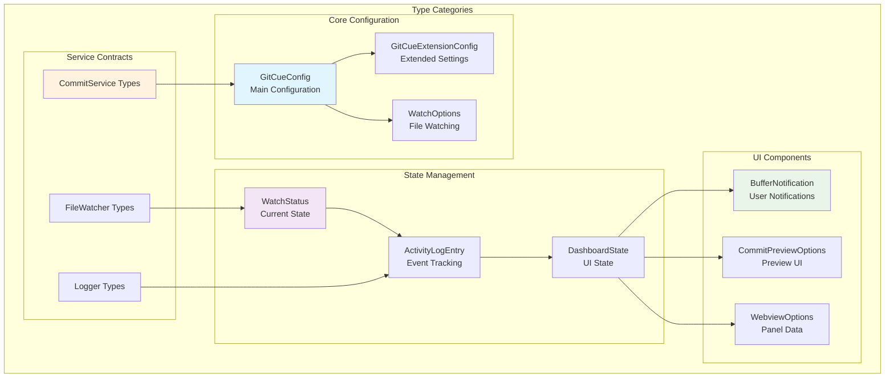
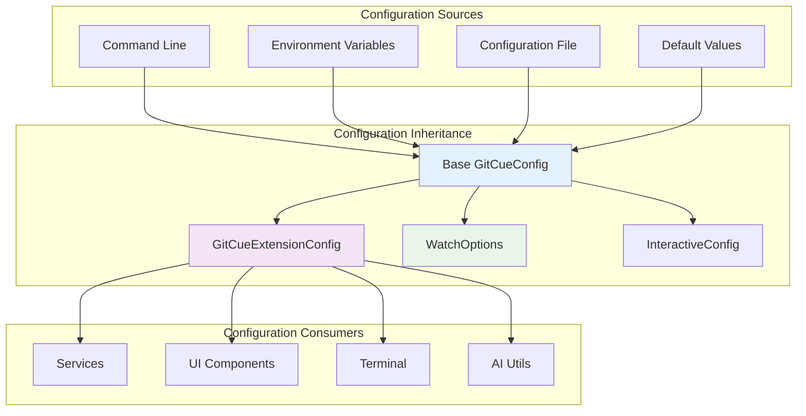
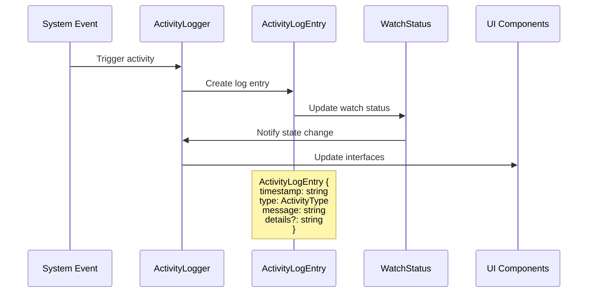
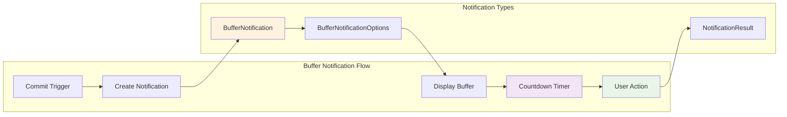
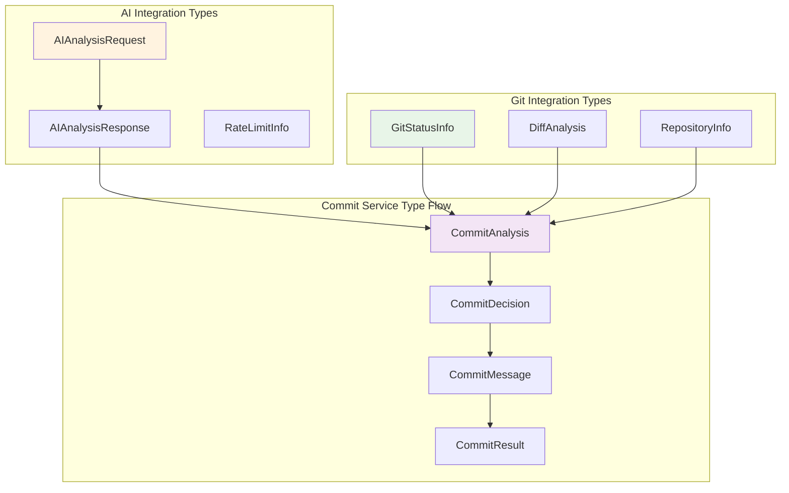
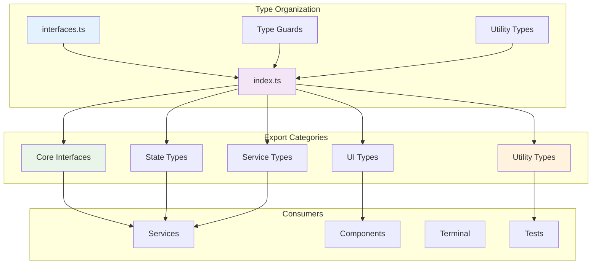

# 📝 Types Directory

The Types directory contains comprehensive TypeScript type definitions and interfaces that define the data structures, contracts, and type safety throughout the GitCue extension. This directory ensures type consistency, improved developer experience, and runtime safety.

## 🏗️ Type Architecture Overview



---

## 🔧 Core Configuration Types

### GitCueConfig Interface

**Purpose**: Defines the main configuration structure for GitCue settings and behavior.

```typescript
export interface GitCueConfig {
  // Core AI settings
  geminiApiKey: string;                    // Google Gemini API key
  commitMode: 'periodic' | 'intelligent'; // Commit behavior mode
  autoPush: boolean;                       // Automatic push after commit
  
  // File watching configuration
  watchPaths: string[];                    // Patterns to watch
  debounceMs: number;                      // Debounce timing (ms)
  bufferTimeSeconds: number;               // Buffer notification time
  
  // Rate limiting and API
  maxCallsPerMinute: number;               // API rate limit
  enableNotifications: boolean;            // Enable UI notifications
  autoWatch: boolean;                      // Auto-start watching
  
  // Interactive terminal settings
  interactiveOnError: boolean;             // Enable AI error analysis
  enableSuggestions: boolean;              // Enable AI suggestions
  terminalVerbose: boolean;                // Verbose terminal output
  sessionPersistence: boolean;             // Save session history
  maxHistorySize: number;                  // Max command history entries
}
```

### Configuration Hierarchy



---

## 📊 State Management Types

### WatchStatus Interface

**Purpose**: Tracks the current state of file watching and GitCue activity.

```typescript
export interface WatchStatus {
  // Core watching state
  isWatching: boolean;                     // Currently monitoring files
  filesChanged: number;                    // Count of changed files
  lastChange: string;                      // Timestamp of last change
  lastCommit: string;                      // Timestamp of last commit
  
  // Commit state
  pendingCommit: boolean;                  // Commit in buffer period
  aiAnalysisInProgress: boolean;           // AI analysis running
  
  // Activity tracking
  activityHistory: ActivityLogEntry[];     // Recent activity log
  changedFiles: Set<string>;               // Currently changed files
}
```

### Activity Tracking Types



```typescript
export interface ActivityLogEntry {
  timestamp: string;                       // ISO timestamp
  type: ActivityType;                      // Event category
  message: string;                         // Human-readable message
  details?: string;                        // Optional additional info
}

export type ActivityType = 
  | 'file_change'                          // File modification detected
  | 'ai_analysis'                          // AI analysis started/completed
  | 'commit'                              // Commit executed
  | 'error'                               // Error occurred
  | 'watch_start'                         // File watching started
  | 'watch_stop';                         // File watching stopped
```

### Dashboard State Management

```typescript
export interface DashboardState {
  // Current system state
  isWatching: boolean;                     // File watching active
  config: GitCueConfig;                    // Current configuration
  watchStatus: WatchStatus;                // Detailed status info
  
  // UI-specific state
  lastUpdated?: string;                    // Last UI update timestamp
  errorMessage?: string;                   // Current error (if any)
  
  // Feature flags
  features?: {
    aiEnabled: boolean;                    // AI features available
    gitAvailable: boolean;                 // Git repository detected
    workspaceOpen: boolean;                // VS Code workspace open
  };
}
```

---

## 🖥️ UI Component Types

### Buffer Notification System



```typescript
export interface BufferNotification {
  panel: vscode.WebviewPanel;              // VS Code webview panel
  timer: NodeJS.Timeout;                   // Countdown timer
  cancelled: boolean;                      // User cancellation state
}

export interface BufferNotificationOptions {
  message: string;                         // Commit message
  status: string;                          // Git status info
  timeLeft: number;                        // Seconds remaining
  config: GitCueConfig;                    // Current config
  
  // Additional context
  workspacePath?: string;                  // Current workspace
  significance?: 'low' | 'medium' | 'high'; // Change significance
  reasoning?: string;                      // AI reasoning
}
```

### Commit Preview System

```typescript
export interface CommitPreviewOptions {
  message: string;                         // Generated commit message
  status: string;                          // Git repository status
  workspacePath: string;                   // Workspace directory
  config: GitCueConfig;                    // Current configuration
  
  // Preview metadata
  filesChanged?: string[];                 // List of changed files
  diffSummary?: string;                    // Summary of changes
  aiGenerated?: boolean;                   // AI-generated message
  canEdit?: boolean;                       // Allow message editing
}
```

---

## 🔄 Service Integration Types

### Commit Service Types



```typescript
// Commit analysis types
export interface CommitAnalysis {
  shouldCommit: boolean;                   // AI recommendation
  reason: string;                          // Analysis reasoning
  significance: 'low' | 'medium' | 'high'; // Change importance
  confidence: number;                      // Confidence score (0-1)
  
  // Additional metadata
  filesAnalyzed: number;                   // Number of files
  linesChanged: number;                    // Total line changes
  commitType?: ConventionalCommitType;     // Suggested commit type
}

export type ConventionalCommitType = 
  | 'feat'     | 'fix'      | 'docs'     | 'style'
  | 'refactor' | 'test'     | 'chore'    | 'perf'
  | 'ci'       | 'build'    | 'revert';

// Git repository types
export interface GitStatusInfo {
  branch: string;                          // Current branch
  ahead: number;                           // Commits ahead of remote
  behind: number;                          // Commits behind remote
  staged: string[];                        // Staged files
  unstaged: string[];                      // Unstaged files
  untracked: string[];                     // Untracked files
  hasRemote: boolean;                      // Remote repository exists
}
```

### File Watcher Service Types

```typescript
// File watching configuration
export interface WatchOptions {
  ignored: string[];                       // Ignore patterns
  persistent: boolean;                     // Keep process alive
  ignoreInitial: boolean;                  // Skip initial scan
  followSymlinks: boolean;                 // Follow symbolic links
  depth?: number;                          // Maximum depth
  
  // Performance options
  awaitWriteFinish?: {
    stabilityThreshold: number;            // File stability timeout
    pollInterval: number;                  // Polling interval
  };
  
  // Custom filters
  usePolling?: boolean;                    // Use polling instead of events
  interval?: number;                       // Polling interval
  binaryInterval?: number;                 // Binary file polling
}

// File change event types
export interface FileChangeEvent {
  type: 'add' | 'change' | 'unlink';       // Change type
  path: string;                            // File path
  timestamp: number;                       // Event timestamp
  size?: number;                           // File size
  isDirectory: boolean;                    // Directory flag
}
```

---

## 🧪 Utility and Helper Types

### Type Guards and Validators

```typescript
// Type guard functions
export function isGitCueConfig(obj: any): obj is GitCueConfig {
  return obj &&
    typeof obj.geminiApiKey === 'string' &&
    ['periodic', 'intelligent'].includes(obj.commitMode) &&
    typeof obj.autoPush === 'boolean' &&
    Array.isArray(obj.watchPaths) &&
    typeof obj.debounceMs === 'number';
}

export function isActivityLogEntry(obj: any): obj is ActivityLogEntry {
  return obj &&
    typeof obj.timestamp === 'string' &&
    typeof obj.message === 'string' &&
    ['file_change', 'ai_analysis', 'commit', 'error', 'watch_start', 'watch_stop'].includes(obj.type);
}

export function isWatchStatus(obj: any): obj is WatchStatus {
  return obj &&
    typeof obj.isWatching === 'boolean' &&
    typeof obj.filesChanged === 'number' &&
    Array.isArray(obj.activityHistory);
}
```

### Utility Types

```typescript
// Partial type utilities
export type PartialConfig = Partial<GitCueConfig>;
export type RequiredConfig = Required<GitCueConfig>;
export type ConfigKeys = keyof GitCueConfig;

// Status update types
export type WatchStatusUpdate = Partial<WatchStatus>;
export type ActivityUpdate = Pick<ActivityLogEntry, 'type' | 'message'> & {
  details?: string;
};

// Event handler types
export type ActivityCallback = (activity: ActivityLogEntry) => void;
export type StatusCallback = (status: WatchStatus) => void;
export type ConfigCallback = (config: GitCueConfig) => void;

// Promise utility types
export type AsyncResult<T> = Promise<T | null>;
export type ServiceResult<T> = Promise<{ success: boolean; data?: T; error?: string }>;
```

---

## 🔍 Advanced Type Patterns

### Conditional Types

```typescript
// Configuration validation types
export type ValidatedConfig<T extends PartialConfig> = T extends { geminiApiKey: string }
  ? T extends { commitMode: 'periodic' | 'intelligent' }
    ? GitCueConfig
    : never
  : never;

// Service state types
export type ServiceState<T extends string> = 
  T extends 'commit' ? CommitServiceState :
  T extends 'watcher' ? FileWatcherState :
  T extends 'dashboard' ? DashboardServiceState :
  never;

interface CommitServiceState {
  isGenerating: boolean;
  lastMessage: string;
  pendingCommits: number;
}

interface FileWatcherState {
  isWatching: boolean;
  watchedPaths: string[];
  lastChange: Date;
}

interface DashboardServiceState {
  openPanels: number;
  lastUpdate: Date;
  isVisible: boolean;
}
```

### Template Literal Types

```typescript
// Activity type templates
export type ActivityMessage<T extends ActivityType> = 
  T extends 'file_change' ? `File changed: ${string}` :
  T extends 'commit' ? `Commit: ${string}` :
  T extends 'error' ? `Error: ${string}` :
  string;

// Configuration key templates
export type ConfigPath = 
  | 'geminiApiKey'
  | 'commitMode'
  | 'autoPush'
  | `watchPaths.${number}`
  | `watchOptions.${keyof WatchOptions}`;
```

---

## 🛠️ Development Utilities

### Type Testing Utilities

```typescript
// Type assertion utilities for testing
export function assertIsGitCueConfig(obj: unknown): asserts obj is GitCueConfig {
  if (!isGitCueConfig(obj)) {
    throw new Error('Invalid GitCueConfig object');
  }
}

export function assertIsWatchStatus(obj: unknown): asserts obj is WatchStatus {
  if (!isWatchStatus(obj)) {
    throw new Error('Invalid WatchStatus object');
  }
}

// Mock type generators for testing
export function createMockConfig(overrides: PartialConfig = {}): GitCueConfig {
  return {
    geminiApiKey: 'test-key',
    commitMode: 'intelligent',
    autoPush: true,
    watchPaths: ['src/**'],
    debounceMs: 30000,
    bufferTimeSeconds: 30,
    maxCallsPerMinute: 15,
    enableNotifications: true,
    autoWatch: false,
    interactiveOnError: true,
    enableSuggestions: true,
    terminalVerbose: false,
    sessionPersistence: true,
    maxHistorySize: 100,
    ...overrides
  };
}

export function createMockWatchStatus(overrides: Partial<WatchStatus> = {}): WatchStatus {
  return {
    isWatching: false,
    filesChanged: 0,
    lastChange: '',
    lastCommit: '',
    pendingCommit: false,
    aiAnalysisInProgress: false,
    activityHistory: [],
    changedFiles: new Set(),
    ...overrides
  };
}
```

### Type Documentation

```typescript
/**
 * GitCue Configuration Interface
 * 
 * Defines the complete configuration structure for GitCue extension.
 * This interface ensures type safety across all configuration operations.
 * 
 * @example
 * ```typescript
 * const config: GitCueConfig = {
 *   geminiApiKey: process.env.GEMINI_API_KEY,
 *   commitMode: 'intelligent',
 *   autoPush: true,
 *   // ... other required properties
 * };
 * ```
 * 
 * @see {@link https://github.com/sbeeredd04/Auto-Commit/tree/main/gitcue#configuration}
 */
export interface GitCueConfig {
  // ... interface definition
}

/**
 * Activity Log Entry Interface
 * 
 * Represents a single activity event in GitCue's activity tracking system.
 * Used for logging file changes, commits, errors, and system events.
 * 
 * @example
 * ```typescript
 * const logEntry: ActivityLogEntry = {
 *   timestamp: new Date().toISOString(),
 *   type: 'commit',
 *   message: 'Successfully committed changes',
 *   details: 'feat: add new feature implementation'
 * };
 * ```
 */
export interface ActivityLogEntry {
  // ... interface definition
}
```

---

## 📚 Type Export Structure

### Index Exports

```typescript
// src/types/index.ts
export * from './interfaces';

// Re-export commonly used types
export type {
  GitCueConfig,
  WatchStatus,
  ActivityLogEntry,
  DashboardState,
  BufferNotification,
  CommitPreviewOptions
} from './interfaces';

// Export utility types
export type {
  PartialConfig,
  ActivityCallback,
  StatusCallback,
  ConfigCallback,
  AsyncResult,
  ServiceResult
} from './interfaces';

// Export type guards
export {
  isGitCueConfig,
  isActivityLogEntry,
  isWatchStatus,
  assertIsGitCueConfig,
  assertIsWatchStatus
} from './interfaces';
```

### Interface Organization



---

## 🧪 Testing Type Safety

### Type Testing Examples

```typescript
// Type safety tests
describe('Type Safety', () => {
  it('should validate GitCueConfig structure', () => {
    const validConfig: GitCueConfig = createMockConfig();
    expect(isGitCueConfig(validConfig)).toBe(true);
    
    const invalidConfig = { ...validConfig, commitMode: 'invalid' };
    expect(isGitCueConfig(invalidConfig)).toBe(false);
  });
  
  it('should enforce activity log entry types', () => {
    const validEntry: ActivityLogEntry = {
      timestamp: new Date().toISOString(),
      type: 'commit',
      message: 'Test commit',
      details: 'Additional details'
    };
    
    expect(isActivityLogEntry(validEntry)).toBe(true);
  });
  
  it('should provide proper type inference', () => {
    const config = createMockConfig({ commitMode: 'periodic' });
    
    // TypeScript should infer the correct type
    if (config.commitMode === 'periodic') {
      expect(config.commitMode).toBe('periodic');
    }
  });
});
```

---

The Types directory provides comprehensive type safety and clear contracts for all data structures used throughout GitCue, ensuring robust development experience, runtime safety, and maintainable code architecture. 