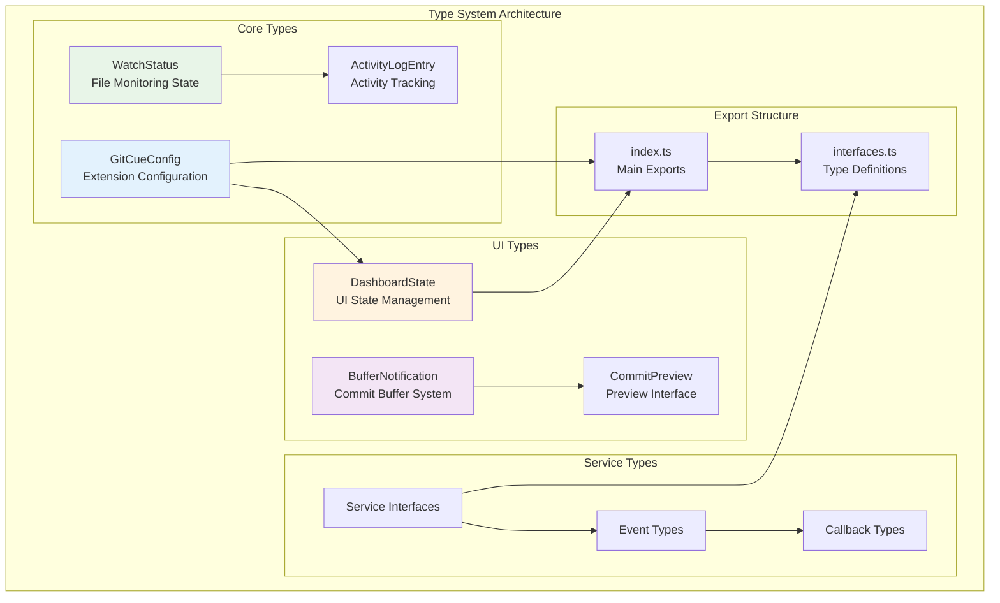
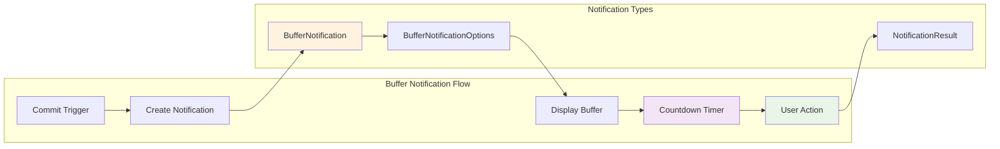

# 🎯 Types Directory

The Types directory contains all TypeScript interface definitions and type declarations for GitCue. This module provides type safety, IntelliSense support, and clear API contracts throughout the extension.

## 🏗️ Architecture Overview



---

## 🎨 Core Configuration Types

### GitCueConfig Interface

**Purpose**: Defines the complete configuration structure for GitCue extension settings.

```typescript
export interface GitCueConfig {
  // Core AI Integration
  geminiApiKey: string;                    // Gemini API key for AI features
  
  // Commit Behavior
  commitMode: 'periodic' | 'intelligent'; // Commit strategy
  autoPush: boolean;                       // Auto-push to remote
  bufferTimeSeconds: number;               // Buffer time for commit cancellation
  
  // File Watching
  watchPaths: string[];                    // Glob patterns for files to watch
  debounceMs: number;                      // Debounce time for file changes
  autoWatch: boolean;                      // Auto-start watching on extension load
  
  // Rate Limiting & Performance
  maxCallsPerMinute: number;               // API rate limiting
  enableNotifications: boolean;            // Show VS Code notifications
  
  // Interactive Terminal
  interactiveOnError: boolean;             // Show AI suggestions on command errors
  enableSuggestions: boolean;              // Enable AI-powered suggestions
  terminalVerbose: boolean;                // Verbose terminal logging
  sessionPersistence: boolean;             // Save command history across sessions
  maxHistorySize: number;                  // Maximum command history entries
  
  // Advanced Watch Configuration
  watchOptions: {
    ignored: string[];                     // Patterns to ignore
    persistent: boolean;                   // Keep watching process alive
    ignoreInitial: boolean;                // Ignore initial file scan
    followSymlinks: boolean;               // Follow symbolic links
    depth?: number;                        // Maximum directory depth
  };
}
```

### Configuration Usage Examples

```typescript
// Basic configuration access
const config = configManager.getConfig();

// Type-safe property access
if (config.commitMode === 'intelligent') {
  // AI-powered commit logic
}

// Configuration validation
const isValid = config.geminiApiKey && config.geminiApiKey.length > 0;
```

---

## 📊 Activity & State Management

### WatchStatus Interface

**Purpose**: Tracks real-time file watching state and activity metrics.

```typescript
export interface WatchStatus {
  isWatching: boolean;                     // Current watching state
  filesChanged: number;                    // Count of changed files
  lastChange: string;                      // Last file change timestamp
  lastCommit: string;                      // Last commit information
  pendingCommit: boolean;                  // Commit in progress
  aiAnalysisInProgress: boolean;           // AI analysis running
  activityHistory: ActivityLogEntry[];     // Recent activity log
  changedFiles: Set<string>;               // Set of changed file paths
}
```

### ActivityLogEntry Interface

**Purpose**: Structured logging for all GitCue activities and events.

```typescript
export interface ActivityLogEntry {
  timestamp: string;                       // ISO timestamp
  type: ActivityType;                      // Activity category
  message: string;                         // Human-readable message
  details?: string;                        // Additional context
}

type ActivityType = 
  | 'file_change'                          // File modification detected
  | 'ai_analysis'                          // AI analysis started/completed
  | 'commit'                               // Commit operation
  | 'error'                                // Error occurrence
  | 'watch_start'                          // File watching started
  | 'watch_stop'                           // File watching stopped
  | 'buffer_start'                         // Commit buffer started
  | 'buffer_cancel';                       // Commit buffer cancelled
```

---

## 🖥️ UI Component Types

### DashboardState Interface

**Purpose**: Manages state for dashboard and webview components.

```typescript
export interface DashboardState {
  // Current system state
  isWatching: boolean;                     // File watching active
  config: GitCueConfig;                    // Current configuration
  watchStatus: WatchStatus;                // Detailed status info
  
  // UI-specific state
  lastUpdated?: string;                    // Last UI update timestamp
  errorMessage?: string;                   // Current error (if any)
  
  // Feature flags
  features?: {
    aiEnabled: boolean;                    // AI features available
    gitAvailable: boolean;                 // Git repository detected
    workspaceOpen: boolean;                // VS Code workspace open
  };
}
```

### Buffer Notification System



```typescript
export interface BufferNotification {
  panel: vscode.WebviewPanel;              // VS Code webview panel
  timer: NodeJS.Timeout;                   // Countdown timer
  cancelled: boolean;                      // User cancellation state
}

export interface BufferNotificationOptions {
  message: string;                         // Commit message
  status: string;                          // Git status output
  timeLeft: number;                        // Remaining buffer time
  config: GitCueConfig;                    // Extension configuration
}
```

### Commit Preview System

```typescript
export interface CommitPreviewOptions {
  message: string;                         // Generated commit message
  status: string;                          // Git status output
  workspacePath: string;                   // Repository path
  config: GitCueConfig;                    // Extension configuration
}

export interface CommitPreviewResult {
  action: 'commit' | 'cancel' | 'edit';    // User action
  commitMessage?: string;                  // Modified commit message
  shouldPush?: boolean;                    // Push to remote
}
```

---

## 🔧 Service Integration Types

### Service Interfaces

```typescript
// Callback types for service communication
export type UpdateCallback = () => void;
export type MessageCallback = (message: any) => void;
export type ErrorCallback = (error: Error) => void;

// Service method signatures
export interface ServiceMethod<T = any> {
  execute: (...args: any[]) => Promise<T>;
  onError?: ErrorCallback;
  onSuccess?: (result: T) => void;
}

// Event system types
export interface GitCueEvent {
  type: string;
  data?: any;
  timestamp: number;
}
```

### Advanced Configuration Types

```typescript
// Watch configuration with advanced options
export interface WatchConfiguration {
  patterns: string[];                      // File patterns to watch
  ignored: string[];                       // Patterns to ignore
  options: {
    usePolling?: boolean;                  // Use polling instead of events
    pollInterval?: number;                 // Polling interval (ms)
    followSymlinks?: boolean;              // Follow symbolic links
    depth?: number;                        // Maximum directory depth
    ignoreInitial?: boolean;               // Ignore initial file scan
  };
}

// AI Analysis configuration
export interface AIAnalysisConfig {
  model: string;                           // AI model to use
  maxTokens: number;                       // Maximum response tokens
  temperature: number;                     // Response creativity (0-1)
  timeout: number;                         // Request timeout (ms)
  retryCount: number;                      // Number of retries
}
```

---

## 📱 Terminal Integration Types

### Terminal Session Types

```typescript
export interface TerminalSession {
  id: string;                              // Unique session identifier
  name: string;                            // Display name
  workspaceRoot: string;                   // Working directory
  history: string[];                       // Command history
  createdAt: Date;                         // Session creation time
  isActive: boolean;                       // Session active state
}

export interface TerminalCommand {
  input: string;                           // User input
  output?: string;                         // Command output
  error?: string;                          // Error output
  exitCode?: number;                       // Exit code
  timestamp: Date;                         // Execution time
  duration?: number;                       // Execution duration (ms)
}
```

---

## 🎯 Type Utilities

### Type Guards

```typescript
// Type guard functions for runtime type checking
export function isGitCueConfig(obj: any): obj is GitCueConfig {
  return obj && typeof obj.geminiApiKey === 'string' && 
         typeof obj.commitMode === 'string';
}

export function isWatchStatus(obj: any): obj is WatchStatus {
  return obj && typeof obj.isWatching === 'boolean' && 
         typeof obj.filesChanged === 'number';
}

export function isActivityLogEntry(obj: any): obj is ActivityLogEntry {
  return obj && typeof obj.timestamp === 'string' && 
         typeof obj.type === 'string' && 
         typeof obj.message === 'string';
}
```

### Type Validation

```typescript
// Configuration validation helpers
export interface ValidationResult {
  valid: boolean;
  errors: string[];
  warnings: string[];
}

export interface ConfigValidator {
  validate(config: Partial<GitCueConfig>): ValidationResult;
  validateProperty(key: keyof GitCueConfig, value: any): boolean;
}
```

---

## 📚 Usage Examples

### Basic Type Usage

```typescript
import { GitCueConfig, WatchStatus, ActivityLogEntry } from '../types';

// Service implementation with proper types
class ExampleService {
  private config: GitCueConfig;
  private watchStatus: WatchStatus;
  
  constructor(config: GitCueConfig) {
    this.config = config;
    this.watchStatus = {
      isWatching: false,
      filesChanged: 0,
      lastChange: 'None',
      lastCommit: 'None',
      pendingCommit: false,
      aiAnalysisInProgress: false,
      activityHistory: [],
      changedFiles: new Set()
    };
  }
  
  logActivity(type: ActivityLogEntry['type'], message: string) {
    const entry: ActivityLogEntry = {
      timestamp: new Date().toISOString(),
      type,
      message
    };
    
    this.watchStatus.activityHistory.push(entry);
  }
}
```

### Advanced Type Usage

```typescript
// Generic service with type parameters
interface GenericService<T, U> {
  process(input: T): Promise<U>;
  validate(input: T): boolean;
}

// Buffer notification with type safety
class BufferService implements GenericService<BufferNotificationOptions, BufferNotification> {
  async process(options: BufferNotificationOptions): Promise<BufferNotification> {
    // Type-safe buffer creation
    const panel = vscode.window.createWebviewPanel(/* ... */);
    const timer = setTimeout(() => {}, options.timeLeft * 1000);
    
    return {
      panel,
      timer,
      cancelled: false
    };
  }
  
  validate(options: BufferNotificationOptions): boolean {
    return options.message.length > 0 && 
           options.timeLeft > 0 && 
           options.config.bufferTimeSeconds > 0;
  }
}
```

---

## 🔍 Type Export Structure

### Main Exports (index.ts)

```typescript
// Core configuration and state types
export type { GitCueConfig, WatchStatus, ActivityLogEntry } from './interfaces';

// UI component types
export type { DashboardState, BufferNotification, CommitPreviewOptions } from './interfaces';

// Service integration types
export type { UpdateCallback, MessageCallback, ServiceMethod } from './interfaces';

// Terminal types
export type { TerminalSession, TerminalCommand } from './interfaces';

// Type utilities
export { isGitCueConfig, isWatchStatus, isActivityLogEntry } from './interfaces';
```

### Complete Interface Definitions (interfaces.ts)

Contains all interface definitions with comprehensive JSDoc documentation, validation rules, and usage examples.

---

## 🧪 Testing Types

### Test Utilities

```typescript
// Mock data generators for testing
export interface MockDataGenerator {
  generateConfig(): GitCueConfig;
  generateWatchStatus(): WatchStatus;
  generateActivityEntry(): ActivityLogEntry;
  generateDashboardState(): DashboardState;
}

// Test helpers
export interface TestHelpers {
  createMockConfig(overrides?: Partial<GitCueConfig>): GitCueConfig;
  createMockWatchStatus(overrides?: Partial<WatchStatus>): WatchStatus;
  validateTypeStructure<T>(obj: T, schema: any): boolean;
}
```

---

## 🚀 Future Enhancements

### Planned Type Additions

1. **Plugin System Types**: Interface definitions for future plugin architecture
2. **Advanced AI Types**: More sophisticated AI interaction types
3. **Performance Metrics**: Types for performance monitoring and optimization
4. **Cloud Integration**: Types for cloud-based features and synchronization
5. **Collaboration Types**: Types for team collaboration features

---

The Types directory provides a robust foundation for type safety throughout GitCue, ensuring reliable code, excellent developer experience, and maintainable architecture as the extension grows and evolves. 