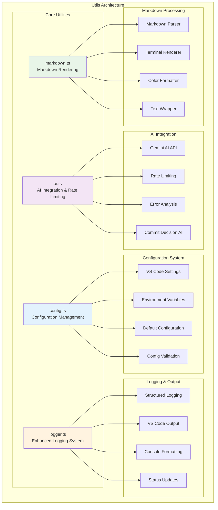
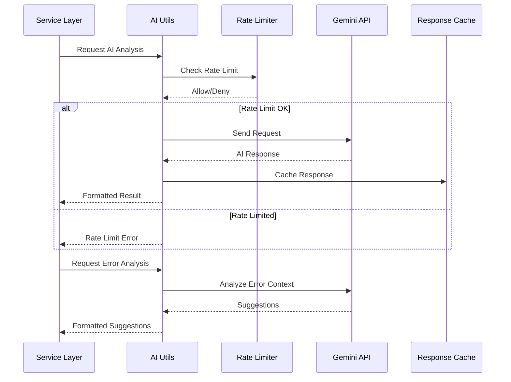
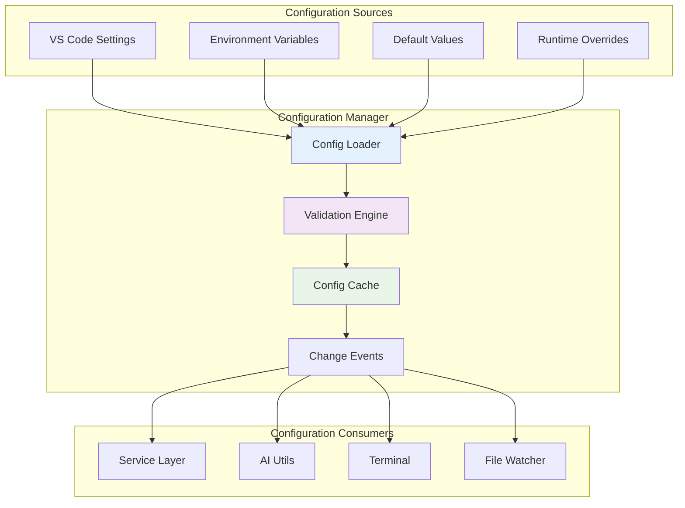
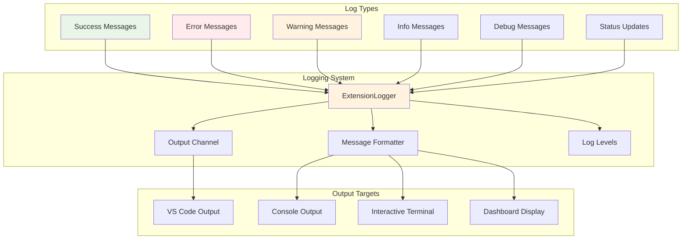
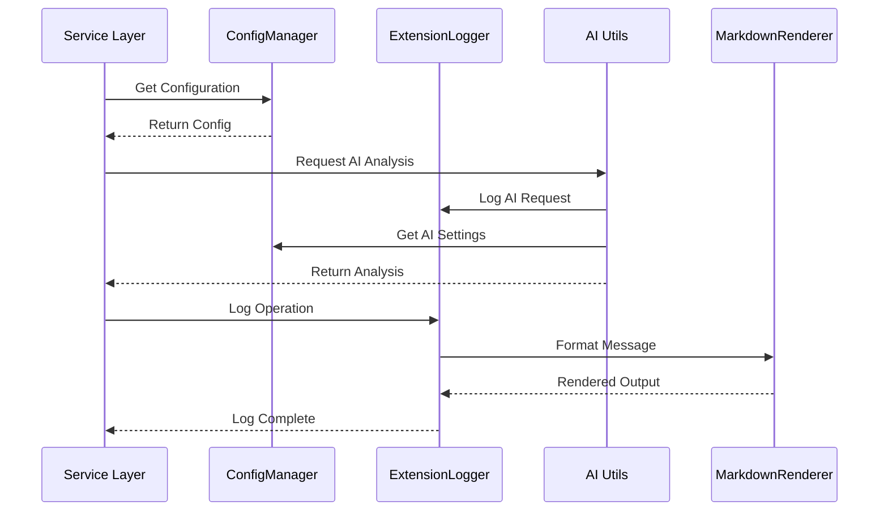

# 🔧 Utils Directory

The Utils directory contains essential utility modules that provide core functionality for AI integration, configuration management, logging, and markdown rendering. These utilities form the foundation of GitCue's advanced features.

## 🏗️ Architecture Overview



---

## 🤖 AI Integration (ai.ts)

**Purpose**: Provides comprehensive AI integration with Gemini API, including rate limiting, error analysis, commit decision making, and intelligent suggestions.

### 🔄 AI Service Architecture



### 🎯 Key Features

#### **Intelligent Commit Decision Making**
```typescript
export async function makeCommitDecisionWithAI(
  gitDiff: string, 
  gitStatus: string
): Promise<CommitDecision> {
  // AI-powered analysis of git changes
  // Returns structured decision with reasoning
  // Includes significance level and suggested actions
}

interface CommitDecision {
  shouldCommit: boolean;
  reason: string;
  significance: 'LOW' | 'MEDIUM' | 'HIGH';
  suggestedMessage?: string;
  nextSteps?: string[];
}
```

#### **Error Analysis & Suggestions**
```typescript
export async function generateErrorSuggestion(
  errorContext: string
): Promise<string> {
  // Analyzes command errors and provides actionable suggestions
  // Includes specific commands and troubleshooting steps
  // Rate-limited for API efficiency
}

export async function showAISuggestionInVSCode(
  errorContext: string
): Promise<void> {
  // Displays AI suggestions in VS Code with proper formatting
  // Includes copy-to-clipboard functionality
  // Provides immediate actionable feedback
}
```

#### **Commit Message Generation**
```typescript
export async function generateCommitMessageWithAI(
  gitDiff: string, 
  gitStatus: string
): Promise<string> {
  // Generates conventional commit messages
  // Follows semantic versioning patterns
  // Includes scope and breaking change detection
}

interface CommitMessage {
  type: string;
  scope?: string;
  description: string;
  body?: string;
  breakingChange?: boolean;
}
```

#### **Rate Limiting System**
```typescript
class RateLimiter {
  private calls: number[] = [];
  private maxCalls: number;
  
  constructor(maxCallsPerMinute: number) {
    this.maxCalls = maxCallsPerMinute;
  }
  
  canMakeCall(): boolean {
    // Sliding window rate limiting
    // Prevents API quota exhaustion
    // Configurable limits per minute
  }
  
  getTimeUntilNextCall(): number {
    // Returns milliseconds until next call allowed
    // Enables user feedback and queue management
  }
}
```

### 🎨 AI Response Formatting

#### **Markdown Formatting**
```typescript
export function formatAISuggestion(suggestion: string): string {
  // Formats AI responses with proper markdown
  // Includes code blocks, headers, and lists
  // Optimizes for terminal and webview display
}

export function formatGitCommand(command: string): string {
  // Syntax highlighting for git commands
  // Visual emphasis for important parts
  // Consistent formatting across interfaces
}
```

#### **Visual Enhancement**
```typescript
export function createBox(message: string, title?: string): string {
  // Creates visual boxes for important information
  // Includes borders, padding, and titles
  // Responsive to terminal width
}
```

---

## ⚙️ Configuration Management (config.ts)

**Purpose**: Centralized configuration management with validation, defaults, and VS Code settings integration.

### 🔄 Configuration Architecture



### 🎯 Key Features

#### **GitCueExtensionConfig Interface**
```typescript
export interface GitCueExtensionConfig {
  // Core settings
  geminiApiKey: string;
  commitMode: 'periodic' | 'intelligent';
  autoPush: boolean;
  watchPaths: string[];
  debounceMs: number;
  bufferTimeSeconds: number;
  maxCallsPerMinute: number;
  enableNotifications: boolean;
  autoWatch: boolean;
  
  // Interactive terminal settings
  interactiveOnError: boolean;
  enableSuggestions: boolean;
  terminalVerbose: boolean;
  sessionPersistence: boolean;
  maxHistorySize: number;
  
  // Watch configuration
  watchOptions: {
    ignored: string[];
    persistent: boolean;
    ignoreInitial: boolean;
    followSymlinks: boolean;
    depth?: number;
  };
}
```

#### **ConfigManager Class**
```typescript
export class ConfigManager {
  private static instance: ConfigManager;
  
  getConfig(): GitCueExtensionConfig {
    // Loads and merges configuration from all sources
    // Applies defaults for missing values
    // Validates configuration integrity
  }
  
  validateConfig(): { valid: boolean; errors: string[] } {
    // Comprehensive configuration validation
    // Checks required fields and value ranges
    // Provides detailed error messages
  }
  
  getOptimizedWatchPatterns(): string[] {
    // Optimizes watch patterns for performance
    // Removes duplicates and conflicting patterns
    // Applies intelligent defaults
  }
  
  async updateConfig(
    key: string, 
    value: any, 
    target: vscode.ConfigurationTarget = vscode.ConfigurationTarget.Workspace
  ): Promise<void> {
    // Updates configuration with validation
    // Supports workspace and global settings
    // Triggers configuration change events
  }
}
```

### 🛠️ Configuration Utilities

#### **Specialized Configuration Getters**
```typescript
getWatchPatterns(): string[] {
  // Returns optimized file watching patterns
  // Includes default patterns and user customizations
}

getWatchOptions() {
  // Returns watch configuration with defaults
  // Includes performance optimizations
}

getInteractiveConfig() {
  // Returns terminal-specific configuration
  // Includes AI integration settings
}

getCommitConfig() {
  // Returns commit-specific configuration
  // Includes AI decision making settings
}
```

#### **Configuration Display**
```typescript
getConfigForDisplay(): Record<string, any> {
  // Returns configuration formatted for display
  // Masks sensitive information (API keys)
  // Includes computed values and status
}
```

---

## 📝 Enhanced Logging (logger.ts)

**Purpose**: Comprehensive logging system with structured output, multiple log levels, and VS Code integration.

### 🔄 Logging Architecture



### 🎯 Key Features

#### **ExtensionLogger Class**
```typescript
export class ExtensionLogger {
  private outputChannel: vscode.OutputChannel;
  private verbose: boolean = false;
  
  constructor(channelName: string = 'GitCue') {
    this.outputChannel = vscode.window.createOutputChannel(channelName);
  }
  
  success(message: string, details?: string): void {
    // Logs success messages with green formatting
    // Includes optional details and timestamps
    // Shows in VS Code output channel
  }
  
  error(message: string, details?: string): void {
    // Logs error messages with red formatting
    // Includes stack traces and error details
    // Provides actionable error information
  }
  
  warning(message: string, details?: string): void {
    // Logs warning messages with yellow formatting
    // Includes context and potential actions
    // Non-blocking notifications
  }
  
  info(message: string, title: string = 'INFO'): void {
    // Logs informational messages
    // Categorizes with custom titles
    // Supports verbose mode filtering
  }
  
  debug(message: string): void {
    // Debug-level logging for development
    // Only shows when verbose mode enabled
    // Includes detailed diagnostic information
  }
}
```

#### **Specialized Logging Methods**
```typescript
status(message: string, type: 'info' | 'success' | 'warning' | 'error' | 'processing' = 'info'): void {
  // Status updates with visual indicators
  // Includes emoji and color coding
  // Formatted for dashboard display
}

section(title: string, subtitle?: string): void {
  // Creates visual sections in logs
  // Includes headers and separators
  // Improves log readability
}

config(title: string, items: Record<string, any>): void {
  // Logs configuration in structured format
  // Includes key-value pairs and validation
  // Masks sensitive information
}

fileChange(event: string, path: string): void {
  // Logs file system events
  // Includes timestamps and file paths
  // Supports watch debugging
}

commitSummary(message: string, hasRemote: boolean): void {
  // Logs commit operations with summary
  // Includes commit message and push status
  // Provides operation feedback
}

interactiveInfo(message: string): void {
  // Logs interactive terminal events
  // Includes session information
  // Supports terminal debugging
}

aiSuggestion(message: string): void {
  // Logs AI-generated suggestions
  // Includes suggestion quality metrics
  // Supports AI debugging and improvement
}
```

### 🎨 Visual Formatting

#### **Message Formatting**
```typescript
// Visual separators and sections
divider(): void {
  // Creates visual dividers in logs
  // Separates logical sections
  // Improves readability
}

space(): void {
  // Adds whitespace for visual separation
  // Prevents log crowding
  // Improves user experience
}

stage(message: string, type: 'info' | 'success' | 'error' | 'processing' = 'info'): void {
  // Logs process stages with visual indicators
  // Includes progress indicators
  // Shows operation flow
}
```

---

## 🎨 Markdown Rendering (markdown.ts)

**Purpose**: Advanced markdown rendering system for terminal output with color support, formatting, and visual enhancements.

### 🔄 Markdown Architecture

```mermaid
graph TB
    subgraph "Markdown Processing"
        PARSER[Markdown Parser]
        RENDERER[Terminal Renderer]
        FORMATTER[Color Formatter]
        WRAPPER[Text Wrapper]
    end
    
    subgraph "Rendering Features"
        HEADERS[Headers (H1-H6)]
        LISTS[Lists (Ordered/Unordered)]
        CODE[Code Blocks]
        INLINE[Inline Formatting]
        LINKS[Links]
        QUOTES[Blockquotes]
    end
    
    subgraph "Visual Enhancements"
        COLORS[Color Schemes]
        BOXES[Visual Boxes]
        SEPARATORS[Separators]
        ICONS[Icons & Emojis]
    end
    
    PARSER --> RENDERER
    RENDERER --> FORMATTER
    FORMATTER --> WRAPPER
    
    HEADERS --> RENDERER
    LISTS --> RENDERER
    CODE --> RENDERER
    INLINE --> RENDERER
    LINKS --> RENDERER
    QUOTES --> RENDERER
    
    COLORS --> FORMATTER
    BOXES --> FORMATTER
    SEPARATORS --> FORMATTER
    ICONS --> FORMATTER
    
    style PARSER fill:#e3f2fd
    style RENDERER fill:#f3e5f5
    style COLORS fill:#e8f5e8
    style BOXES fill:#fff3e0
```

### 🎯 Key Features

#### **MarkdownRenderer Class**
```typescript
export class MarkdownRenderer {
  private options: Required<MarkdownRenderOptions>;
  
  constructor(options: MarkdownRenderOptions = {}) {
    this.options = {
      maxWidth: options.maxWidth || 80,
      colors: {
        header: options.colors?.header || '\x1b[1;36m',
        code: options.colors?.code || '\x1b[1;33m',
        bold: options.colors?.bold || '\x1b[1m',
        italic: options.colors?.italic || '\x1b[3m',
        list: options.colors?.list || '\x1b[36m',
        quote: options.colors?.quote || '\x1b[2m',
        reset: options.colors?.reset || '\x1b[0m',
        dim: options.colors?.dim || '\x1b[2m',
        ...options.colors
      }
    };
  }
  
  render(content: string): string {
    // Renders markdown content with full formatting
    // Includes headers, lists, code blocks, and inline formatting
    // Supports color themes and terminal width adaptation
  }
  
  createBox(text: string, title?: string): string {
    // Creates visual boxes with borders
    // Includes optional titles and padding
    // Responsive to terminal width
  }
  
  wrapText(text: string, width?: number): string {
    // Intelligent text wrapping
    // Preserves formatting and indentation
    // Handles ANSI color codes properly
  }
}
```

#### **Rendering Options**
```typescript
export interface MarkdownRenderOptions {
  maxWidth?: number;
  colors?: {
    header: string;
    code: string;
    bold: string;
    italic: string;
    list: string;
    quote: string;
    reset: string;
    dim: string;
  };
}
```

### 🎨 Visual Formatting

#### **Utility Functions**
```typescript
export function renderMarkdown(
  content: string, 
  options?: MarkdownRenderOptions
): string {
  // Convenience function for quick markdown rendering
  // Uses default options with customization support
  // Optimized for common use cases
}

export function createErrorSuggestionBox(suggestion: string): string {
  // Creates specialized boxes for error suggestions
  // Includes error-specific styling and icons
  // Optimized for AI suggestion display
}
```

#### **Advanced Features**
```typescript
private processInlineFormatting(line: string): string {
  // Processes inline markdown formatting
  // Supports **bold**, *italic*, `code`, and links
  // Maintains color consistency
}

private stripAnsi(text: string): string {
  // Removes ANSI color codes for length calculation
  // Enables proper text wrapping and alignment
  // Preserves visual formatting
}
```

---

## 🔗 Utils Integration

### Cross-Module Communication



### Shared Utilities

```typescript
// Singleton pattern for global access
export const configManager = ConfigManager.getInstance();
export const logger = new ExtensionLogger('GitCue');

// Utility functions for common operations
export function formatOperationResult(
  operation: string, 
  success: boolean, 
  details?: string
): string {
  // Formats operation results consistently
  // Includes success/failure indicators
  // Supports additional context
}

export function createProgressIndicator(
  current: number, 
  total: number, 
  message: string
): string {
  // Creates visual progress indicators
  // Includes percentage and progress bars
  // Supports custom messages
}
```

---

## 🧪 Testing Utilities

### Mock and Test Helpers

```typescript
// Mock configuration for testing
export function createMockConfig(overrides?: Partial<GitCueExtensionConfig>): GitCueExtensionConfig {
  return {
    geminiApiKey: 'test-key',
    commitMode: 'intelligent',
    autoPush: true,
    watchPaths: ['src/**'],
    debounceMs: 30000,
    bufferTimeSeconds: 30,
    maxCallsPerMinute: 15,
    enableNotifications: true,
    autoWatch: false,
    interactiveOnError: true,
    enableSuggestions: true,
    terminalVerbose: false,
    sessionPersistence: true,
    maxHistorySize: 100,
    watchOptions: {
      ignored: ['node_modules/**', '.git/**'],
      persistent: true,
      ignoreInitial: true,
      followSymlinks: false
    },
    ...overrides
  };
}

// Test utilities for AI functions
export function mockAIResponse(response: Partial<CommitDecision>): CommitDecision {
  return {
    shouldCommit: true,
    reason: 'Test reasoning',
    significance: 'MEDIUM',
    ...response
  };
}
```

---

## 📚 Usage Examples

### Basic Configuration Usage
```typescript
import { configManager } from '../utils/config';

// Get current configuration
const config = configManager.getConfig();

// Update configuration
await configManager.updateConfig('commitMode', 'intelligent');

// Validate configuration
const validation = configManager.validateConfig();
if (!validation.valid) {
  console.error('Configuration errors:', validation.errors);
}
```

### AI Integration Usage
```typescript
import { makeCommitDecisionWithAI, generateErrorSuggestion } from '../utils/ai';

// Make commit decision
const decision = await makeCommitDecisionWithAI(gitDiff, gitStatus);
if (decision.shouldCommit) {
  console.log('Commit recommended:', decision.reason);
}

// Generate error suggestion
const errorContext = `Command: git push\nError: ${errorMessage}`;
const suggestion = await generateErrorSuggestion(errorContext);
console.log('AI Suggestion:', suggestion);
```

### Logging Usage
```typescript
import logger from '../utils/logger';

// Log different types of messages
logger.success('Operation completed successfully');
logger.error('Failed to process request', error.message);
logger.warning('Configuration incomplete');
logger.info('Processing files...');
logger.debug('Debug information');

// Log structured data
logger.config('GitCue Configuration', {
  mode: 'intelligent',
  autoPush: true,
  apiKey: '***masked***'
});
```

### Markdown Rendering Usage
```typescript
import { renderMarkdown, createErrorSuggestionBox } from '../utils/markdown';

// Render markdown content
const rendered = renderMarkdown(`
# AI Suggestion
Try running these commands:
\`\`\`bash
git add .
git commit -m "fix: resolve merge conflict"
git push
\`\`\`
`);

// Create error suggestion box
const errorBox = createErrorSuggestionBox('Command failed. Try checking your Git configuration.');
```

---

## 🚀 Future Enhancements

### Planned Utilities

1. **Cache Management**: Intelligent caching for AI responses and configuration
2. **Performance Monitoring**: Utils for tracking extension performance
3. **Telemetry Utils**: Privacy-focused usage analytics
4. **Plugin System**: Utilities for extensible plugin architecture
5. **Cloud Integration**: Utils for cloud-based features and sync

### Optimization Opportunities

1. **Lazy Loading**: Load utilities only when needed
2. **Memory Management**: Optimize memory usage for large workspaces
3. **Parallel Processing**: Parallel AI requests and processing
4. **Offline Support**: Fallback functionality when API unavailable

---

The Utils directory provides essential foundation services that power GitCue's advanced features, ensuring reliable operation, excellent user experience, and maintainable architecture across all extension components. 