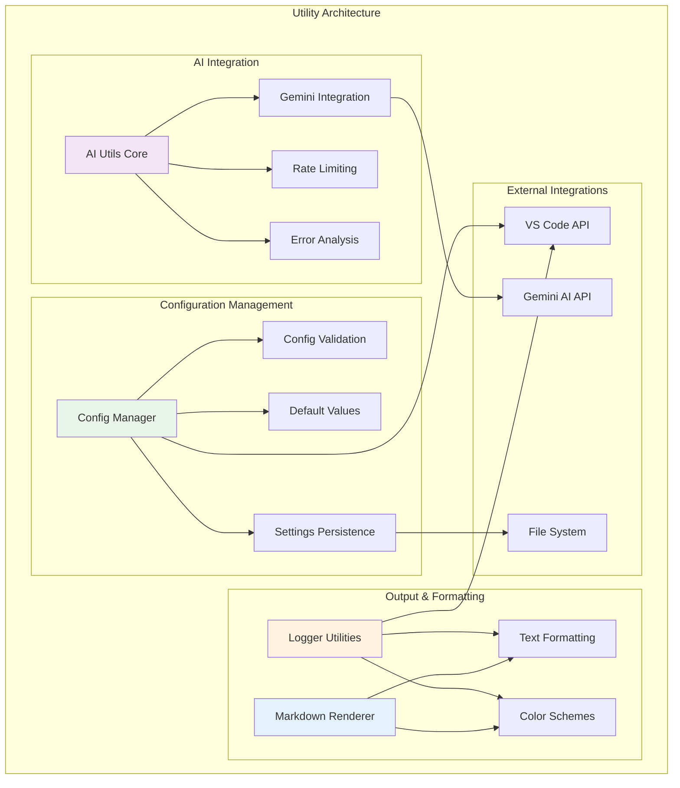
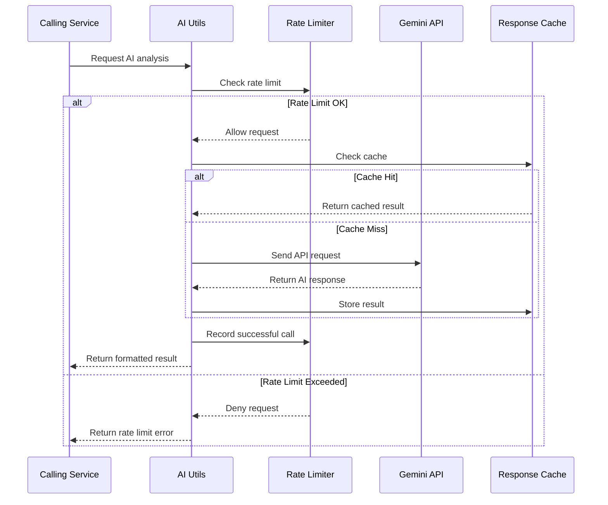
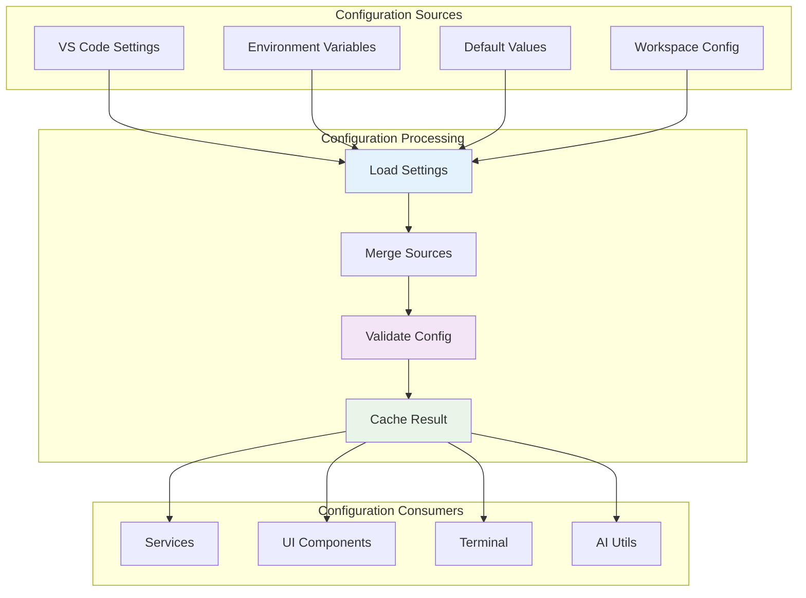
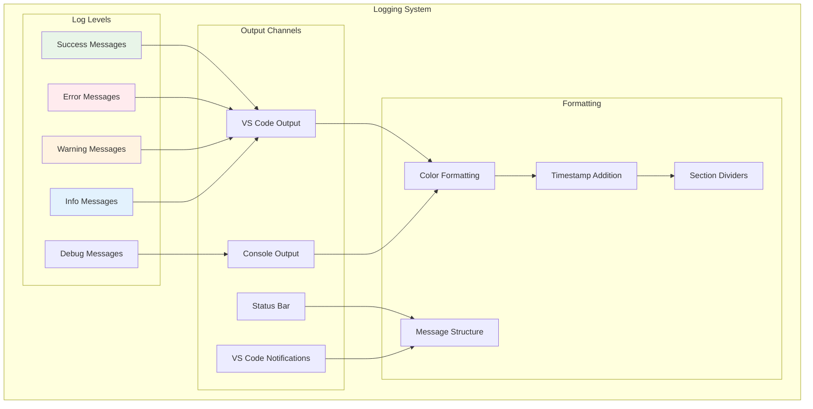
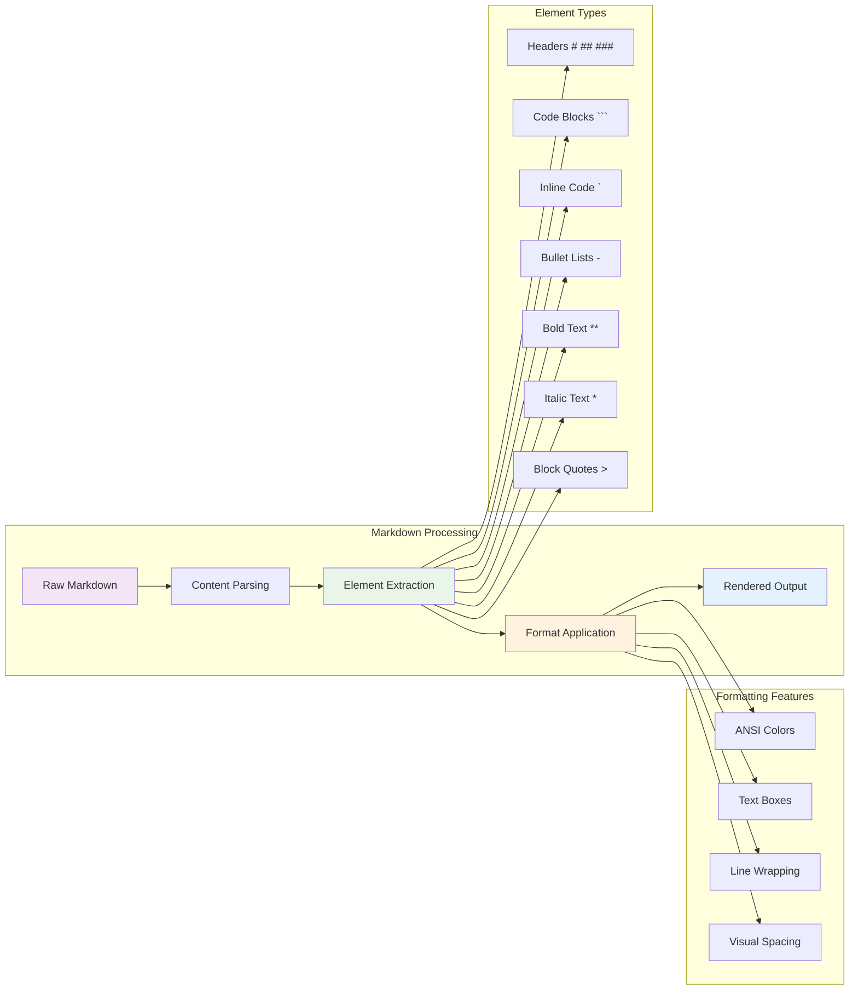
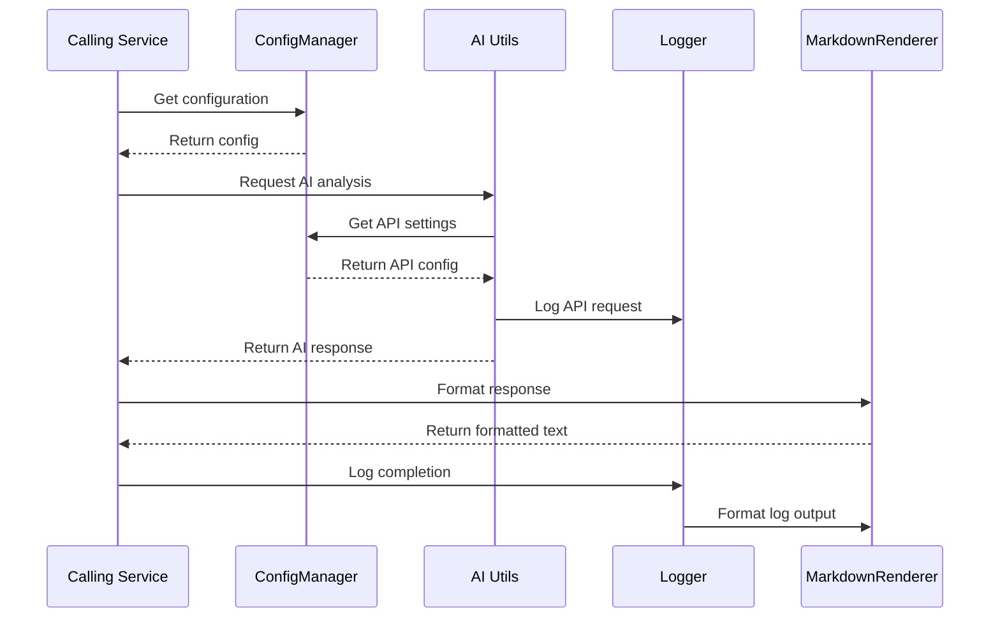
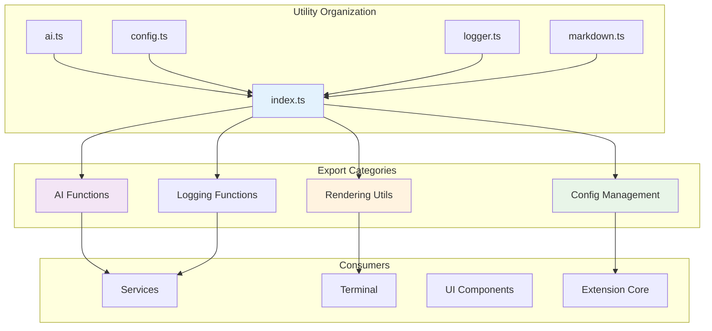

# 🛠️ Utils Directory

The Utils directory contains essential utility functions and helper modules that provide core functionality across the GitCue extension. These utilities handle AI integration, configuration management, logging, and markdown rendering with a focus on reusability and maintainability.

## 🏗️ Architecture Overview



---

## 🤖 AI Utils (`ai.ts`)

**Purpose**: Manages AI integration with Google Gemini, including rate limiting, error analysis, commit decision making, and intelligent suggestions.

### 🔄 AI Integration Flow



### 🎯 Key Features

#### **Intelligent Commit Decision Making**

```typescript
// AI-powered commit analysis with function calling
export async function makeCommitDecisionWithAI(
  gitDiff: string, 
  gitStatus: string
): Promise<CommitDecision> {
  const model = ai.getGenerativeModel({ 
    model: 'gemini-2.0-flash',
    tools: [{ functionDeclarations: [getCommitDecisionFunctionDeclaration()] }]
  });
  
  const prompt = `
    Analyze the following git changes and determine if they warrant a commit:
    
    Git Status:
    ${gitStatus}
    
    Git Diff:
    ${gitDiff}
    
    Consider:
    - Completeness of the change
    - Significance level (LOW/MEDIUM/HIGH)  
    - Whether this represents a logical unit of work
    - Code quality and potential issues
  `;
  
  const result = await model.generateContent(prompt);
  const functionCall = result.response.functionCalls()?.[0];
  
  if (functionCall?.name === 'should_commit_changes') {
    return functionCall.args as CommitDecision;
  }
  
  throw new Error('Invalid AI response format');
}
```

#### **Rate Limiting System**

```typescript
class RateLimiter {
  private calls: number[] = [];
  private maxCalls: number;
  
  constructor(maxCallsPerMinute: number) {
    this.maxCalls = maxCallsPerMinute;
  }
  
  canMakeCall(): boolean {
    this.cleanupOldCalls();
    return this.calls.length < this.maxCalls;
  }
  
  recordCall(): void {
    this.calls.push(Date.now());
  }
  
  getTimeUntilNextCall(): number {
    if (this.canMakeCall()) return 0;
    
    this.cleanupOldCalls();
    if (this.calls.length === 0) return 0;
    
    const oldestCall = Math.min(...this.calls);
    const timeElapsed = Date.now() - oldestCall;
    return Math.max(0, 60000 - timeElapsed);
  }
  
  private cleanupOldCalls(): void {
    const oneMinuteAgo = Date.now() - 60000;
    this.calls = this.calls.filter(timestamp => timestamp > oneMinuteAgo);
  }
}
```

#### **Error Analysis with Concise Suggestions**

```typescript
export async function generateErrorSuggestion(errorContext: string): Promise<string> {
  const model = ai.getGenerativeModel({ model: 'gemini-2.0-flash' });
  
  const prompt = `
    Analyze this error and provide a concise, actionable solution:
    
    ${errorContext}
    
    Requirements:
    - Keep response under 200 words
    - Focus on the most likely fix first
    - Provide specific commands when possible
    - Use markdown formatting for clarity
    - Include alternative solutions if relevant
  `;
  
  const result = await model.generateContent(prompt);
  return result.response.text();
}
```

### 🔧 AI Utils Methods

| Method | Description | Parameters | Returns |
|--------|-------------|------------|---------|
| `makeCommitDecisionWithAI()` | AI-powered commit decision | `gitDiff`, `gitStatus` | `CommitDecision` |
| `generateCommitMessageWithAI()` | Generate commit message | `gitDiff`, `gitStatus` | `string` |
| `generateErrorSuggestion()` | Analyze errors with AI | `errorContext` | `string` |
| `generateErrorSuggestionWithRateLimit()` | Rate-limited error analysis | `errorContext` | `string` |
| `testAIConnection()` | Test Gemini API connectivity | None | `boolean` |
| `formatAISuggestion()` | Format AI response | `suggestion` | `string` |

---

## ⚙️ Config Manager (`config.ts`)

**Purpose**: Centralized configuration management with validation, defaults, and VS Code settings integration.

### 🔄 Configuration Management Flow



### 🎯 Key Features

#### **Comprehensive Configuration Interface**

```typescript
export interface GitCueExtensionConfig {
  // Core settings
  geminiApiKey: string;
  commitMode: 'periodic' | 'intelligent';
  autoPush: boolean;
  watchPaths: string[];
  debounceMs: number;
  bufferTimeSeconds: number;
  maxCallsPerMinute: number;
  enableNotifications: boolean;
  autoWatch: boolean;
  
  // Interactive terminal settings
  interactiveOnError: boolean;
  enableSuggestions: boolean;
  terminalVerbose: boolean;
  sessionPersistence: boolean;
  maxHistorySize: number;
  
  // Watch configuration
  watchOptions: {
    ignored: string[];
    persistent: boolean;
    ignoreInitial: boolean;
    followSymlinks: boolean;
    depth?: number;
  };
}
```

#### **Smart Configuration Loading**

```typescript
export class ConfigManager {
  private static instance: ConfigManager;
  
  getConfig(): GitCueExtensionConfig {
    const config = vscode.workspace.getConfiguration('gitcue');
    
    return {
      // Core settings with validation
      geminiApiKey: config.get('geminiApiKey', ''),
      commitMode: config.get('commitMode', 'intelligent') as 'periodic' | 'intelligent',
      autoPush: config.get('autoPush', true),
      
      // File watching with intelligent defaults
      watchPaths: config.get('watchPaths', ['src/**', '*.js', '*.ts', '*.py', '*.md']),
      debounceMs: Math.max(1000, config.get('debounceMs', 30000)),
      bufferTimeSeconds: Math.max(5, config.get('bufferTimeSeconds', 30)),
      
      // Rate limiting
      maxCallsPerMinute: Math.max(1, Math.min(60, config.get('maxCallsPerMinute', 15))),
      
      // UI settings
      enableNotifications: config.get('enableNotifications', true),
      autoWatch: config.get('autoWatch', false),
      
      // Terminal settings
      interactiveOnError: config.get('interactiveOnError', true),
      enableSuggestions: config.get('enableSuggestions', true),
      terminalVerbose: config.get('terminalVerbose', false),
      sessionPersistence: config.get('sessionPersistence', true),
      maxHistorySize: Math.max(10, Math.min(1000, config.get('maxHistorySize', 100))),
      
      // Watch options
      watchOptions: this.getWatchOptions()
    };
  }
}
```

#### **Configuration Validation**

```typescript
validateConfig(): { valid: boolean; errors: string[] } {
  const config = this.getConfig();
  const errors: string[] = [];
  
  // Validate API key
  if (!config.geminiApiKey || config.geminiApiKey.trim() === '') {
    errors.push('Gemini API key is required');
  }
  
  // Validate commit mode
  if (!['periodic', 'intelligent'].includes(config.commitMode)) {
    errors.push('Commit mode must be either "periodic" or "intelligent"');
  }
  
  // Validate numeric values
  if (config.debounceMs < 1000) {
    errors.push('Debounce time must be at least 1000ms');
  }
  
  if (config.bufferTimeSeconds < 5) {
    errors.push('Buffer time must be at least 5 seconds');
  }
  
  if (config.maxCallsPerMinute < 1 || config.maxCallsPerMinute > 60) {
    errors.push('Max calls per minute must be between 1 and 60');
  }
  
  return {
    valid: errors.length === 0,
    errors
  };
}
```

### 🔧 Config Manager Methods

| Method | Description | Parameters | Returns |
|--------|-------------|------------|---------|
| `getConfig()` | Get current configuration | None | `GitCueExtensionConfig` |
| `validateConfig()` | Validate configuration | None | `ValidationResult` |
| `getOptimizedWatchPatterns()` | Get optimized watch patterns | None | `string[]` |
| `updateConfig()` | Update configuration value | `key`, `value`, `target` | `Promise<void>` |
| `resetConfig()` | Reset to defaults | None | `Promise<void>` |
| `getConfigForDisplay()` | Get config for UI display | None | `Record<string, any>` |

---

## 📝 Logger Utilities (`logger.ts`)

**Purpose**: Structured logging system with multiple output channels, color formatting, and VS Code integration.

### 🔄 Logging Architecture



### 🎯 Key Features

#### **Structured Logging with Color Support**

```typescript
export class ExtensionLogger {
  private outputChannel: vscode.OutputChannel;
  private verbose: boolean = false;
  
  success(message: string, details?: string): void {
    const timestamp = new Date().toLocaleTimeString();
    const prefix = `✅ [${timestamp}] SUCCESS`;
    
    this.outputChannel.appendLine(`${prefix}: ${message}`);
    if (details) {
      this.outputChannel.appendLine(`   Details: ${details}`);
    }
    
    if (this.verbose) {
      this.outputChannel.show(true);
    }
  }
  
  error(message: string, details?: string): void {
    const timestamp = new Date().toLocaleTimeString();
    const prefix = `❌ [${timestamp}] ERROR`;
    
    this.outputChannel.appendLine(`${prefix}: ${message}`);
    if (details) {
      this.outputChannel.appendLine(`   Details: ${details}`);
      this.outputChannel.appendLine(`   Stack: ${new Error().stack}`);
    }
    
    this.outputChannel.show(true);
    vscode.window.showErrorMessage(`GitCue: ${message}`);
  }
}
```

#### **Specialized Logging Methods**

```typescript
// Configuration display logging
config(title: string, items: Record<string, any>): void {
  this.section(title);
  
  Object.entries(items).forEach(([key, value]) => {
    const displayValue = typeof value === 'object' 
      ? JSON.stringify(value, null, 2)
      : String(value);
    this.outputChannel.appendLine(`  ${key}: ${displayValue}`);
  });
  
  this.space();
}

// File change event logging
fileChange(event: string, path: string): void {
  const timestamp = new Date().toLocaleTimeString();
  const fileName = path.split('/').pop() || path;
  
  this.outputChannel.appendLine(`📁 [${timestamp}] ${event.toUpperCase()}: ${fileName}`);
  this.outputChannel.appendLine(`   Path: ${path}`);
}

// AI suggestion formatting
aiSuggestion(message: string): void {
  this.outputChannel.appendLine('🤖 AI SUGGESTION');
  this.outputChannel.appendLine('─'.repeat(50));
  this.outputChannel.appendLine(message);
  this.outputChannel.appendLine('─'.repeat(50));
}
```

### 🔧 Logger Methods

| Method | Description | Parameters | Use Case |
|--------|-------------|------------|----------|
| `success()` | Log success messages | `message`, `details?` | Commit completion, operations |
| `error()` | Log error messages | `message`, `details?` | API failures, exceptions |
| `warning()` | Log warning messages | `message`, `details?` | Rate limits, validation |
| `info()` | Log informational messages | `message`, `title?` | Status updates, progress |
| `debug()` | Log debug information | `message` | Development debugging |
| `config()` | Display configuration | `title`, `items` | Settings overview |
| `fileChange()` | Log file changes | `event`, `path` | File monitoring |
| `aiSuggestion()` | Format AI responses | `message` | AI error analysis |

---

## 🎨 Markdown Renderer (`markdown.ts`)

**Purpose**: Professional markdown rendering for terminal output with color support, proper formatting, and visual enhancements.

### 🔄 Markdown Processing Pipeline



### 🎯 Key Features

#### **Professional Markdown Rendering**

```typescript
export class MarkdownRenderer {
  private options: Required<MarkdownRenderOptions>;
  
  constructor(options: MarkdownRenderOptions = {}) {
    this.options = {
      maxWidth: options.maxWidth || 80,
      colors: {
        header: options.colors?.header || '\x1b[1;36m',    // Bright cyan
        code: options.colors?.code || '\x1b[1;33m',        // Bright yellow
        bold: options.colors?.bold || '\x1b[1m',           // Bold
        italic: options.colors?.italic || '\x1b[3m',       // Italic
        list: options.colors?.list || '\x1b[36m',          // Cyan
        quote: options.colors?.quote || '\x1b[2m',         // Dim
        reset: options.colors?.reset || '\x1b[0m',         // Reset
        dim: options.colors?.dim || '\x1b[2m',             // Dim
        ...options.colors
      }
    };
  }
  
  render(content: string): string {
    const lines = content.split('\n');
    const rendered: string[] = [];
    
    for (const line of lines) {
      rendered.push(this.processLine(line));
    }
    
    return rendered.join('\n');
  }
}
```

#### **Advanced Element Processing**

```typescript
private processLine(line: string): string {
  // Headers (# ## ###)
  if (line.match(/^#{1,6}\s/)) {
    const level = line.match(/^#+/)?.[0].length || 1;
    const text = line.replace(/^#+\s*/, '');
    const headerChar = level === 1 ? '═' : level === 2 ? '─' : '·';
    
    return `${this.options.colors.header}${text}${this.options.colors.reset}\n` +
           `${this.options.colors.dim}${headerChar.repeat(text.length)}${this.options.colors.reset}`;
  }
  
  // Code blocks (```)
  if (line.startsWith('```')) {
    return `${this.options.colors.code}${line}${this.options.colors.reset}`;
  }
  
  // Lists (- or *)
  if (line.match(/^\s*[-*]\s/)) {
    const indent = line.match(/^\s*/)?.[0] || '';
    const content = line.replace(/^\s*[-*]\s/, '');
    return `${indent}${this.options.colors.list}•${this.options.colors.reset} ${this.processInlineFormatting(content)}`;
  }
  
  // Block quotes (>)
  if (line.startsWith('>')) {
    const content = line.replace(/^>\s?/, '');
    return `${this.options.colors.quote}▌ ${content}${this.options.colors.reset}`;
  }
  
  return this.processInlineFormatting(line);
}

private processInlineFormatting(line: string): string {
  // Inline code (`code`)
  line = line.replace(/`([^`]+)`/g, 
    `${this.options.colors.code}$1${this.options.colors.reset}`);
  
  // Bold text (**bold**)
  line = line.replace(/\*\*([^*]+)\*\*/g, 
    `${this.options.colors.bold}$1${this.options.colors.reset}`);
  
  // Italic text (*italic*)
  line = line.replace(/\*([^*]+)\*/g, 
    `${this.options.colors.italic}$1${this.options.colors.reset}`);
  
  return line;
}
```

#### **Text Box Creation**

```typescript
createBox(text: string, title?: string): string {
  const maxWidth = this.options.maxWidth;
  const lines = this.wrapText(text, maxWidth - 4).split('\n');
  const width = Math.max(
    maxWidth,
    Math.max(...lines.map(line => this.stripAnsi(line).length)) + 4,
    title ? title.length + 4 : 0
  );
  
  const topBorder = title 
    ? `╭─ ${title} ${'─'.repeat(Math.max(0, width - title.length - 4))}╮`
    : `╭${'─'.repeat(width - 2)}╮`;
  
  const bottomBorder = `╰${'─'.repeat(width - 2)}╯`;
  
  const contentLines = lines.map(line => {
    const padding = width - this.stripAnsi(line).length - 3;
    return `│ ${line}${' '.repeat(Math.max(0, padding))}│`;
  });
  
  return [topBorder, ...contentLines, bottomBorder].join('\n');
}
```

### 🔧 Markdown Renderer Methods

| Method | Description | Parameters | Returns |
|--------|-------------|------------|---------|
| `render()` | Render markdown content | `content` | `string` |
| `createBox()` | Create bordered text box | `text`, `title?` | `string` |
| `wrapText()` | Wrap text to specified width | `text`, `width?` | `string` |
| `processLine()` | Process single markdown line | `line` | `string` |
| `processInlineFormatting()` | Apply inline formatting | `line` | `string` |

---

## 🔗 Utility Integration Patterns

### Cross-Utility Communication



### Utility Factory Pattern

```typescript
// Utility factory for consistent initialization
export class UtilityFactory {
  private static configManager: ConfigManager;
  private static logger: ExtensionLogger;
  private static markdownRenderer: MarkdownRenderer;
  
  static getConfigManager(): ConfigManager {
    if (!this.configManager) {
      this.configManager = ConfigManager.getInstance();
    }
    return this.configManager;
  }
  
  static getLogger(): ExtensionLogger {
    if (!this.logger) {
      this.logger = new ExtensionLogger('GitCue');
    }
    return this.logger;
  }
  
  static getMarkdownRenderer(): MarkdownRenderer {
    if (!this.markdownRenderer) {
      this.markdownRenderer = new MarkdownRenderer({
        maxWidth: 80,
        colors: {
          header: '\x1b[1;36m',
          code: '\x1b[1;33m',
          bold: '\x1b[1m',
          italic: '\x1b[3m',
          list: '\x1b[36m',
          quote: '\x1b[2m',
          reset: '\x1b[0m',
          dim: '\x1b[2m'
        }
      });
    }
    return this.markdownRenderer;
  }
}
```

---

## 🧪 Testing Utilities

### Utility Testing Framework

```typescript
describe('Utils Testing', () => {
  describe('ConfigManager', () => {
    it('should load default configuration', () => {
      const config = ConfigManager.getInstance().getConfig();
      expect(config).toBeDefined();
      expect(config.commitMode).toBe('intelligent');
    });
    
    it('should validate configuration correctly', () => {
      const result = ConfigManager.getInstance().validateConfig();
      expect(result).toHaveProperty('valid');
      expect(result).toHaveProperty('errors');
    });
  });
  
  describe('MarkdownRenderer', () => {
    let renderer: MarkdownRenderer;
    
    beforeEach(() => {
      renderer = new MarkdownRenderer();
    });
    
    it('should render headers correctly', () => {
      const result = renderer.render('# Test Header');
      expect(result).toContain('Test Header');
    });
    
    it('should create bordered boxes', () => {
      const result = renderer.createBox('Test content', 'Test Title');
      expect(result).toContain('╭─ Test Title');
      expect(result).toContain('Test content');
      expect(result).toContain('╰─');
    });
  });
  
  describe('AI Utils', () => {
    it('should format AI suggestions correctly', () => {
      const suggestion = 'Test AI suggestion';
      const formatted = formatAISuggestion(suggestion);
      expect(formatted).toContain(suggestion);
    });
    
    it('should handle rate limiting', async () => {
      const rateLimiter = new RateLimiter(1);
      expect(rateLimiter.canMakeCall()).toBe(true);
      
      rateLimiter.recordCall();
      expect(rateLimiter.canMakeCall()).toBe(false);
    });
  });
});
```

---

## 📚 Utility Export Structure

### Index Exports

```typescript
// src/utils/index.ts
export * from './ai';
export * from './config';
export * from './logger';
export * from './markdown';

// Re-export commonly used utilities
export {
  ConfigManager,
  ExtensionLogger,
  MarkdownRenderer
} from './config';

// Export utility functions
export {
  generateErrorSuggestion,
  generateErrorSuggestionWithRateLimit,
  testAIConnection,
  formatAISuggestion,
  makeCommitDecisionWithAI,
  generateCommitMessageWithAI
} from './ai';

// Export markdown utilities
export {
  renderMarkdown,
  createErrorSuggestionBox
} from './markdown';
```

### Utility Organization



---

The Utils directory provides essential, reusable functionality that powers GitCue's core features including AI integration, configuration management, structured logging, and professional output formatting, ensuring consistent behavior across the entire extension. 